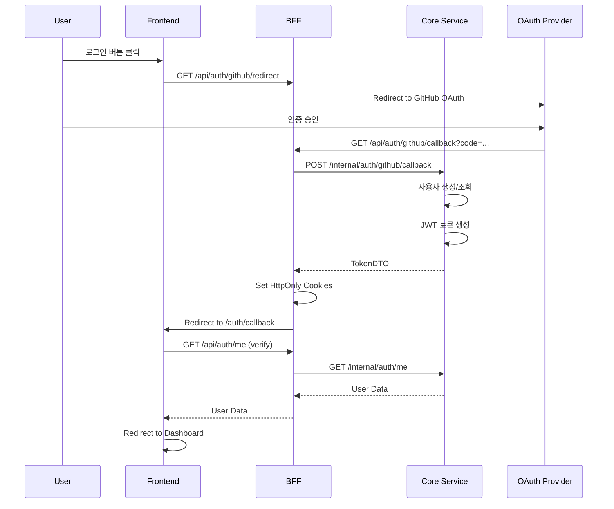
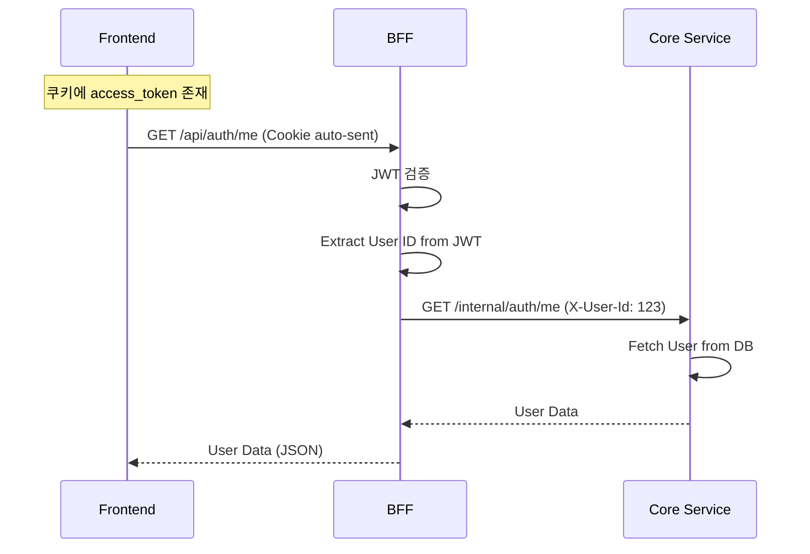
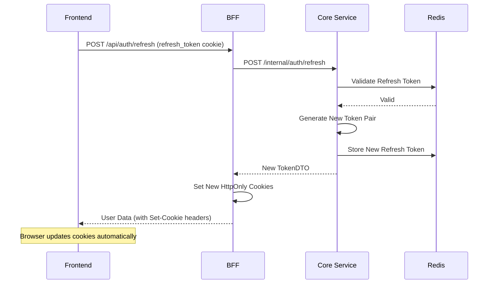

# Application Architecture

Toy Domain Service의 전체 아키텍처 문서입니다.

## 개요

**3-Tier 레이어 아키텍처**로 구성된 마이크로서비스 기반 시스템입니다. 각 레이어는 명확한 책임을 가지며, 독립적으로 개발 및 배포 가능합니다.

```
┌─────────────────────────────────────────────────────┐
│                    Frontend Layer                    │
│                     (Next.js)                        │
│                  UI/UX, User Input                   │
└────────────────────┬────────────────────────────────┘
                     │ HTTP/JSON (Public API)
                     │ /api/*
                     ▼
┌─────────────────────────────────────────────────────┐
│                      BFF Layer                       │
│           (Backend For Frontend - Laravel)           │
│     JWT Auth, API Gateway, Response Transform       │
└────────────────────┬────────────────────────────────┘
                     │ Internal Call (Private API)
                     │ /internal/*
                     ▼
┌─────────────────────────────────────────────────────┐
│                  Core Service Layer                  │
│                    (Laravel)                         │
│       Domain Logic, Business Rules, Data Access      │
└────────────────────┬────────────────────────────────┘
                     │
                     ▼
         ┌───────────────────────────┐
         │   Infrastructure Layer    │
         │  PostgreSQL, Redis, MinIO │
         │        MongoDB            │
         └───────────────────────────┘
```

## 레이어 구성

### 1. Frontend Layer

**기술 스택:** Next.js 16.x, React 19.x, TypeScript, Tailwind CSS

| 항목 | 설명 |
|------|------|
| **위치** | `/frontend` |
| **역할** | 사용자 UI 제공, 사용자 입력 처리, 화면 렌더링 |
| **호출 대상** | BFF Layer (`/api/*`) |
| **인증 방식** | HttpOnly Cookie (access_token, refresh_token) |
| **문서** | [FRONTEND.md](./FRONTEND.md) |

**주요 책임:**
- 사용자 인터페이스 렌더링
- 클라이언트 사이드 상태 관리 (React Query)
- 사용자 입력 검증 (React Hook Form + Zod)
- BFF API 호출 (쿠키 자동 전송)
- 라우트 보호 (Next.js Middleware)

**특징:**
- BFF만 호출하며, Core Service에 직접 접근하지 않음
- HttpOnly Cookie로 토큰 관리 (XSS 방지)
- SSR/CSR 하이브리드 렌더링
- 39개의 Metronic 레이아웃 제공

---

### 2. BFF Layer (Backend For Frontend)

**기술 스택:** Laravel 12.x, PHP 8.4+

| 항목 | 설명 |
|------|------|
| **위치** | `app/Bff/`, `routes/api.php` |
| **경로** | `/api/*` (외부 공개) |
| **역할** | JWT 인증/인가, Core Service 호출, 응답 변환 |
| **호출 대상** | Core Service (`/internal/*`) |
| **인증 방식** | JWT (Bearer Token 또는 Cookie) |
| **문서** | [BFF.md](./BFF.md) |

**주요 책임:**
- JWT 토큰 검증 및 관리 (발급, 갱신, 무효화)
- OAuth 소셜 로그인 흐름 처리 (리다이렉트, 콜백)
- Core Service 내부 API 호출
- 프론트엔드 친화적 응답 포맷 변환
- Rate Limiting

**특징:**
- 프론트엔드와 Core Service 사이의 게이트웨이 역할
- JWT 검증 후 `X-User-Id` 헤더로 사용자 ID 전달
- HttpOnly 쿠키 설정으로 보안 강화
- Core Service를 직접 호출하는 유일한 외부 인터페이스

**파일 구조:**
```
app/Bff/
├── Controllers/
│   └── AuthController.php         # BFF 인증 컨트롤러
├── Middleware/
│   └── JwtAuthenticate.php        # JWT 검증 미들웨어
└── Services/
    └── CoreAuthService.php        # Core Service 클라이언트
```

---

### 3. Core Service Layer

**기술 스택:** Laravel 12.x, PHP 8.4+, PostgreSQL, Redis, MongoDB, MinIO

| 항목 | 설명 |
|------|------|
| **위치** | `app/Domain/`, `app/Http/`, `app/Services/` |
| **경로** | `/internal/*` (내부 전용) |
| **역할** | 비즈니스 로직, 도메인 규칙, 데이터 관리 |
| **호출자** | BFF Layer |
| **인증 방식** | `X-User-Id` 헤더 (BFF에서 전달) |
| **문서** | [CORE.md](./CORE.md) |

**주요 책임:**
- 도메인 비즈니스 로직 실행
- 데이터베이스 CRUD 작업
- 캐싱 전략 (Redis)
- 파일 저장소 관리 (MinIO)
- 알림 발송 (Email, SMS, Slack)
- 사용자 활동 로그 (MongoDB)
- Queue 작업 처리

**특징:**
- 재사용 가능한 도메인 서비스 제공
- DDD(Domain-Driven Design) 기반 구조
- Repository 패턴으로 데이터 추상화
- 도메인 예외 처리 (자동 API 응답 변환)
- 공통 HTTP 응답 포맷 (ApiResponse)

**파일 구조:**
```
app/
├── Domain/                        # 도메인 레이어 (DDD)
│   ├── Auth/                      # 인증 도메인
│   │   ├── Controllers/
│   │   ├── Services/
│   │   ├── DTOs/
│   │   ├── Repositories/
│   │   └── Exceptions/
│   ├── Health/                    # Health Check
│   └── UserActivity/              # 사용자 활동 로그
│
├── Http/Controllers/              # HTTP 컨트롤러
│   ├── TimerController.php
│   ├── FileController.php
│   └── NotificationController.php
│
├── Services/                      # 비즈니스 서비스
│   ├── TimerService.php
│   ├── FileService.php
│   └── Notification/
│
├── Repositories/                  # Repository 구현체
│   ├── CachedTimerRepository.php
│   ├── EloquentTimerRepository.php
│   └── ...
│
├── Models/                        # Eloquent Models
│   ├── User.php
│   ├── Timer.php
│   └── ...
│
└── Shared/                        # 공유 레이어
    ├── Exceptions/                # 도메인 예외
    ├── Http/                      # API 응답 공통화
    └── Database/                  # MongoDB 연결
```

---

## 레이어 간 통신

### Frontend → BFF

| 항목 | 설명 |
|------|------|
| **프로토콜** | HTTP/HTTPS |
| **경로** | `/api/*` |
| **인증** | HttpOnly Cookie (`access_token`) 또는 `Authorization: Bearer` 헤더 |
| **응답 포맷** | JSON (ApiResponse 표준 포맷) |

**예시 요청:**
```http
GET /api/auth/me HTTP/1.1
Host: api.example.com
Cookie: access_token=eyJhbGc...
```

**예시 응답:**
```json
{
    "success": true,
    "data": {
        "id": 1,
        "name": "홍길동",
        "email": "hong@example.com"
    }
}
```

---

### BFF → Core Service

| 항목 | 설명 |
|------|------|
| **프로토콜** | Internal Call (동일 Laravel 앱) |
| **경로** | `/internal/*` |
| **인증** | `X-User-Id` 헤더 (JWT 검증 후 전달) |
| **응답 포맷** | DTO 또는 JSON |

**예시 호출:**
```php
// BFF Controller
$response = Http::asJson()
    ->withHeaders(['X-User-Id' => $userId])
    ->get('/internal/auth/me');

return $this->successResponse($response->json());
```

---

## 인증 흐름

### 소셜 로그인 (OAuth)



### API 인증 (JWT)



### 토큰 갱신



---

## 데이터 흐름

### 읽기 요청 (Read)

```
User → Frontend → BFF → Core Service → Repository → Cache/DB
                                                          ↓
User ← Frontend ← BFF ← Core Service ← Repository ← Cache Hit
                                                          ↓
                                                      Cache Miss → DB
```

### 쓰기 요청 (Write)

```
User → Frontend → BFF → Core Service → Repository → DB
                                                      ↓
                                                  Cache Invalidate
                                                      ↓
User ← Frontend ← BFF ← Core Service ← Repository ← Success
```

---

## 도메인 서비스

Core Service는 다음 도메인 서비스를 제공합니다:

| 도메인 | 경로 | 문서 | 설명 |
|--------|------|------|------|
| **Auth** | `/internal/auth/*` | [AUTH.md](./AUTH.md) | JWT 인증, 소셜 로그인 |
| **Timer** | `/internal/timers/*` | [TIMER.md](./TIMER.md) | 목표 시점 타이머 관리 |
| **File** | `/internal/files/*` | [FILE.md](./FILE.md) | MinIO 파일 저장소 |
| **Notification** | `/internal/notifications/*` | [NOTIFICATION.md](./NOTIFICATION.md) | 다채널 알림 발송 |
| **User Activity** | `/internal/user-activity/*` | [USER_ACTIVITY.md](./USER_ACTIVITY.md) | MongoDB 활동 로그 |
| **Health** | `/internal/health/*` | [HEALTH.md](./HEALTH.md) | 인프라 Health Check |

---

## 공통 컴포넌트

### HTTP Response 표준 포맷

모든 API 응답은 `ApiResponse` 클래스를 통해 통일된 포맷으로 반환됩니다.

**성공 응답:**
```json
{
    "success": true,
    "data": { ... },
    "message": "optional message"
}
```

**에러 응답:**
```json
{
    "success": false,
    "error": {
        "code": "ERROR_CODE",
        "message": "에러 메시지",
        "details": { ... }
    }
}
```

**위치:** `app/Shared/Http/ApiResponse.php`

---

### Exception Handling

도메인 예외가 자동으로 API 응답으로 변환됩니다.

**예외 클래스:**
- `NotFoundException` → 404
- `BadRequestException` → 400
- `UnauthorizedException` → 401
- `ForbiddenException` → 403
- `ConflictException` → 409
- `DomainValidationException` → 400

**위치:** `app/Shared/Exceptions/`

---

## 인프라 구성

### 데이터베이스

| 종류 | 용도 | 사용 도메인 |
|------|------|-------------|
| **PostgreSQL** | 관계형 데이터 저장 | Auth, Timer, File, Notification |
| **Redis** | 캐싱, 세션, Refresh Token | 모든 도메인 |
| **MongoDB** | 로그 저장 (Schema-less) | User Activity, Auth Events |
| **MinIO** | 파일 저장소 (S3 호환) | File |

### 환경 변수

**Backend (.env):**
```env
# Database
DB_CONNECTION=pgsql
DB_HOST=postgres
DB_DATABASE=toy_core_system

# Cache
REDIS_HOST=redis
REDIS_PORT=6379

# MongoDB
MONGODB_URI=mongodb://mongodb:27017
MONGODB_DATABASE=toy_logs

# MinIO
MINIO_ENDPOINT=http://minio:9000
MINIO_KEY=minioadmin
MINIO_SECRET=minioadmin

# Frontend URL
FRONTEND_URL=http://localhost:3002

# JWT
JWT_SECRET=your-secret-key
JWT_ACCESS_TTL=3600          # 1시간
JWT_REFRESH_TTL=604800       # 7일
```

**Frontend (.env):**
```env
# Backend API URL
NEXT_PUBLIC_API_URL=http://localhost:8000/api
```

---

## 개발 워크플로우

### 새 기능 추가 시

1. **Core Service에 도메인 로직 구현**
   ```bash
   app/Domain/{DomainName}/
   ├── Controllers/
   ├── Services/
   ├── DTOs/
   ├── Repositories/
   └── Exceptions/
   ```

2. **Internal API 라우트 추가** (`routes/internal.php`)
   ```php
   Route::prefix('new-domain')->group(function () {
       Route::get('/', [NewController::class, 'index']);
   });
   ```

3. **BFF에서 Core Service 호출** (필요시)
   ```php
   // app/Bff/Services/CoreNewService.php
   public function getData(): array
   {
       return Http::get('/internal/new-domain')->json();
   }
   ```

4. **BFF API 라우트 추가** (`routes/api.php`)
   ```php
   Route::get('new-feature', [BffController::class, 'index'])
       ->middleware('bff.auth');
   ```

5. **Frontend에서 API 호출**
   ```typescript
   // lib/api/client.ts
   export const newApi = {
       getData: async () => {
           return fetch(`${API_URL}/new-feature`, {
               credentials: 'include',
           });
       },
   };
   ```

6. **도메인 문서 작성** (`docs/{DOMAIN}.md`)

---

## 배포 아키텍처

```
                    ┌─────────────┐
                    │   Cloudflare │
                    │     (CDN)     │
                    └──────┬────────┘
                           │
              ┌────────────┴────────────┐
              │                         │
    ┌─────────▼─────────┐   ┌──────────▼──────────┐
    │  Frontend (Next.js) │   │   Backend (Laravel)  │
    │   Static/SSR        │   │    BFF + Core       │
    │   Port: 3002        │   │    Port: 8000       │
    └─────────────────────┘   └──────────┬──────────┘
                                          │
                    ┌─────────────────────┴─────────────────────┐
                    │                                           │
        ┌───────────▼──────────┐              ┌────────────────▼────────────┐
        │   PostgreSQL          │              │   Redis                     │
        │   (Primary DB)        │              │   (Cache, Session, Queue)   │
        └───────────────────────┘              └─────────────────────────────┘
                    │                                           │
        ┌───────────▼──────────┐              ┌────────────────▼────────────┐
        │   MongoDB             │              │   MinIO                     │
        │   (Activity Logs)     │              │   (Object Storage)          │
        └───────────────────────┘              └─────────────────────────────┘
```

---

## 보안 고려사항

### 인증/인가

| 레이어 | 방법 | 설명 |
|--------|------|------|
| Frontend → BFF | JWT (HttpOnly Cookie) | XSS 방지를 위한 HttpOnly 설정 |
| BFF → Core | `X-User-Id` 헤더 | JWT 검증 후 사용자 ID 전달 |

### CORS

```php
// config/cors.php
'allowed_origins' => [
    env('FRONTEND_URL', 'http://localhost:3002'),
],
'supports_credentials' => true, // Cookie 전송 허용
```

### Rate Limiting

| 엔드포인트 | 제한 |
|-----------|------|
| OAuth Callback | 10회/분 |
| Token Refresh | 30회/분 |
| 일반 API | 60회/분 |

### 환경별 설정

- **로컬:** `SESSION_SECURE_COOKIE=false`, `SESSION_DOMAIN=null`
- **프로덕션:** `SESSION_SECURE_COOKIE=true`, `SESSION_DOMAIN=.example.com`

---

## 테스트 전략

### Unit Tests

- **위치:** `tests/Unit/`
- **대상:** Service, Repository, DTO, Helper
- **실행:** `php artisan test --testsuite=Unit`

### Feature Tests

- **위치:** `tests/Feature/`
- **대상:** API 엔드포인트, 통합 흐름
- **실행:** `php artisan test --testsuite=Feature`

### E2E Tests (Frontend)

- **도구:** Playwright (예정)
- **대상:** 사용자 시나리오 (로그인, CRUD 등)

---

## 모니터링

### 에러 추적

| 레이어 | 도구 | 설정 |
|--------|------|------|
| Frontend | Sentry | `NEXT_PUBLIC_SENTRY_DSN` |
| Backend | Sentry | `SENTRY_LARAVEL_DSN` |

### 로그

| 레이어 | 저장소 | 포맷 |
|--------|--------|------|
| Frontend | Browser Console | JSON |
| Backend | Laravel Logs | `storage/logs/laravel.log` |
| Activity | MongoDB | JSON Document |

---

## 참고 문서

### 레이어별 문서

- [Frontend 문서](./FRONTEND.md)
- [BFF 문서](./BFF.md)
- [Core Service 문서](./CORE.md)

### 도메인별 문서

- [Auth 도메인](./AUTH.md)
- [Timer 도메인](./TIMER.md)
- [File 도메인](./FILE.md)
- [Notification 도메인](./NOTIFICATION.md)
- [User Activity 도메인](./USER_ACTIVITY.md)
- [Health Check](./HEALTH.md)

### 프로젝트 문서

- [CLAUDE.md](../CLAUDE.md) - 프로젝트 개요 및 가이드

---

## 버전

- **아키텍처 버전:** v1.0.0
- **작성일:** 2025-12-15
- **최종 수정일:** 2025-12-15
