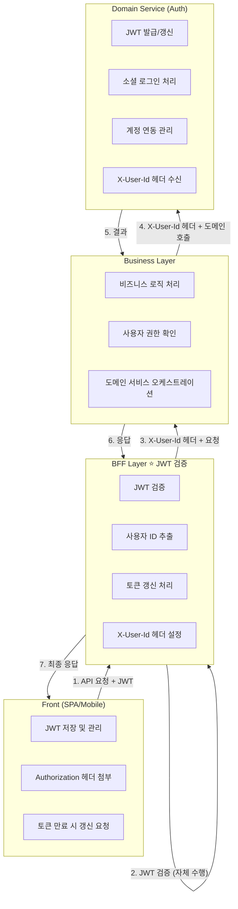
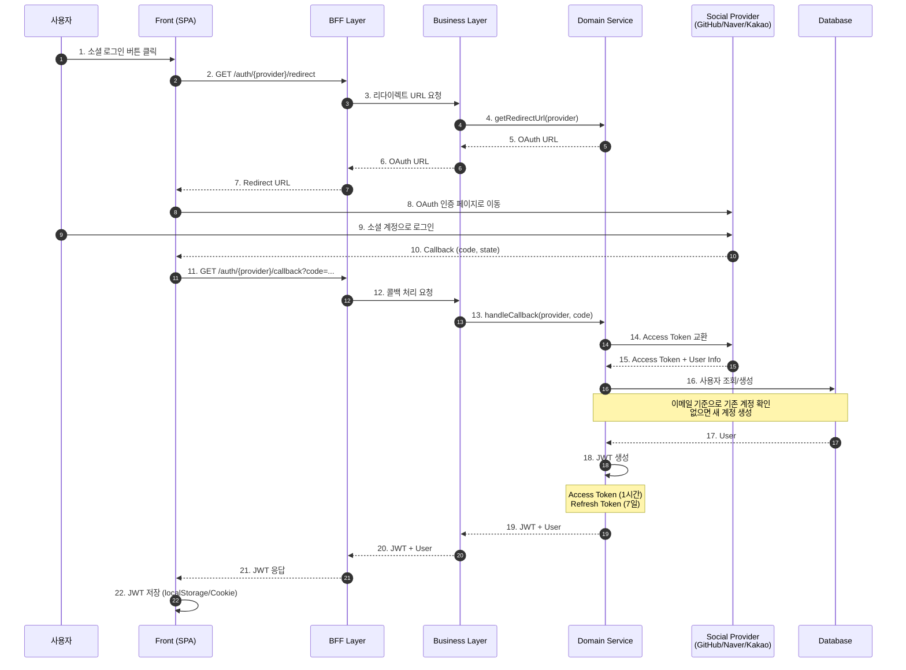
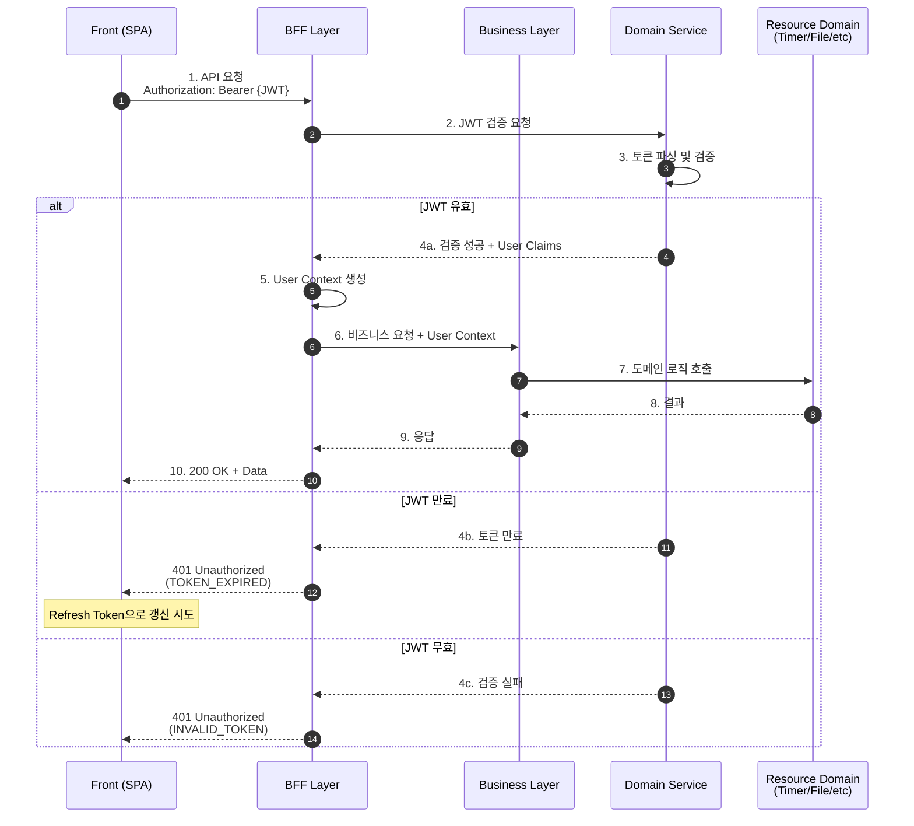
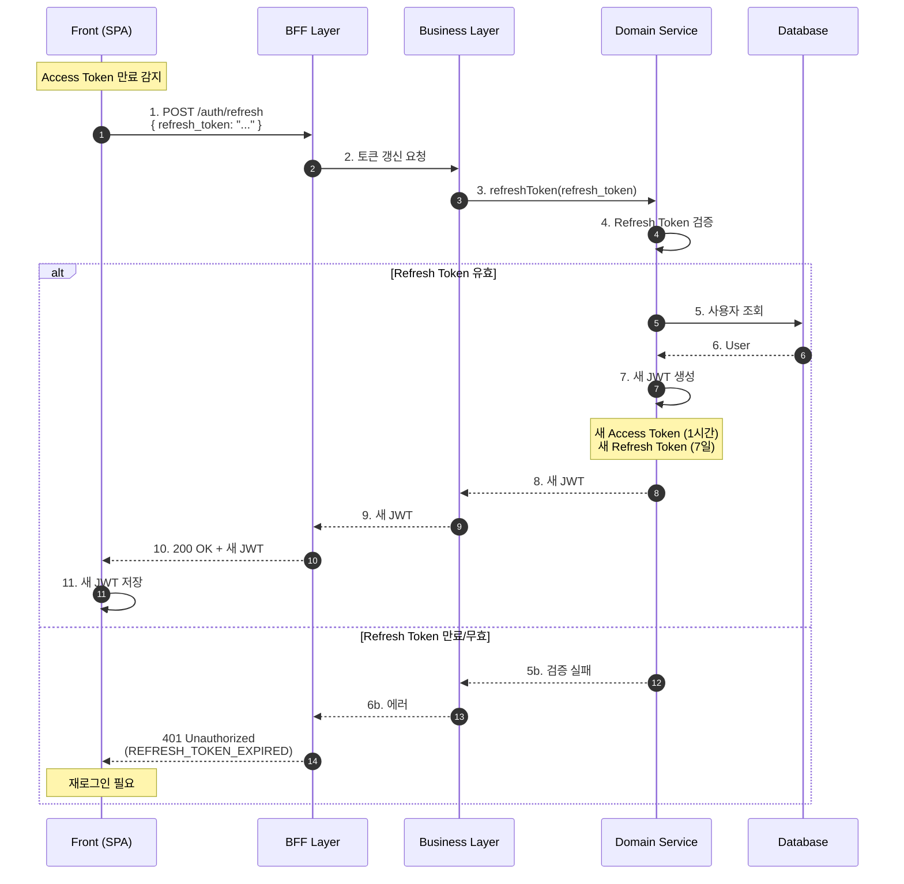
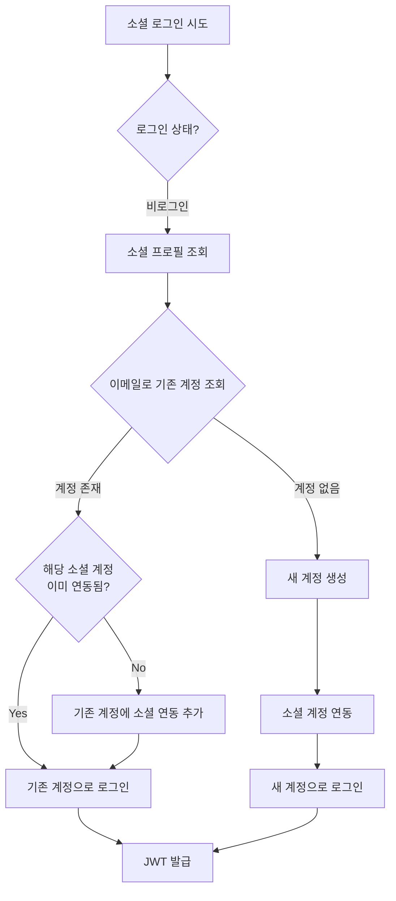
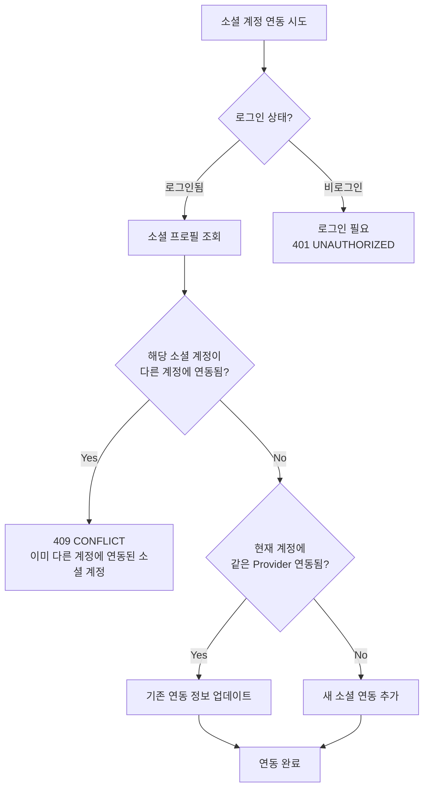
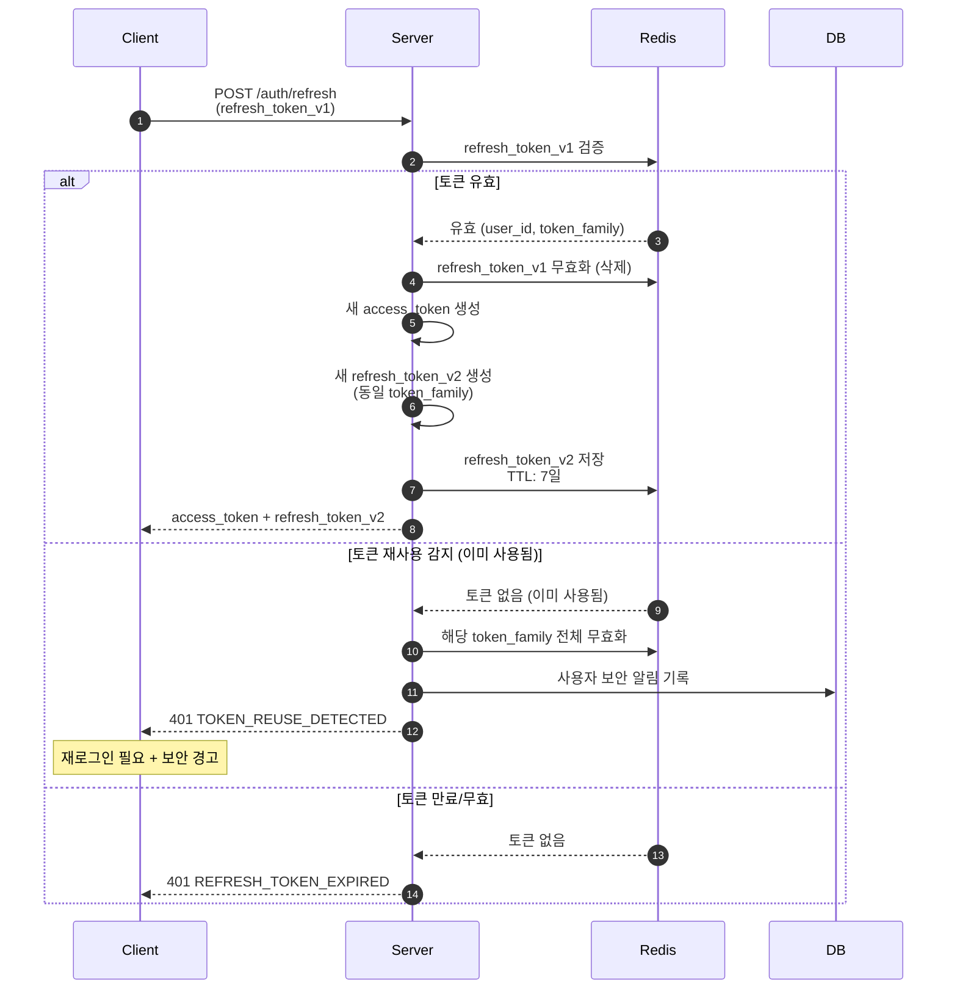
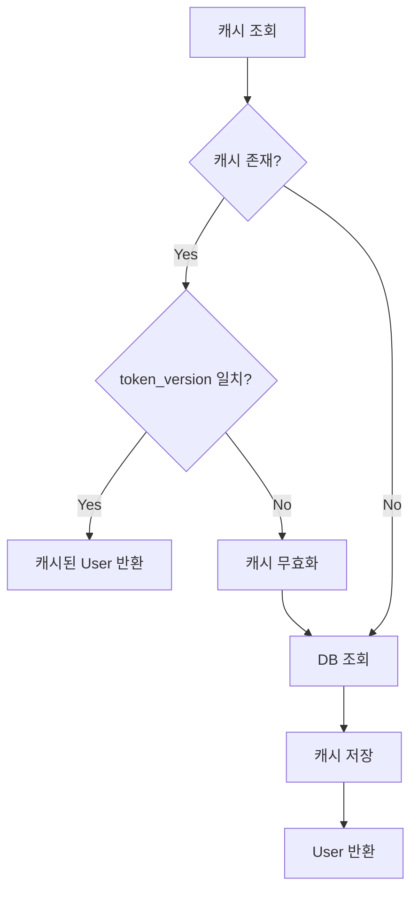

# Auth 도메인

Auth 도메인은 JWT 토큰 발급 및 소셜 로그인 연동을 담당하는 원자적 도메인 서비스입니다.

## 개요

| 항목 | 설명 |
|------|------|
| **목적** | JWT 토큰 발급/갱신 및 소셜 로그인(OAuth2) 연동 |
| **주요 기능** | 소셜 로그인, JWT 발급/갱신, 계정 연동 관리 |
| **특징** | 다중 소셜 계정 연동, 이메일 기반 계정 식별 |

> **Note**: JWT 검증은 BFF/Aggregator에서 수행하며, Domain Service는 `X-User-Id` 헤더로 사용자 ID만 전달받습니다.

### 지원 소셜 로그인 제공자

| Provider | 상태 | 패키지 |
|----------|------|--------|
| GitHub | ✅ 지원 | `laravel/socialite` (기본) |
| Naver | ✅ 지원 | `socialiteproviders/naver` |
| Kakao | ✅ 지원 | `socialiteproviders/kakao` |
| Google | ⏳ 예정 | `laravel/socialite` (기본) |
| Apple | ⏳ 예정 | `socialiteproviders/apple` |

---

## 시스템 아키텍처

### 전체 서비스 흐름도

```text
┌─────────────────────────────────────────────────────────────────────────────────┐
│                              SERVICE ARCHITECTURE                                │
├─────────────────────────────────────────────────────────────────────────────────┤
│                                                                                 │
│   ┌──────────┐     ┌──────────┐     ┌──────────┐     ┌──────────────────────┐  │
│   │  Front   │────▶│   BFF    │────▶│ Business │────▶│   Domain Service     │  │
│   │  (SPA)   │◀────│  Layer   │◀────│  Layer   │◀────│   (toy-core-system)  │  │
│   └──────────┘     └──────────┘     └──────────┘     └──────────────────────┘  │
│        │                │                │                     │               │
│        │                │                │                     │               │
│   ┌────▼────┐      ┌────▼────┐     ┌────▼────┐          ┌─────▼─────┐         │
│   │ JWT     │      │ JWT     │     │X-User-Id│          │ JWT 발급  │         │
│   │ 저장    │      │ 검증    │     │ 헤더    │          │ + 갱신    │         │
│   │(Storage)│      │ ⭐      │     │ 전달    │          │           │         │
│   └─────────┘      └─────────┘     └─────────┘          └───────────┘         │
│                                                                                 │
│   ⭐ JWT 검증은 BFF/Aggregator에서 수행                                          │
│                                                                                 │
└─────────────────────────────────────────────────────────────────────────────────┘
```

### 레이어별 역할



---

## JWT 인증 흐름

### 1. 소셜 로그인 → JWT 발급 흐름



### 2. API 요청 시 JWT 검증 흐름



### 3. JWT 토큰 갱신 흐름



---

## 소셜 계정 연동 규칙

### 계정 식별 및 연동 정책

```text
┌─────────────────────────────────────────────────────────────────────────────┐
│                         계정 식별 기준: EMAIL                                │
├─────────────────────────────────────────────────────────────────────────────┤
│                                                                             │
│  [회원가입 시 - 비로그인 상태]                                               │
│  ┌─────────────────────────────────────────────────────────────────────┐   │
│  │  소셜 로그인 → 이메일 확인                                            │   │
│  │       │                                                              │   │
│  │       ├─▶ 동일 이메일 계정 존재 → 기존 계정에 소셜 연동               │   │
│  │       │                                                              │   │
│  │       └─▶ 이메일 없음 → 새 계정 생성 + 소셜 연동                      │   │
│  └─────────────────────────────────────────────────────────────────────┘   │
│                                                                             │
│  [계정 연동 시 - 로그인 상태]                                                │
│  ┌─────────────────────────────────────────────────────────────────────┐   │
│  │  소셜 로그인 → 현재 로그인된 계정에 연동 (이메일 무관)                  │   │
│  │                                                                      │   │
│  │  ※ 소셜 계정의 이메일이 달라도 현재 계정에 연동됨                      │   │
│  │  ※ 이미 다른 계정에 연동된 소셜 계정은 연동 불가 (CONFLICT)            │   │
│  └─────────────────────────────────────────────────────────────────────┘   │
│                                                                             │
└─────────────────────────────────────────────────────────────────────────────┘
```

### 회원가입 (비로그인 상태) 흐름



### 계정 연동 (로그인 상태) 흐름



### 연동 시나리오 예시

| 시나리오 | 상태 | 소셜 이메일 | 결과 |
|----------|------|-------------|------|
| GitHub 최초 로그인 | 비로그인 | user@gmail.com (신규) | 새 계정 생성 |
| Kakao 로그인 | 비로그인 | user@gmail.com (기존) | 기존 계정에 Kakao 연동 |
| Naver 연동 추가 | 로그인 (user@gmail.com) | other@naver.com | 현재 계정에 Naver 연동 |
| GitHub 연동 시도 | 로그인 (user@gmail.com) | (이미 다른 계정에 연동됨) | 409 CONFLICT |
| Kakao 최초 로그인 | 비로그인 | null (이메일 미제공) | 임시 이메일로 새 계정 생성 |

### 이메일 미제공 Provider 처리

일부 소셜 로그인 제공자(예: Kakao)는 사용자의 이메일을 필수로 제공하지 않을 수 있습니다. 이 경우 시스템은 다음과 같이 처리합니다:

```text
┌─────────────────────────────────────────────────────────────────────────────┐
│                    이메일 미제공 시 처리 전략                                  │
├─────────────────────────────────────────────────────────────────────────────┤
│                                                                             │
│  [이메일이 null인 경우]                                                       │
│  ┌─────────────────────────────────────────────────────────────────────┐   │
│  │  임시 이메일 생성: {provider}_{provider_user_id}@noemail.local        │   │
│  │                                                                      │   │
│  │  예시:                                                                │   │
│  │  - kakao_12345678@noemail.local                                      │   │
│  │  - naver_98765432@noemail.local                                      │   │
│  │                                                                      │   │
│  │  ※ 임시 이메일은 고유성을 보장하며, 실제 이메일이 아님을 명시          │   │
│  │  ※ 사용자가 이후 프로필 설정에서 실제 이메일 추가 가능                 │   │
│  └─────────────────────────────────────────────────────────────────────┘   │
│                                                                             │
│  [Provider별 이메일 제공 정책]                                               │
│  ┌─────────────────────────────────────────────────────────────────────┐   │
│  │  Provider   │ 이메일 필수 │ 비고                                      │   │
│  │  ───────────┼────────────┼──────────────────────────────────────────│   │
│  │  GitHub     │ 대부분 제공 │ private 설정 시 미제공 가능               │   │
│  │  Naver      │ 선택적 동의 │ 사용자가 동의하지 않으면 미제공            │   │
│  │  Kakao      │ 선택적 동의 │ 사용자가 동의하지 않으면 미제공            │   │
│  └─────────────────────────────────────────────────────────────────────┘   │
│                                                                             │
└─────────────────────────────────────────────────────────────────────────────┘
```

#### 임시 이메일 관리

- **형식**: `{provider}_{provider_user_id}@noemail.local`
- **고유성**: provider와 provider_user_id 조합으로 고유성 보장
- **식별**: `@noemail.local` 도메인으로 임시 이메일 여부 판별 가능
- **업데이트**: 사용자가 프로필 설정에서 실제 이메일로 변경 가능

---

## 아키텍처

### 레이어 구조

```text
Controller (SocialAuthController)
    ↓
Service (SocialAuthService, JwtService)
    ↓
Repository Interface (SocialAccountRepositoryInterface, UserRepositoryInterface)
    ↓
├── EloquentSocialAccountRepository (DB 구현체)
└── EloquentUserRepository (DB 구현체)
        ↓
    Database (PostgreSQL)
```

### 파일 구조

```text
app/
├── Domain/
│   └── Auth/
│       ├── Controllers/
│       │   └── SocialAuthController.php          # 소셜 인증 컨트롤러
│       ├── Services/
│       │   ├── SocialAuthService.php             # 소셜 인증 비즈니스 로직
│       │   ├── JwtService.php                    # JWT 토큰 관리
│       │   ├── UserCacheService.php              # 사용자 캐시 서비스
│       │   └── UserCacheServiceInterface.php     # 캐시 서비스 인터페이스
│       ├── Models/
│       │   └── SocialAccount.php                 # 소셜 계정 모델
│       ├── Repositories/
│       │   ├── SocialAccountRepositoryInterface.php
│       │   ├── EloquentSocialAccountRepository.php
│       │   ├── RefreshTokenRepositoryInterface.php # Refresh Token 인터페이스
│       │   ├── RedisRefreshTokenRepository.php   # Redis 토큰 저장소
│       │   ├── UserRepositoryInterface.php
│       │   └── EloquentUserRepository.php
│       ├── Observers/
│       │   └── UserObserver.php                  # 사용자 모델 옵저버
│       ├── DTOs/
│       │   ├── SocialUserDTO.php                 # 소셜 사용자 정보
│       │   └── TokenDTO.php                      # JWT 토큰 정보
│       └── Exceptions/
│           ├── SocialAccountAlreadyLinkedException.php
│           └── InvalidTokenException.php
│
├── Models/
│   └── User.php                                  # 사용자 모델 (수정)

config/
├── jwt.php                                       # JWT 설정
└── services.php                                  # 소셜 Provider 설정

database/migrations/
├── xxxx_add_avatar_to_users_table.php
└── xxxx_create_social_accounts_table.php

tests/
├── Feature/Auth/
│   ├── SocialAuthControllerTest.php
│   └── JwtAuthenticationTest.php
└── Unit/Auth/
    ├── SocialAuthServiceTest.php
    └── JwtServiceTest.php
```

---

## 데이터베이스 스키마

### users 테이블 (수정)

| 컬럼 | 타입 | 설명 |
|------|------|------|
| `id` | BIGINT | Primary Key |
| `name` | VARCHAR(255) | 사용자 이름 |
| `email` | VARCHAR(255) | 이메일 (UNIQUE) - **고유 식별자** |
| `email_verified_at` | TIMESTAMP | 이메일 인증 시간 |
| `password` | VARCHAR(255) | 비밀번호 (nullable - 소셜 전용 계정) |
| `avatar` | VARCHAR(255) | 프로필 이미지 URL (nullable) |
| `token_version` | INT | 토큰 버전 (기본: 1) - 전체 토큰 무효화 용 |
| `remember_token` | VARCHAR(100) | Remember Token |
| `created_at` | TIMESTAMP | 생성 시간 |
| `updated_at` | TIMESTAMP | 수정 시간 |

### social_accounts 테이블 (신규)

| 컬럼 | 타입 | 설명 |
|------|------|------|
| `id` | BIGINT | Primary Key |
| `user_id` | BIGINT | FK → users.id |
| `provider` | VARCHAR(50) | 소셜 제공자 (github, naver, kakao) |
| `provider_user_id` | VARCHAR(255) | 소셜 서비스의 사용자 ID |
| `provider_email` | VARCHAR(255) | 소셜 계정 이메일 (nullable) |
| `provider_token` | TEXT | Access Token (nullable, encrypted) |
| `provider_refresh_token` | TEXT | Refresh Token (nullable, encrypted) |
| `token_expires_at` | TIMESTAMP | 토큰 만료 시간 (nullable) |
| `created_at` | TIMESTAMP | 생성 시간 |
| `updated_at` | TIMESTAMP | 수정 시간 |

### 인덱스

```sql
-- social_accounts 테이블
CREATE UNIQUE INDEX social_accounts_provider_user_unique
    ON social_accounts (provider, provider_user_id);

CREATE INDEX social_accounts_user_id_index
    ON social_accounts (user_id);

-- users 테이블
CREATE UNIQUE INDEX users_email_unique ON users (email);
```

### ERD

```text
┌─────────────────────────┐       ┌─────────────────────────────────┐
│         users           │       │        social_accounts          │
├─────────────────────────┤       ├─────────────────────────────────┤
│ id (PK)                 │──┐    │ id (PK)                         │
│ name                    │  │    │ user_id (FK)                    │──┐
│ email (UNIQUE)          │  └───▶│ provider                        │  │
│ email_verified_at       │       │ provider_user_id                │  │
│ password (nullable)     │       │ provider_email                  │  │
│ avatar (nullable)       │       │ provider_token                  │  │
│ token_version           │       │ provider_refresh_token          │  │
│ remember_token          │       │ token_expires_at                │  │
│ created_at              │       │ created_at                      │  │
│ updated_at              │       │ updated_at                      │  │
└─────────────────────────┘       └─────────────────────────────────┘

        1                    :                    N
      (User)              ────────────▶    (SocialAccounts)
```

---

## API 엔드포인트

### 소셜 로그인 리다이렉트

```
GET /api/auth/{provider}/redirect
```

**Path Parameters**
| 파라미터 | 타입 | 필수 | 설명 |
|----------|------|------|------|
| `provider` | String | O | 소셜 제공자 (github, naver, kakao) |

**응답 (200 OK)**
```json
{
    "success": true,
    "data": {
        "redirect_url": "https://github.com/login/oauth/authorize?client_id=..."
    }
}
```

### 소셜 로그인 콜백

```
GET /api/auth/{provider}/callback
```

**Query Parameters**
| 파라미터 | 타입 | 필수 | 설명 |
|----------|------|------|------|
| `code` | String | O | OAuth 인증 코드 |
| `state` | String | - | CSRF 방지 state (stateless 모드에서는 선택적) |

> **Note**: 이 API는 Laravel Socialite의 stateless 모드를 사용하므로 state 파라미터 검증을 서버에서 수행하지 않습니다. CSRF 보호는 클라이언트에서 처리해야 합니다.

**응답 (200 OK) - 로그인 성공**
```json
{
    "success": true,
    "data": {
        "access_token": "<ACCESS_TOKEN_EXAMPLE>",
        "refresh_token": "<REFRESH_TOKEN_EXAMPLE>",
        "token_type": "bearer",
        "expires_in": 3600,
        "user": {
            "id": 1,
            "name": "홍길동",
            "email": "user@example.com",
            "avatar": "https://avatars.githubusercontent.com/..."
        }
    }
}
```

**에러 (400 Bad Request)**
```json
{
    "success": false,
    "error": {
        "code": "BAD_REQUEST",
        "message": "지원하지 않는 소셜 로그인 제공자입니다: facebook"
    }
}
```

### 소셜 계정 연동 (로그인 상태)

```
POST /api/auth/{provider}/link
```

**Headers**
```
X-User-Id: {user_id}
```

> **Note**: BFF에서 JWT 검증 후 사용자 ID를 `X-User-Id` 헤더로 전달합니다.

**응답 (200 OK)**
```json
{
    "success": true,
    "data": {
        "message": "소셜 계정이 연동되었습니다.",
        "provider": "kakao",
        "linked_at": "2025-12-11T10:00:00+09:00"
    }
}
```

**에러 (409 Conflict)**
```json
{
    "success": false,
    "error": {
        "code": "CONFLICT",
        "message": "해당 소셜 계정은 이미 다른 계정에 연동되어 있습니다."
    }
}
```

### 소셜 계정 연동 해제

```
DELETE /api/auth/{provider}/unlink
```

**Headers**
```
X-User-Id: {user_id}
```

**응답 (200 OK)**
```json
{
    "success": true,
    "data": {
        "message": "소셜 계정 연동이 해제되었습니다.",
        "provider": "github"
    }
}
```

**에러 (400 Bad Request)**
```json
{
    "success": false,
    "error": {
        "code": "BAD_REQUEST",
        "message": "마지막 로그인 수단은 해제할 수 없습니다."
    }
}
```

### JWT 토큰 갱신

```
POST /api/auth/refresh
```

**요청**
```json
{
    "refresh_token": "<REFRESH_TOKEN_EXAMPLE>"
}
```

**응답 (200 OK)**
```json
{
    "success": true,
    "data": {
        "access_token": "<ACCESS_TOKEN_EXAMPLE>",
        "refresh_token": "<REFRESH_TOKEN_EXAMPLE>",
        "token_type": "bearer",
        "expires_in": 3600
    }
}
```

**에러 (401 Unauthorized)**
```json
{
    "success": false,
    "error": {
        "code": "UNAUTHORIZED",
        "message": "Refresh Token이 만료되었습니다. 다시 로그인해주세요."
    }
}
```

### 로그아웃

```
POST /api/auth/logout
```

**Headers**
```
X-User-Id: {user_id}
```

**Request Body (optional)**
```json
{
    "refresh_token": "<REFRESH_TOKEN_EXAMPLE>"
}
```

> **Note**: Access Token은 BFF에서 관리합니다. Domain Service에서는 Refresh Token만 무효화합니다.

**응답 (200 OK)**
```json
{
    "success": true,
    "data": {
        "message": "로그아웃되었습니다."
    }
}
```

### 전체 로그아웃 (모든 디바이스)

```
POST /api/auth/logout-all
```

**Headers**
```
X-User-Id: {user_id}
```

**응답 (200 OK)**
```json
{
    "success": true,
    "data": {
        "message": "모든 디바이스에서 로그아웃되었습니다."
    }
}
```

**에러 (400 Bad Request)**
```json
{
    "success": false,
    "error": {
        "code": "BAD_REQUEST",
        "message": "X-User-Id 헤더가 필요합니다."
    }
}
```

> **Note**: 이 엔드포인트는 사용자의 `token_version`을 증가시켜 기존 발급된 모든 Access Token과 Refresh Token을 무효화합니다.

### 토큰 유효성 검증

```
POST /api/auth/validate
```

**Headers**
```
Authorization: Bearer {access_token}
```

**응답 (200 OK)**
```json
{
    "success": true,
    "data": {
        "valid": true,
        "user_id": 1,
        "expires_in": 3542,
        "token_type": "access"
    }
}
```

**에러 (401 Unauthorized) - 토큰 만료**
```json
{
    "success": false,
    "error": {
        "code": "UNAUTHORIZED",
        "message": "토큰이 만료되었습니다."
    }
}
```

**에러 (401 Unauthorized) - 토큰 무효**
```json
{
    "success": false,
    "error": {
        "code": "UNAUTHORIZED",
        "message": "유효하지 않은 토큰입니다."
    }
}
```

### 현재 사용자 정보

```
GET /api/auth/me
```

**Headers**
```
X-User-Id: {user_id}
```

**응답 (200 OK)**
```json
{
    "success": true,
    "data": {
        "id": 1,
        "name": "홍길동",
        "email": "user@example.com",
        "avatar": "https://avatars.githubusercontent.com/...",
        "email_verified_at": "2025-12-11T10:00:00+09:00",
        "created_at": "2025-12-01T09:00:00+09:00",
        "social_accounts": [
            {
                "provider": "github",
                "linked_at": "2025-12-01T09:00:00+09:00"
            },
            {
                "provider": "kakao",
                "linked_at": "2025-12-05T14:30:00+09:00"
            }
        ]
    }
}
```

### 연동된 소셜 계정 목록

```
GET /api/auth/social-accounts
```

**Headers**
```
X-User-Id: {user_id}
```

**응답 (200 OK)**
```json
{
    "success": true,
    "data": [
        {
            "provider": "github",
            "provider_email": "user@github.com",
            "linked_at": "2025-12-01T09:00:00+09:00"
        },
        {
            "provider": "kakao",
            "provider_email": "user@kakao.com",
            "linked_at": "2025-12-05T14:30:00+09:00"
        }
    ]
}
```

---

## JWT 토큰 구조

### Access Token Claims

```json
{
    "iss": "toy-core-system",
    "sub": "1",
    "iat": 1702263600,
    "exp": 1702267200,
    "nbf": 1702263600,
    "jti": "unique-token-id",
    "type": "access",
    "user": {
        "id": 1,
        "email": "user@example.com",
        "name": "홍길동"
    }
}
```

### Refresh Token Claims

```json
{
    "iss": "toy-core-system",
    "sub": "1",
    "iat": 1702263600,
    "exp": 1702868400,
    "nbf": 1702263600,
    "jti": "unique-refresh-token-id",
    "type": "refresh"
}
```

### 토큰 만료 시간

| 토큰 타입 | 만료 시간 | 용도 |
|-----------|----------|------|
| Access Token | 1시간 (3600초) | API 인증 |
| Refresh Token | 7일 (604800초) | Access Token 갱신 |

---

## 보안

### Refresh Token Rotation

Refresh Token 탈취 시 피해를 최소화하기 위해 **토큰 갱신 시마다 새로운 Refresh Token을 발급**합니다.

#### 동작 방식



#### Token Family 개념

```text
┌─────────────────────────────────────────────────────────────────────────┐
│                         Token Family                                     │
├─────────────────────────────────────────────────────────────────────────┤
│                                                                         │
│  로그인 시 새로운 token_family (UUID) 생성                                │
│                                                                         │
│  ┌─────────────┐    갱신    ┌─────────────┐    갱신    ┌─────────────┐  │
│  │ refresh_v1  │ ────────▶ │ refresh_v2  │ ────────▶ │ refresh_v3  │  │
│  │ family: A   │           │ family: A   │           │ family: A   │  │
│  │ (무효화)    │           │ (무효화)    │           │ (현재 유효)  │  │
│  └─────────────┘           └─────────────┘           └─────────────┘  │
│                                                                         │
│  ⚠️ refresh_v1 재사용 시도 → family A 전체 무효화 → 재로그인 필요         │
│                                                                         │
└─────────────────────────────────────────────────────────────────────────┘
```

#### Redis 저장 구조

```
# Refresh Token 저장
Key:   refresh_token:{jti}
Value: { "user_id": 1, "family": "uuid-family-id" }
TTL:   604800 (7일)

# Token Family 관리 (선택적)
Key:   token_family:{family_id}
Value: { "user_id": 1, "created_at": "...", "last_used": "..." }
TTL:   604800 (7일)
```

---

### Token Blacklist (토큰 무효화)

로그아웃 및 보안 이벤트 발생 시 토큰을 즉시 무효화합니다.

#### 무효화 전략

| 전략 | 구현 | 장점 | 단점 |
|------|------|------|------|
| **Redis Blacklist** ⭐ | JWT ID(jti)를 Redis에 저장 | 빠른 검증, 확장성 | Redis 의존성 |
| Token Version | DB에 버전 저장, JWT에 포함 | 전체 토큰 일괄 무효화 | DB 조회 필요 |
| Short-lived Token | Access Token 수명 단축 (5분) | 간단, Blacklist 불필요 | 잦은 갱신 요청 |

#### Redis Blacklist 구현 (권장)

```text
┌─────────────────────────────────────────────────────────────────────────┐
│                      Token Blacklist Flow                                │
├─────────────────────────────────────────────────────────────────────────┤
│                                                                         │
│  [로그아웃 시]                                                           │
│  ┌─────────────────────────────────────────────────────────────────┐   │
│  │  1. Access Token의 jti 추출                                      │   │
│  │  2. Redis에 저장: blacklist:access:{jti} = 1                     │   │
│  │     TTL = 토큰 남은 만료 시간                                     │   │
│  │  3. Refresh Token도 동일하게 처리                                 │   │
│  └─────────────────────────────────────────────────────────────────┘   │
│                                                                         │
│  [토큰 검증 시]                                                          │
│  ┌─────────────────────────────────────────────────────────────────┐   │
│  │  1. JWT 서명 검증                                                 │   │
│  │  2. 만료 시간 확인                                                │   │
│  │  3. Redis Blacklist 확인: EXISTS blacklist:access:{jti}          │   │
│  │     → 존재하면 401 UNAUTHORIZED (TOKEN_REVOKED)                   │   │
│  └─────────────────────────────────────────────────────────────────┘   │
│                                                                         │
└─────────────────────────────────────────────────────────────────────────┘
```

#### Redis 키 구조

```
# Access Token Blacklist
Key:   blacklist:access:{jti}
Value: 1
TTL:   토큰 남은 만료 시간 (최대 3600초)

# Refresh Token Blacklist (Token Rotation 사용 시 불필요)
Key:   blacklist:refresh:{jti}
Value: 1
TTL:   토큰 남은 만료 시간 (최대 604800초)
```

#### 전체 토큰 무효화 (Token Version)

비밀번호 변경, 계정 탈취 의심 등 모든 세션을 종료해야 할 때 사용합니다.

```sql
-- users 테이블에 token_version 컬럼 추가
ALTER TABLE users ADD COLUMN token_version INT DEFAULT 1;

-- 전체 토큰 무효화 시
UPDATE users SET token_version = token_version + 1 WHERE id = ?;
```

```json
// JWT Claims에 token_version 포함
{
    "sub": "1",
    "token_version": 3,
    ...
}
```

```
검증 시: JWT의 token_version과 DB의 token_version 비교
→ 불일치 시 401 UNAUTHORIZED (ALL_TOKENS_REVOKED)
```

---

### 토큰 저장 보안 가이드

#### 저장 위치별 보안 비교

| 저장 위치 | XSS 공격 | CSRF 공격 | 새로고침 유지 | 권장 |
|----------|:--------:|:--------:|:------------:|:----:|
| localStorage | ⚠️ 취약 | ✅ 안전 | ✅ 유지 | ❌ |
| sessionStorage | ⚠️ 취약 | ✅ 안전 | ❌ 탭별 | ❌ |
| HttpOnly Cookie | ✅ 안전 | ⚠️ 취약 | ✅ 유지 | ⭕ |
| Memory (JS 변수) | ✅ 안전 | ✅ 안전 | ❌ 초기화 | ⭕ |

#### 권장 저장 방식

```text
┌─────────────────────────────────────────────────────────────────────────┐
│                     권장 토큰 저장 전략                                   │
├─────────────────────────────────────────────────────────────────────────┤
│                                                                         │
│  [Access Token]                                                         │
│  ┌─────────────────────────────────────────────────────────────────┐   │
│  │  저장: JavaScript 메모리 (변수) 또는 HttpOnly Cookie              │   │
│  │  전송: Authorization: Bearer {token} 헤더                        │   │
│  │                                                                  │   │
│  │  ※ 메모리 저장 시: 새로고침하면 토큰 소실 → Refresh Token으로 복구  │   │
│  └─────────────────────────────────────────────────────────────────┘   │
│                                                                         │
│  [Refresh Token]                                                        │
│  ┌─────────────────────────────────────────────────────────────────┐   │
│  │  저장: HttpOnly + Secure + SameSite=Strict Cookie               │   │
│  │  전송: Cookie 자동 전송 (갱신 요청 시)                            │   │
│  │                                                                  │   │
│  │  Cookie 설정:                                                    │   │
│  │  Set-Cookie: refresh_token=xxx;                                 │   │
│  │              HttpOnly;                                          │   │
│  │              Secure;                                            │   │
│  │              SameSite=Strict;                                   │   │
│  │              Path=/api/auth/refresh;                            │   │
│  │              Max-Age=604800                                     │   │
│  └─────────────────────────────────────────────────────────────────┘   │
│                                                                         │
└─────────────────────────────────────────────────────────────────────────┘
```

#### CSRF 보호 (Cookie 사용 시)

HttpOnly Cookie로 토큰을 전송할 경우 CSRF 공격에 대비해야 합니다.

```text
┌─────────────────────────────────────────────────────────────────────────┐
│                      CSRF 보호 전략                                      │
├─────────────────────────────────────────────────────────────────────────┤
│                                                                         │
│  1. SameSite=Strict 쿠키 속성 사용                                       │
│     → 크로스 사이트 요청에서 쿠키 전송 차단                               │
│                                                                         │
│  2. Double Submit Cookie 패턴                                           │
│     → CSRF Token을 Cookie + Header 양쪽에 전송, 서버에서 비교            │
│                                                                         │
│  3. Origin 헤더 검증                                                     │
│     → 요청의 Origin이 허용된 도메인인지 확인                              │
│                                                                         │
└─────────────────────────────────────────────────────────────────────────┘
```

#### Front-end 구현 예시

```typescript
// 토큰 관리 (메모리 + Cookie 혼합 방식)
class TokenManager {
    private accessToken: string | null = null;

    // Access Token은 메모리에 저장
    setAccessToken(token: string) {
        this.accessToken = token;
    }

    getAccessToken(): string | null {
        return this.accessToken;
    }

    // Refresh Token은 HttpOnly Cookie로 서버에서 설정
    // 클라이언트에서 직접 접근 불가

    // 새로고침 시 토큰 복구
    async restoreSession() {
        if (!this.accessToken) {
            const response = await fetch('/api/auth/refresh', {
                method: 'POST',
                credentials: 'include', // Cookie 포함
            });
            if (response.ok) {
                const { access_token } = await response.json();
                this.setAccessToken(access_token);
            }
        }
    }
}
```

---

### Rate Limiting

인증 관련 엔드포인트에 요청 제한을 적용하여 브루트포스 공격을 방지합니다.

#### 엔드포인트별 제한

| 엔드포인트 | 제한 | 기준 | 차단 시간 |
|-----------|------|------|----------|
| `POST /auth/{provider}/callback` | 10회/분 | IP | 5분 |
| `POST /auth/refresh` | 30회/분 | IP + User | 1분 |
| `POST /auth/logout` | 10회/분 | User | 1분 |
| `GET /auth/me` | 60회/분 | User | 30초 |
| `POST /auth/{provider}/link` | 5회/분 | User | 5분 |

#### 구현 (Laravel Middleware)

```php
// routes/api.php
Route::prefix('auth')->group(function () {
    // 소셜 로그인 콜백 - IP 기준 제한
    Route::get('{provider}/callback', [SocialAuthController::class, 'callback'])
        ->middleware('throttle:10,1'); // 10회/분

    // 토큰 갱신 - 더 느슨한 제한
    Route::post('refresh', [SocialAuthController::class, 'refresh'])
        ->middleware('throttle:30,1'); // 30회/분

    // 사용자 ID 필요 엔드포인트 (BFF에서 JWT 검증 후 X-User-Id 헤더로 전달)
    Route::middleware(['user.id', 'throttle:60,1'])->group(function () {
        Route::get('me', [SocialAuthController::class, 'me']);
        Route::post('logout', [SocialAuthController::class, 'logout']);
        Route::post('{provider}/link', [SocialAuthController::class, 'link'])
            ->middleware('throttle:5,1'); // 연동은 더 엄격하게
    });
});
```

> **Note**: `user.id` 미들웨어는 `X-User-Id` 헤더에서 사용자 ID를 추출합니다. JWT 검증은 BFF에서 수행됩니다.

#### Rate Limit 응답

```json
// 429 Too Many Requests
{
    "success": false,
    "error": {
        "code": "TOO_MANY_REQUESTS",
        "message": "요청이 너무 많습니다. 잠시 후 다시 시도해주세요.",
        "details": {
            "retry_after": 60
        }
    }
}
```

#### 응답 헤더

```
X-RateLimit-Limit: 10
X-RateLimit-Remaining: 3
X-RateLimit-Reset: 1702267200
Retry-After: 60  (429 응답 시)
```

---

## 캐싱 전략

성능 최적화를 위해 다층 캐싱 전략을 사용합니다.

### 캐시 레이어 구조

```text
┌─────────────────────────────────────────────────────────────────────────────┐
│                           캐싱 아키텍처                                       │
├─────────────────────────────────────────────────────────────────────────────┤
│                                                                             │
│  [User Cache Layer]                                                         │
│  ┌─────────────────────────────────────────────────────────────────────┐   │
│  │  Key:    user:{user_id}                                              │   │
│  │  Value:  Serialized User Model                                       │   │
│  │  TTL:    300초 (5분)                                                 │   │
│  │  Store:  Laravel Cache (Redis/File)                                  │   │
│  │                                                                      │   │
│  │  무효화 조건:                                                         │   │
│  │  - User 모델 updated 이벤트                                          │   │
│  │  - User 모델 deleted 이벤트                                          │   │
│  │  - token_version 불일치 감지 시                                       │   │
│  └─────────────────────────────────────────────────────────────────────┘   │
│                                                                             │
│  [Refresh Token Layer]                                                      │
│  ┌─────────────────────────────────────────────────────────────────────┐   │
│  │  Key:    refresh_token:{jti}                                         │   │
│  │  Value:  { user_id, family, token_version }                          │   │
│  │  TTL:    604800초 (7일)                                              │   │
│  │  Store:  Redis                                                       │   │
│  └─────────────────────────────────────────────────────────────────────┘   │
│                                                                             │
│  [Token Family Layer]                                                       │
│  ┌─────────────────────────────────────────────────────────────────────┐   │
│  │  Key:    token_family:{family_id}                                    │   │
│  │  Value:  Set of token JTIs                                           │   │
│  │  TTL:    604800초 (7일)                                              │   │
│  │  Store:  Redis                                                       │   │
│  └─────────────────────────────────────────────────────────────────────┘   │
│                                                                             │
│  [Access Token Blacklist]                                                   │
│  ┌─────────────────────────────────────────────────────────────────────┐   │
│  │  Key:    blacklist:access:{jti}                                      │   │
│  │  Value:  1                                                           │   │
│  │  TTL:    토큰 남은 만료 시간 (최대 3600초)                             │   │
│  │  Store:  Redis                                                       │   │
│  └─────────────────────────────────────────────────────────────────────┘   │
│                                                                             │
└─────────────────────────────────────────────────────────────────────────────┘
```

### UserCacheService

JWT 검증 및 토큰 갱신 시 빈번하게 발생하는 사용자 조회를 최적화합니다.

```php
// 캐시 조회 (없으면 DB에서 조회 후 캐시)
$user = $userCacheService->find($userId);

// token_version 검증 포함 조회
$user = $userCacheService->findWithVersionCheck($userId, $expectedVersion);

// 캐시 무효화
$userCacheService->invalidate($userId);

// 캐시 갱신
$userCacheService->refresh($user);
```

#### token_version 검증 흐름



### Redis Pipeline 최적화

Refresh Token 저장 시 3개의 Redis 명령을 단일 round-trip으로 최적화합니다.

```text
┌─────────────────────────────────────────────────────────────────────────────┐
│                      Redis Pipeline 최적화                                   │
├─────────────────────────────────────────────────────────────────────────────┤
│                                                                             │
│  [Before - 3 round-trips]                                                   │
│  ┌─────────────────────────────────────────────────────────────────────┐   │
│  │  Client ──SETEX──▶ Redis                                             │   │
│  │  Client ◀──OK──── Redis                                             │   │
│  │  Client ──SADD───▶ Redis                                             │   │
│  │  Client ◀──OK──── Redis                                             │   │
│  │  Client ──EXPIRE─▶ Redis                                             │   │
│  │  Client ◀──OK──── Redis                                             │   │
│  └─────────────────────────────────────────────────────────────────────┘   │
│                                                                             │
│  [After - 1 round-trip with Pipeline]                                       │
│  ┌─────────────────────────────────────────────────────────────────────┐   │
│  │  Client ──[SETEX, SADD, EXPIRE]──▶ Redis                             │   │
│  │  Client ◀──[OK, OK, OK]────────── Redis                             │   │
│  └─────────────────────────────────────────────────────────────────────┘   │
│                                                                             │
│  ※ 네트워크 지연 감소: ~3ms → ~1ms (약 66% 개선)                            │
│                                                                             │
└─────────────────────────────────────────────────────────────────────────────┘
```

### Lua Script 원자적 연산

Token Family 무효화 시 SMEMBERS + DEL을 원자적으로 실행합니다.

```lua
-- Token Family 전체 무효화 Lua Script
local familyKey = KEYS[1]
local prefix = ARGV[1]

local tokenIds = redis.call('SMEMBERS', familyKey)

if #tokenIds > 0 then
    local keys = {}
    for i, tokenId in ipairs(tokenIds) do
        keys[i] = prefix .. tokenId
    end
    redis.call('DEL', unpack(keys))
end

redis.call('DEL', familyKey)
return #tokenIds
```

### 캐시 무효화 자동화 (Observer)

User 모델의 변경사항을 감지하여 캐시를 자동으로 무효화합니다.

```text
┌─────────────────────────────────────────────────────────────────────────────┐
│                      UserObserver 캐시 무효화                                 │
├─────────────────────────────────────────────────────────────────────────────┤
│                                                                             │
│  [이벤트 흐름]                                                               │
│  ┌─────────────────────────────────────────────────────────────────────┐   │
│  │  User->save()                                                        │   │
│  │       ↓                                                              │   │
│  │  Eloquent 'updated' Event                                            │   │
│  │       ↓                                                              │   │
│  │  UserObserver::updated($user)                                        │   │
│  │       ↓                                                              │   │
│  │  UserCacheService->invalidate($user->id)                             │   │
│  │       ↓                                                              │   │
│  │  Cache::forget('user:{id}')                                          │   │
│  └─────────────────────────────────────────────────────────────────────┘   │
│                                                                             │
│  [처리되는 이벤트]                                                           │
│  - updated: 사용자 정보 수정 시                                              │
│  - deleted: 사용자 삭제 시                                                   │
│                                                                             │
└─────────────────────────────────────────────────────────────────────────────┘
```

### 캐시 키 요약

| 키 패턴 | TTL | 용도 |
|---------|-----|------|
| `user:{id}` | 5분 | 사용자 정보 캐시 |
| `refresh_token:{jti}` | 7일 | Refresh Token 저장 |
| `token_family:{family_id}` | 7일 | Token Family 관리 |
| `blacklist:access:{jti}` | 토큰 남은 시간 | Access Token 블랙리스트 |

### 관련 파일

| 파일 | 설명 |
|------|------|
| `app/Domain/Auth/Services/UserCacheService.php` | 사용자 캐시 서비스 |
| `app/Domain/Auth/Services/UserCacheServiceInterface.php` | 캐시 서비스 인터페이스 |
| `app/Domain/Auth/Observers/UserObserver.php` | 사용자 모델 옵저버 |
| `app/Domain/Auth/Repositories/RedisRefreshTokenRepository.php` | Redis 토큰 저장소 |

---

## 예외 처리

| 예외 | HTTP | 상황 |
|------|------|------|
| `UnauthorizedException` | 401 | JWT 토큰 없음/무효/만료 |
| `ForbiddenException` | 403 | 권한 없음 |
| `BadRequestException` | 400 | 지원하지 않는 Provider, 잘못된 요청 |
| `ConflictException` | 409 | 소셜 계정이 이미 다른 계정에 연동됨 |
| `NotFoundException` | 404 | 사용자/소셜 계정 없음 |
| `ServiceUnavailableException` | 503 | 소셜 Provider 연결 실패 |

### 에러 코드

| Code | 설명 |
|------|------|
| `INVALID_TOKEN` | JWT 토큰이 유효하지 않음 |
| `TOKEN_EXPIRED` | JWT 토큰 만료 |
| `TOKEN_REVOKED` | JWT 토큰이 무효화됨 (로그아웃 등) |
| `TOKEN_REUSE_DETECTED` | Refresh Token 재사용 감지 (보안 위협) |
| `ALL_TOKENS_REVOKED` | 모든 토큰 무효화됨 (비밀번호 변경 등) |
| `REFRESH_TOKEN_EXPIRED` | Refresh Token 만료 |
| `SOCIAL_ACCOUNT_ALREADY_LINKED` | 소셜 계정이 이미 연동됨 |
| `UNSUPPORTED_PROVIDER` | 지원하지 않는 소셜 Provider |
| `SOCIAL_AUTH_FAILED` | 소셜 인증 실패 |
| `TOO_MANY_REQUESTS` | 요청 한도 초과 (Rate Limit) |

---

## 환경 설정

### .env 예시

```env
# JWT
JWT_SECRET=your-secret-key
JWT_TTL=60
JWT_REFRESH_TTL=10080

# GitHub OAuth
GITHUB_CLIENT_ID=your-github-client-id
GITHUB_CLIENT_SECRET=your-github-client-secret
GITHUB_REDIRECT_URI=https://your-domain.com/api/auth/github/callback

# Naver OAuth
NAVER_CLIENT_ID=your-naver-client-id
NAVER_CLIENT_SECRET=your-naver-client-secret
NAVER_REDIRECT_URI=https://your-domain.com/api/auth/naver/callback

# Kakao OAuth
KAKAO_CLIENT_ID=your-kakao-client-id
KAKAO_CLIENT_SECRET=your-kakao-client-secret
KAKAO_REDIRECT_URI=https://your-domain.com/api/auth/kakao/callback
```

---

## 운영 체크리스트

프로덕션 환경에서 토큰 인증 시스템 운영 시 확인해야 할 핵심 항목입니다.

### 1. 토큰 발급 및 검증

| 항목 | 상태 | 위치 | 비고 |
|------|:----:|------|------|
| JWT Secret 환경변수 분리 | ✅ | `config/jwt.php:18` | `JWT_SECRET` 환경변수 사용 |
| 토큰 만료 시간 설정 | ✅ | `JwtService.php:19` | Access: 1시간, Refresh: 7일 |
| 필수 클레임 검증 | ✅ | `config/jwt.php:148-155` | iss, iat, exp, nbf, sub, jti |
| Token Version 검증 | ✅ | `JwtService.php:204-207` | 전체 로그아웃 지원 |
| Blacklist 검증 | ✅ | `JwtService.php:192-195` | 로그아웃된 토큰 거부 |
| 서명 알고리즘 | ✅ | `config/jwt.php:135` | HS256 (HMAC) |

### 2. 토큰 저장 보안

| 항목 | 상태 | 위치 | 비고 |
|------|:----:|------|------|
| HttpOnly 쿠키 사용 | ✅ | `Bff/AuthController.php:410-424` | `access_token`, `refresh_token` |
| Secure 쿠키 (HTTPS) | ✅ | `Bff/AuthController.php:328-331` | 환경 설정 또는 자동 감지 |
| SameSite 속성 | ✅ | `Bff/AuthController.php:423` | `Lax` 설정 |
| 쿠키 Domain 설정 | ✅ | `Bff/AuthController.php:334-340` | 환경변수 또는 자동 추출 |
| token_type만 JS 접근 | ✅ | `Bff/AuthController.php:81` | `httpOnly: false` |
| Refresh Token Redis 저장 | ✅ | `RedisRefreshTokenRepository.php` | TTL 7일 |

### 3. 토큰 갱신 (Refresh Token)

| 항목 | 상태 | 위치 | 비고 |
|------|:----:|------|------|
| Token Rotation | ✅ | `JwtService.php:91` | 갱신 시 새 Refresh Token 발급 |
| Token Family 관리 | ✅ | `RedisRefreshTokenRepository.php:75-100` | 재사용 감지 시 Family 무효화 |
| 동시 갱신 요청 방지 (FE) | ✅ | `frontend/lib/api/client.ts:96-131` | `refreshPromise` 싱글톤 |
| 401 시 자동 갱신 (FE) | ✅ | `frontend/lib/api/client.ts:208-230` | 재시도 로직 포함 |
| Token Version 검증 | ✅ | `JwtService.php:82-88` | 전체 로그아웃 후 갱신 차단 |

### 4. 토큰 무효화 (Logout/Revoke)

| 항목 | 상태 | 위치 | 비고 |
|------|:----:|------|------|
| 단일 로그아웃 | ✅ | `JwtService.php:128-156` | Access Blacklist + Refresh 삭제 |
| 전체 로그아웃 | ✅ | `JwtService.php:161-166` | `token_version` 증가 |
| Access Token Blacklist | ✅ | `RedisRefreshTokenRepository.php:105-108` | TTL = 토큰 남은 시간 |
| Token Family 무효화 | ✅ | `RedisRefreshTokenRepository.php:75-100` | Lua Script 원자적 실행 |
| 쿠키 삭제 | ✅ | `Bff/AuthController.php:203-206` | domain/path 일치 |

### 5. 보안 취약점 방지

| 항목 | 상태 | 위치 | 비고 |
|------|:----:|------|------|
| Rate Limiting - 콜백 | ✅ | `routes/api.php:42` | 10회/분 |
| Rate Limiting - 갱신 | ✅ | `routes/api.php:46` | 30회/분 |
| Rate Limiting - 연동 | ✅ | `routes/api.php:72` | 5회/분 |
| CORS 설정 | ✅ | `config/cors.php` | `supports_credentials: true` |
| Origin 제한 | ✅ | `config/cors.php:22-24` | `FRONTEND_URL`만 허용 |
| XSS 방지 | ✅ | HttpOnly 쿠키 | JS에서 토큰 접근 불가 |
| CSRF 방지 | ✅ | `SameSite=Lax` | 크로스 사이트 요청 제한 |
| 토큰 재사용 감지 | ✅ | `JwtService.php:109-123` | Family 전체 무효화 |

### 6. 에러 처리

| 항목 | 상태 | 위치 | 비고 |
|------|:----:|------|------|
| 통일된 에러 응답 포맷 | ✅ | `Shared/Exceptions/Handler.php` | ApiResponse 형식 |
| 토큰 만료 예외 | ✅ | `TokenException.php:11-13` | 명확한 메시지 |
| 토큰 무효 예외 | ✅ | `TokenException.php:16-18` | - |
| 토큰 재사용 감지 예외 | ✅ | `TokenException.php:31-35` | 보안 경고 포함 |
| 전체 토큰 무효화 예외 | ✅ | `TokenException.php:37-41` | 재로그인 안내 |
| Production 예외 마스킹 | ✅ | `Handler.php:107-109` | 상세 정보 숨김 |

### 7. 운영 모니터링

| 항목 | 상태 | 위치 | 비고 |
|------|:----:|------|------|
| Sentry 통합 | ✅ | `bootstrap/app.php:8` | 예외 자동 보고 |
| 인증 이벤트 로깅 | ⚠️ | - | 추가 권장 |
| 토큰 재사용 감지 알림 | ⚠️ | - | 보안 이벤트 알림 권장 |
| Rate Limit 히트 모니터링 | ⚠️ | - | 공격 탐지용 |
| 로그인 시도 기록 | ⚠️ | - | 감사 로그용 |

### 개선 권장사항

#### 높은 우선순위

| 항목 | 현재 상태 | 권장 조치 |
|------|----------|----------|
| 인증 이벤트 로깅 | 미구현 | 로그인/로그아웃/토큰갱신 시 로그 기록 |
| 토큰 재사용 감지 알림 | 미구현 | Slack/Email 알림 + 관리자 대시보드 |
| 비정상 로그인 탐지 | 미구현 | 새로운 IP/디바이스에서 로그인 시 알림 |

#### 중간 우선순위

| 항목 | 현재 상태 | 권장 조치 |
|------|----------|----------|
| Rate Limit 모니터링 | 미구현 | 429 응답 급증 시 알림 |
| JWT 키 로테이션 | 미구현 | 주기적 키 교체 전략 수립 |
| Refresh Token 만료 임박 알림 | 미구현 | 클라이언트에서 사전 갱신 |

#### 낮은 우선순위

| 항목 | 현재 상태 | 권장 조치 |
|------|----------|----------|
| 비대칭 키 사용 (RS256) | HS256 사용 | 마이크로서비스 확장 시 고려 |
| 토큰 압축 | 미구현 | 페이로드가 커지면 고려 |

### 종합 평가

```text
┌─────────────────────────────────────────────────────────────┐
│                    토큰 인증 시스템 점검 결과                 │
├─────────────────────────────────────────────────────────────┤
│                                                             │
│  ✅ 핵심 보안 기능: 100% 구현                                │
│     - 토큰 발급/검증/갱신/무효화 완비                        │
│     - Token Rotation, Blacklist, Version 검증              │
│     - HttpOnly + Secure + SameSite 쿠키                    │
│     - Rate Limiting + CORS 설정                            │
│                                                             │
│  ⚠️ 운영 모니터링: 부분 구현                                 │
│     - Sentry 예외 모니터링 ✅                               │
│     - 인증 이벤트 로깅 ❌ (권장)                             │
│     - 보안 이벤트 알림 ❌ (권장)                             │
│                                                             │
│  📊 전체 점수: 85/100                                       │
│                                                             │
└─────────────────────────────────────────────────────────────┘
```

---

## 테스트 커버리지

| 영역 | 테스트 수 | 파일 |
|------|----------|------|
| Feature (소셜 로그인) | - | `tests/Feature/Auth/SocialAuthControllerTest.php` |
| Feature (JWT 인증) | - | `tests/Feature/Auth/JwtAuthenticationTest.php` |
| Service Unit | - | `tests/Unit/Auth/SocialAuthServiceTest.php` |
| JWT Unit | - | `tests/Unit/Auth/JwtServiceTest.php` |
| Observer Unit | 2 | `tests/Unit/Auth/UserObserverTest.php` |

---

## 참고 문서

- [프로젝트 가이드](../CLAUDE.md)
- [HTTP Response 공통화](../CLAUDE.md#http-response-공통화)
- [Exception Handling 공통화](../CLAUDE.md#exception-handling-공통화)
- [Laravel Socialite](https://laravel.com/docs/socialite)
- [php-open-source-saver/jwt-auth](https://github.com/php-open-source-saver/jwt-auth)
