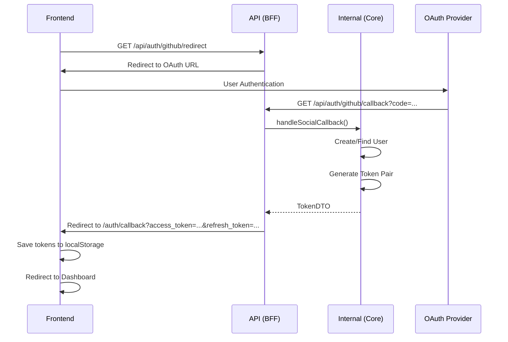
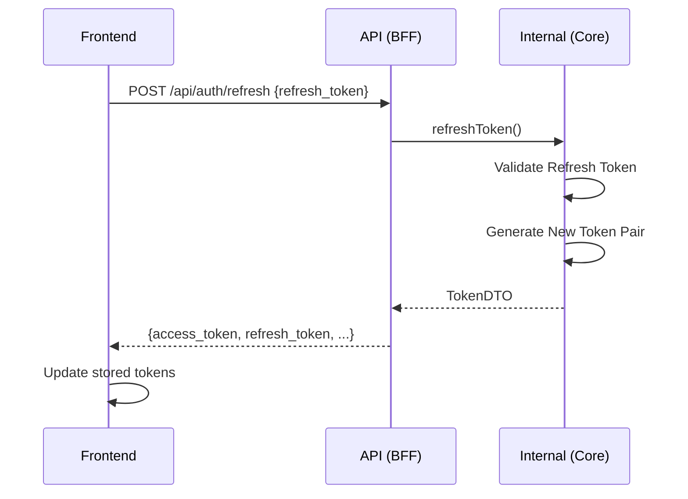

# BFF (Backend For Frontend)

## 개요

BFF(Backend For Frontend)는 프론트엔드와 Core Service 사이의 중간 계층으로, 클라이언트 친화적인 API를 제공합니다.

### 주요 기능

- **JWT 토큰 관리**: Access Token 검증 및 Refresh Token을 통한 갱신
- **인증 흐름 처리**: 소셜 로그인 OAuth 흐름 관리
- **Core Service 호출**: 내부 Domain Service API 호출 및 응답 변환
- **클라이언트 최적화**: 프론트엔드에 최적화된 응답 포맷 제공

### 아키텍처

```
Frontend (Next.js)
    │
    ▼ HTTP (JSON)
API Layer (/api/*)      ← BFF 역할
    │ - JWT 검증
    │ - 토큰 관리
    │ - 응답 변환
    ▼ Internal Call
Internal (/internal/*)   ← Core Service
    │ - Domain 로직
    │ - 데이터베이스
    ▼
Database (PostgreSQL, Redis, MongoDB)
```

## 파일 구조

```
app/Bff/
├── Controllers/
│   └── AuthController.php     # 인증 BFF 컨트롤러
├── Middleware/
│   └── JwtAuthenticate.php    # JWT 인증 미들웨어
└── Services/
    └── CoreAuthService.php    # Core Auth Service 클라이언트

routes/
├── api.php                    # 외부 공개 API (BFF)
└── internal.php               # 내부 전용 API (Core Service)
```

## API 엔드포인트

### 소셜 로그인

| Method | Endpoint | Description | Auth |
|--------|----------|-------------|------|
| GET | `/api/auth/{provider}/redirect` | OAuth 리다이렉트 | 불필요 |
| GET | `/api/auth/{provider}/callback` | OAuth 콜백 처리 | 불필요 |

**지원 Provider**: `github`, `naver`, `kakao`

### 토큰 관리

| Method | Endpoint | Description | Auth |
|--------|----------|-------------|------|
| POST | `/api/auth/refresh` | 토큰 갱신 | 불필요 |
| POST | `/api/auth/validate` | 토큰 검증 | Bearer Token |

### 사용자 관리

| Method | Endpoint | Description | Auth |
|--------|----------|-------------|------|
| GET | `/api/auth/me` | 현재 사용자 정보 | Bearer Token |
| POST | `/api/auth/logout` | 로그아웃 | Bearer Token |
| POST | `/api/auth/logout-all` | 전체 세션 로그아웃 | Bearer Token |

### 소셜 계정 관리

| Method | Endpoint | Description | Auth |
|--------|----------|-------------|------|
| GET | `/api/auth/social-accounts` | 연동된 소셜 계정 목록 | Bearer Token |
| POST | `/api/auth/{provider}/link` | 소셜 계정 연동 | Bearer Token |
| DELETE | `/api/auth/{provider}/unlink` | 소셜 계정 연동 해제 | Bearer Token |

## 인증 흐름

### 소셜 로그인 흐름



### 토큰 갱신 흐름



## API 상세 명세

### POST /api/auth/refresh

토큰 갱신 요청

**Request Body:**
```json
{
    "refresh_token": "uuid-refresh-token"
}
```

**Response (200):**
```json
{
    "success": true,
    "data": {
        "access_token": "eyJhbGciOiJIUzI1NiIsInR5cCI6IkpXVCJ9...",
        "refresh_token": "new-uuid-refresh-token",
        "token_type": "bearer",
        "expires_in": 3600,
        "user": {
            "id": 1,
            "name": "홍길동",
            "email": "hong@example.com",
            "avatar": "https://..."
        }
    }
}
```

**Error Response (401):**
```json
{
    "success": false,
    "error": {
        "code": "UNAUTHORIZED",
        "message": "Refresh Token이 만료되었습니다."
    }
}
```

### GET /api/auth/me

현재 인증된 사용자 정보 조회

**Headers:**
```http
Authorization: Bearer {access_token}
```

**Response (200):**
```json
{
    "success": true,
    "data": {
        "id": 1,
        "name": "홍길동",
        "email": "hong@example.com",
        "avatar": "https://...",
        "email_verified_at": "2024-01-01T00:00:00.000Z",
        "created_at": "2024-01-01T00:00:00.000Z",
        "updated_at": "2024-01-01T00:00:00.000Z"
    }
}
```

### POST /api/auth/logout

현재 세션 로그아웃

**Headers:**
```http
Authorization: Bearer {access_token}
```

**Request Body:**
```json
{
    "refresh_token": "uuid-refresh-token"
}
```

**Response (200):**
```json
{
    "success": true,
    "data": null,
    "message": "로그아웃되었습니다."
}
```

## 미들웨어

### JwtAuthenticate

JWT 토큰을 검증하고 인증된 사용자 정보를 Request에 추가합니다.

**사용법:**
```php
// 필수 인증
Route::middleware('bff.auth')->group(function () {
    Route::get('me', [AuthController::class, 'me']);
});

// 선택적 인증
Route::middleware('bff.auth:optional')->group(function () {
    Route::get('posts', [PostController::class, 'index']);
});
```

**동작:**
1. `Authorization: Bearer {token}` 헤더에서 토큰 추출
2. JwtService를 통해 토큰 검증
3. 검증 성공 시 `$request->user()`로 사용자 접근 가능
4. 검증 실패 시 401 응답 반환 (optional이 아닌 경우)

## 환경 설정

### Backend (.env)

```env
# Frontend URL (BFF 콜백에서 사용)
FRONTEND_URL=http://localhost:3000

# Social Login Redirect URI
GITHUB_REDIRECT_URI=${APP_URL}/api/auth/github/callback
NAVER_REDIRECT_URI=${APP_URL}/api/auth/naver/callback
KAKAO_REDIRECT_URI=${APP_URL}/api/auth/kakao/callback
```

### Frontend (.env)

```env
# Backend API URL
NEXT_PUBLIC_API_URL=http://localhost:8000/api
```

## 프론트엔드 연동

### API 클라이언트 사용

```typescript
import { authApi, saveTokens, clearTokens, getAccessToken } from '@/lib/api/client';

// 소셜 로그인 URL
const githubLoginUrl = authApi.getSocialLoginUrl('github');

// 현재 사용자 정보 조회
const response = await authApi.me();
if (response.success) {
    console.log(response.data); // User 정보
}

// 로그아웃
await authApi.logout();
clearTokens();
```

### OAuth 콜백 처리

`/auth/callback` 페이지에서 URL 파라미터로 전달된 토큰을 저장합니다:

```typescript
// URL: /auth/callback?access_token=...&refresh_token=...
const accessToken = searchParams.get('access_token');
const refreshToken = searchParams.get('refresh_token');

if (accessToken && refreshToken) {
    saveTokens(accessToken, refreshToken);
    router.push('/'); // 메인 페이지로 이동
}
```

## Rate Limiting

| Endpoint | Limit |
|----------|-------|
| `/api/auth/{provider}/callback` | 10회/분 |
| `/api/auth/refresh` | 30회/분 |
| `/api/auth/me` | 60회/분 |
| `/api/auth/logout` | 10회/분 |
| `/api/auth/logout-all` | 10회/분 |
| `/api/auth/social-accounts` | 60회/분 |
| `/api/auth/{provider}/link` | 5회/분 |
| `/api/auth/{provider}/unlink` | 5회/분 |

## API vs Internal 비교

| 구분 | Internal (/internal/*) | API (/api/*) |
|------|------------------------|--------------|
| 대상 | 내부 서비스 | 프론트엔드 |
| 역할 | Core Service | BFF |
| 인증 | X-User-Id 헤더 | Bearer Token (JWT) |
| 토큰 검증 | 하지 않음 | JWT 검증 |
| 응답 포맷 | 내부 DTO | 클라이언트 친화적 JSON |
| OAuth 흐름 | URL 반환 | 리다이렉트 처리 |

## 테스트

### 테스트 파일 위치

```
tests/
├── Feature/Bff/
│   └── AuthControllerTest.php    # API Auth 통합 테스트
└── Unit/Bff/
    ├── JwtAuthenticateTest.php   # JWT 미들웨어 테스트
    └── CoreAuthServiceTest.php   # Core Service 클라이언트 테스트
```

## 관련 문서

- [AUTH.md](AUTH.md) - Core Auth 도메인 문서
- [FRONTEND.md](FRONTEND.md) - 프론트엔드 문서
