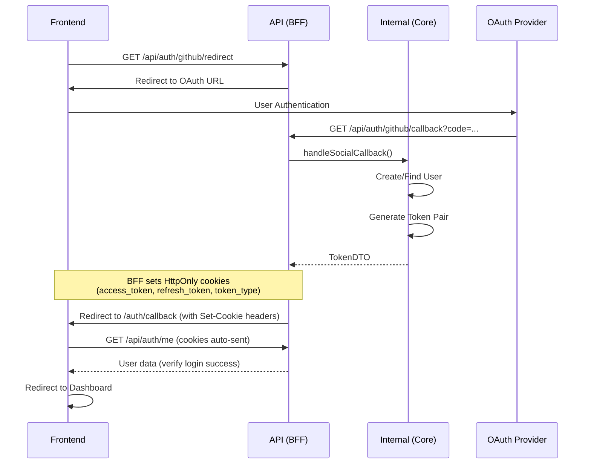
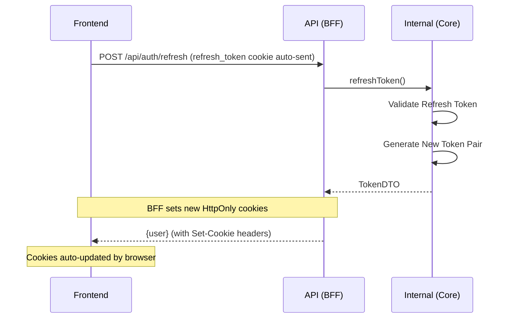

# BFF (Backend For Frontend)

## 개요

BFF(Backend For Frontend)는 프론트엔드와 Core Service 사이의 중간 계층으로, 클라이언트 친화적인 API를 제공합니다.

> **📚 전체 아키텍처:** [ARCHITECTURE.md](./ARCHITECTURE.md)
>
> **⚙️ Core Service:** [CORE.md](./CORE.md)
>
> **🖥️ Frontend:** [FRONTEND.md](./FRONTEND.md)

### 주요 기능

- **JWT 토큰 관리**: Access Token 검증 및 Refresh Token을 통한 갱신
- **인증 흐름 처리**: 소셜 로그인 OAuth 흐름 관리
- **Core Service 호출**: 내부 Domain Service API 호출 및 응답 변환
- **클라이언트 최적화**: 프론트엔드에 최적화된 응답 포맷 제공

### 레이어 구조

BFF는 3-Tier 아키텍처의 중간 레이어입니다:

```
┌─────────────────────────────────────────┐
│         Frontend Layer (Next.js)        │  ← 사용자 UI
│              /frontend                  │
└────────────────┬────────────────────────┘
                 │ HTTP/JSON (/api/*)
                 ▼
┌─────────────────────────────────────────┐
│        BFF Layer (Laravel)              │  ← 이 문서
│    JWT Auth, API Gateway, Transform     │
│         app/Bff/, routes/api.php        │
└────────────────┬────────────────────────┘
                 │ Internal Call (/internal/*)
                 ▼
┌─────────────────────────────────────────┐
│      Core Service Layer (Laravel)       │  ← 비즈니스 로직
│    Domain Logic, Business Rules, DB     │
│   app/Domain/, app/Services/, routes/   │
└────────────────┬────────────────────────┘
                 │
                 ▼
┌─────────────────────────────────────────┐
│    Infrastructure (PostgreSQL, Redis)   │
└─────────────────────────────────────────┘
```

**역할 분담:**
- **Frontend:** UI 렌더링, 사용자 입력 처리
- **BFF:** JWT 인증, Core Service 호출, 응답 변환
- **Core Service:** 도메인 로직, 데이터 관리

> 전체 아키텍처 상세: [ARCHITECTURE.md](./ARCHITECTURE.md)

## 파일 구조

```
app/Bff/
├── Controllers/
│   └── AuthController.php     # 인증 BFF 컨트롤러
├── Middleware/
│   └── JwtAuthenticate.php    # JWT 인증 미들웨어
└── Services/
    └── CoreAuthService.php    # Core Auth Service 클라이언트

routes/
├── api.php                    # 외부 공개 API (BFF)
└── internal.php               # 내부 전용 API (Core Service)
```

## API 엔드포인트

### 소셜 로그인

| Method | Endpoint | Description | Auth |
|--------|----------|-------------|------|
| GET | `/api/auth/{provider}/redirect` | OAuth 리다이렉트 | 불필요 |
| GET | `/api/auth/{provider}/callback` | OAuth 콜백 처리 | 불필요 |

**지원 Provider**: `github`, `naver`, `kakao`

### 토큰 관리

| Method | Endpoint | Description | Auth |
|--------|----------|-------------|------|
| POST | `/api/auth/refresh` | 토큰 갱신 | 불필요 |
| POST | `/api/auth/validate` | 토큰 검증 | Bearer Token |

### 사용자 관리

| Method | Endpoint | Description | Auth |
|--------|----------|-------------|------|
| GET | `/api/auth/me` | 현재 사용자 정보 | Bearer Token |
| POST | `/api/auth/logout` | 로그아웃 | Bearer Token |
| POST | `/api/auth/logout-all` | 전체 세션 로그아웃 | Bearer Token |

### 소셜 계정 관리

| Method | Endpoint | Description | Auth |
|--------|----------|-------------|------|
| GET | `/api/auth/social-accounts` | 연동된 소셜 계정 목록 | Bearer Token |
| POST | `/api/auth/{provider}/link` | 소셜 계정 연동 | Bearer Token |
| DELETE | `/api/auth/{provider}/unlink` | 소셜 계정 연동 해제 | Bearer Token |

## 인증 흐름

### 소셜 로그인 흐름

토큰은 HttpOnly 쿠키로 관리되어 프론트엔드에서 직접 접근할 수 없습니다.
보안을 위해 `access_token`과 `refresh_token`은 HttpOnly로 설정되며, 인증 상태 확인을 위한 `token_type` 쿠키만 JavaScript에서 읽을 수 있습니다.



**주의사항:**
- 토큰은 URL 파라미터로 전달되지 않습니다 (보안)
- localStorage에 토큰을 저장하지 마세요 (XSS 취약점)
- 프론트엔드는 `/api/auth/me` 호출로 로그인 성공 여부를 확인해야 합니다

### 토큰 갱신 흐름

토큰 갱신도 쿠키 기반으로 동작합니다. 새 토큰은 응답 본문이 아닌 Set-Cookie 헤더로 전달됩니다.



**프론트엔드 처리:**
- `credentials: 'include'`로 쿠키 자동 전송
- 응답 status가 200이면 갱신 성공 (브라우저가 쿠키 자동 업데이트)
- 응답 본문에는 user 정보만 포함 (토큰은 Set-Cookie로 전달)

## API 상세 명세

### POST /api/auth/refresh

토큰 갱신 요청. `refresh_token`은 HttpOnly 쿠키로 자동 전송됩니다.

**Request:**
- 별도 Body 불필요 (refresh_token 쿠키가 자동 전송됨)
- `credentials: 'include'` 옵션 필수

**Response Headers:**
```http
Set-Cookie: access_token=new-jwt-token; HttpOnly; Secure; SameSite=Lax
Set-Cookie: refresh_token=new-uuid; HttpOnly; Secure; SameSite=Lax
Set-Cookie: token_type=bearer; Secure; SameSite=Lax
```

**Response (200):**
```json
{
    "success": true,
    "data": {
        "user": {
            "id": 1,
            "name": "홍길동",
            "email": "hong@example.com",
            "avatar": "https://..."
        }
    }
}
```

> **Note**: 토큰은 응답 본문이 아닌 Set-Cookie 헤더로 전달됩니다. 브라우저가 쿠키를 자동으로 업데이트합니다.

**Error Response (401):**
```json
{
    "success": false,
    "error": {
        "code": "UNAUTHORIZED",
        "message": "Refresh Token이 만료되었습니다."
    }
}
```

### GET /api/auth/me

현재 인증된 사용자 정보 조회

**Headers:**
```http
Authorization: Bearer {access_token}
```

**Response (200):**
```json
{
    "success": true,
    "data": {
        "id": 1,
        "name": "홍길동",
        "email": "hong@example.com",
        "avatar": "https://...",
        "email_verified_at": "2024-01-01T00:00:00.000Z",
        "created_at": "2024-01-01T00:00:00.000Z",
        "updated_at": "2024-01-01T00:00:00.000Z"
    }
}
```

### POST /api/auth/logout

현재 세션 로그아웃. 쿠키가 자동 전송되어 별도 Request Body가 불필요합니다.

**Request:**
- 인증 쿠키 자동 전송 (credentials: 'include')
- 별도 Body 불필요

**Response Headers:**
```http
Set-Cookie: access_token=; expires=Thu, 01 Jan 1970; Path=/
Set-Cookie: refresh_token=; expires=Thu, 01 Jan 1970; Path=/
Set-Cookie: token_type=; expires=Thu, 01 Jan 1970; Path=/
```

**Response (200):**
```json
{
    "success": true,
    "data": null,
    "message": "로그아웃되었습니다."
}
```

> **Note**: 서버가 쿠키 만료 헤더를 전송하여 브라우저에서 쿠키가 삭제됩니다.

### POST /api/auth/logout-all

모든 디바이스에서 로그아웃합니다.

**Request:**
- 인증 쿠키 자동 전송 (credentials: 'include')
- 별도 Body 불필요

**Response (200):**
```json
{
    "success": true,
    "data": null,
    "message": "모든 세션에서 로그아웃되었습니다."
}
```

**Response Headers:**
```http
Set-Cookie: access_token=; expires=Thu, 01 Jan 1970; Path=/
Set-Cookie: refresh_token=; expires=Thu, 01 Jan 1970; Path=/
Set-Cookie: token_type=; expires=Thu, 01 Jan 1970; Path=/
```

> **Note**: 모든 디바이스의 토큰이 Redis에서 무효화됩니다.

### POST /api/auth/validate

토큰 유효성 검증 (미들웨어 없이 직접 검증)

**Headers:**
```http
Authorization: Bearer {access_token}
```

또는 `access_token` 쿠키 사용

**Response (200) - 유효한 토큰:**
```json
{
    "success": true,
    "data": {
        "valid": true,
        "user": {
            "id": 1,
            "name": "홍길동",
            "email": "hong@example.com",
            "avatar": "https://..."
        }
    }
}
```

**Response (200) - 유효하지 않은 토큰:**
```json
{
    "success": true,
    "data": {
        "valid": false,
        "error": "Token expired"
    }
}
```

### GET /api/auth/social-accounts

연동된 소셜 계정 목록 조회

**Headers:**
```http
Authorization: Bearer {access_token}
```

**Response (200):**
```json
{
    "success": true,
    "data": [
        {
            "provider": "github",
            "provider_user_id": "12345",
            "email": "hong@example.com",
            "name": "홍길동",
            "linked_at": "2024-01-01T00:00:00.000Z"
        },
        {
            "provider": "naver",
            "provider_user_id": "67890",
            "email": "hong@naver.com",
            "name": "홍길동",
            "linked_at": "2024-01-02T00:00:00.000Z"
        }
    ]
}
```

### POST /api/auth/{provider}/link

새로운 소셜 계정 연동 시작

**Provider:** `github` | `naver` | `kakao`

**Headers:**
```http
Authorization: Bearer {access_token}
```

**Response:** OAuth Provider로 리다이렉트 (302)

**흐름:**
1. 세션에 `social_link_mode` 플래그 설정
2. OAuth Provider로 리다이렉트
3. OAuth 인증 완료 후 콜백에서 계정 연동 처리
4. 성공 시 프론트엔드 `/auth/callback`으로 리다이렉트

**Error Response (409) - 이미 연동된 계정:**
```json
{
    "success": false,
    "error": {
        "code": "CONFLICT",
        "message": "이미 다른 계정에 연동된 소셜 계정입니다."
    }
}
```

### DELETE /api/auth/{provider}/unlink

소셜 계정 연동 해제

**Provider:** `github` | `naver` | `kakao`

**Headers:**
```http
Authorization: Bearer {access_token}
```

**Response (200):**
```json
{
    "success": true,
    "data": null,
    "message": "소셜 계정 연동이 해제되었습니다."
}
```

**Error Response (400) - 마지막 로그인 수단:**
```json
{
    "success": false,
    "error": {
        "code": "BAD_REQUEST",
        "message": "마지막 로그인 수단은 해제할 수 없습니다."
    }
}
```

**Error Response (404) - 연동되지 않은 계정:**
```json
{
    "success": false,
    "error": {
        "code": "NOT_FOUND",
        "message": "연동된 소셜 계정을 찾을 수 없습니다."
    }
}
```

## 미들웨어

### JwtAuthenticate

JWT 토큰을 검증하고 인증된 사용자 정보를 Request에 추가합니다.

**사용법:**
```php
// 필수 인증
Route::middleware('bff.auth')->group(function () {
    Route::get('me', [AuthController::class, 'me']);
});

// 선택적 인증
Route::middleware('bff.auth:optional')->group(function () {
    Route::get('posts', [PostController::class, 'index']);
});
```

**동작:**
1. `Authorization: Bearer {token}` 헤더 또는 `access_token` 쿠키에서 토큰 추출
2. JwtService를 통해 토큰 검증
3. 검증 성공 시 `$request->user()`로 사용자 접근 가능
4. 검증 실패 시 401 응답 반환 (optional이 아닌 경우)

> **Note**: 쿠키와 Authorization 헤더 모두 지원합니다. 헤더가 우선합니다.

## 환경 설정

### Backend (.env)

```env
# Frontend URL (BFF 콜백에서 사용)
FRONTEND_URL=http://localhost:3002

# 쿠키 도메인 설정 (프로덕션 필수)
# 서브도메인 간 쿠키 공유를 위해 앞에 점(.)을 붙임
# 예: api.example.com과 app.example.com이 쿠키를 공유하려면 .example.com 설정
SESSION_DOMAIN=.example.com

# HTTPS 환경에서는 true로 설정 (프로덕션 필수)
SESSION_SECURE_COOKIE=true

# Social Login Redirect URI
GITHUB_REDIRECT_URI=${APP_URL}/api/auth/github/callback
NAVER_REDIRECT_URI=${APP_URL}/api/auth/naver/callback
KAKAO_REDIRECT_URI=${APP_URL}/api/auth/kakao/callback
```

> **중요**: `SESSION_DOMAIN`을 명시적으로 설정하지 않으면 프론트엔드 URL에서 자동 추출을 시도합니다.
> 이 방식은 일부 국가별 TLD(co.kr, com.au 등)에서 올바르게 동작하지 않을 수 있으므로,
> 프로덕션 환경에서는 반드시 명시적으로 설정하세요.

### Frontend (.env)

```env
# Backend API URL
NEXT_PUBLIC_API_URL=http://localhost:8000/api
```

## 프론트엔드 연동

### API 클라이언트 사용

```typescript
import { authApi, clearTokenCookie, isAuthenticated } from '@/lib/api/client';

// 소셜 로그인 URL
const githubLoginUrl = authApi.getSocialLoginUrl('github');

// 현재 사용자 정보 조회 (쿠키 자동 전송)
const response = await authApi.me();
if (response.success) {
    console.log(response.data); // User 정보
}

// 인증 상태 확인 (token_type 쿠키 존재 여부)
if (isAuthenticated()) {
    // 로그인된 상태
}

// 로그아웃 (서버가 쿠키 삭제)
await authApi.logout();
clearTokenCookie(); // token_type 쿠키 정리 (선택적)
```

> **Note**: `credentials: 'include'` 옵션이 자동 적용되어 쿠키가 자동 전송됩니다.

### OAuth 콜백 처리

`/auth/callback` 페이지에서 서버 API 호출로 로그인 성공 여부를 확인합니다:

```typescript
'use client';

import { useEffect, useState } from 'react';
import { useRouter } from 'next/navigation';

export default function AuthCallbackPage() {
  const router = useRouter();
  const [status, setStatus] = useState<'loading' | 'success' | 'error'>('loading');

  useEffect(() => {
    let timeoutId: NodeJS.Timeout;

    const verifyAuth = async () => {
      try {
        // 서버 API로 인증 확인 (쿠키 자동 전송)
        const response = await fetch('/api/auth/me', {
          credentials: 'include',
        });

        if (response.ok) {
          setStatus('success');
          timeoutId = setTimeout(() => router.push('/'), 1500);
        } else {
          setStatus('error');
          timeoutId = setTimeout(() => router.push('/login'), 3000);
        }
      } catch {
        setStatus('error');
        timeoutId = setTimeout(() => router.push('/login'), 3000);
      }
    };

    verifyAuth();

    return () => clearTimeout(timeoutId);
  }, [router]);

  // UI 렌더링...
}
```

> **주의사항:**
> - URL 파라미터에서 토큰을 읽지 마세요 (쿠키로 전달됨)
> - localStorage에 토큰을 저장하지 마세요 (HttpOnly 쿠키 사용)
> - `/api/auth/me` 응답으로 로그인 성공 여부를 확인하세요

## Rate Limiting

| Endpoint | Limit |
|----------|-------|
| `/api/auth/{provider}/callback` | 10회/분 |
| `/api/auth/refresh` | 30회/분 |
| `/api/auth/me` | 60회/분 |
| `/api/auth/logout` | 10회/분 |
| `/api/auth/logout-all` | 10회/분 |
| `/api/auth/social-accounts` | 60회/분 |
| `/api/auth/{provider}/link` | 5회/분 |
| `/api/auth/{provider}/unlink` | 5회/분 |

## API vs Internal 비교

| 구분 | Internal (/internal/*) | API (/api/*) |
|------|------------------------|--------------|
| 대상 | 내부 서비스 | 프론트엔드 |
| 역할 | Core Service | BFF |
| 인증 | X-User-Id 헤더 | Bearer Token (JWT) |
| 토큰 검증 | 하지 않음 | JWT 검증 |
| 응답 포맷 | 내부 DTO | 클라이언트 친화적 JSON |
| OAuth 흐름 | URL 반환 | 리다이렉트 처리 |

## Swagger UI (API 문서)

BFF API는 OpenAPI 3.0 스펙으로 문서화되어 있으며, Swagger UI를 통해 인터랙티브하게 테스트할 수 있습니다.

### 접근 방법

| 환경 | URL | 설명 |
|------|-----|------|
| 로컬 개발 | `http://localhost:8000/swagger` | 로컬 서버 |
| 개발 서버 | `https://dev-core.shaul.link/swagger` | 개발 환경 |

### 환경 변수 설정

```env
# .env 파일
SWAGGER_UI_ENABLED=true   # Swagger UI 활성화 (기본값: false)
```

> **Note**: 프로덕션 환경에서는 보안을 위해 `SWAGGER_UI_ENABLED=false`로 설정하세요.

### OpenAPI 스펙 파일

```
resources/swagger/openapi.json
```

**포함된 API 그룹:**
- **Auth** - JWT 인증 및 소셜 로그인 (BFF)
- **Timer** - 타이머 관리 (Domain)
- **File** - 파일 저장 및 관리 (Domain)
- **Notification** - 다채널 알림 발송 (Domain)
- **User Activity** - 사용자 활동 로그 (Domain)

### Swagger UI 설정 파일

```
config/swagger-ui.php
```

**주요 설정:**
- `enabled`: Swagger UI 활성화 여부
- `files[].path`: Swagger UI 접근 경로 (`/swagger`)
- `files[].versions`: OpenAPI 스펙 버전 관리
- `modify_file`: 서버 URL 자동 수정 여부 (기본: false)

### API 테스트 방법

1. Swagger UI 페이지 접속 (`/swagger`)
2. 테스트할 API 엔드포인트 선택
3. "Try it out" 버튼 클릭
4. 필요한 파라미터 입력
5. "Execute" 버튼으로 API 호출

**인증이 필요한 API 테스트:**
1. 먼저 `/api/auth/{provider}/redirect`로 소셜 로그인
2. 로그인 후 브라우저 쿠키에 토큰이 저장됨
3. 이후 인증 필요 API 호출 시 쿠키가 자동 전송됨

---

## 테스트 커버리지

| 영역 | 테스트 수 | 파일 |
|------|----------|------|
| Feature (API) | 11개 | `tests/Feature/Bff/AuthControllerTest.php` |
| **총합** | **11개** | |

### 테스트 파일 위치

```
tests/
└── Feature/Bff/
    └── AuthControllerTest.php    # API Auth 통합 테스트 (11개)
```

## 관련 문서

- [AUTH.md](AUTH.md) - Core Auth 도메인 문서
- [FRONTEND.md](FRONTEND.md) - 프론트엔드 문서
