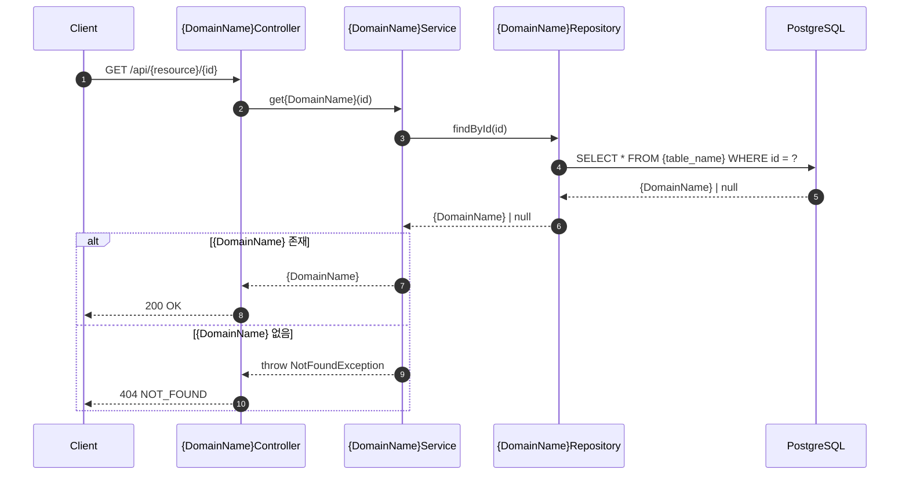
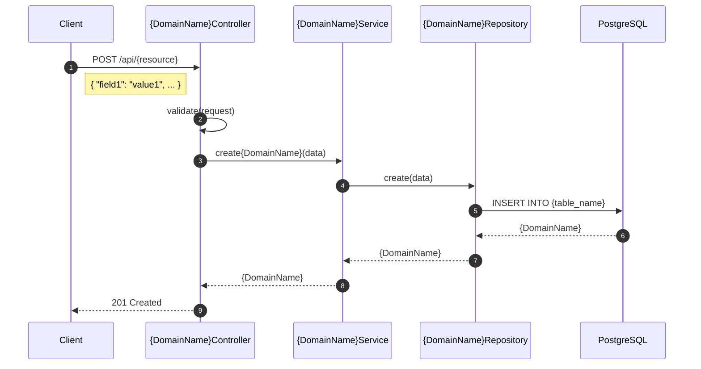

# {Domain Name} 도메인

{Domain Name} 도메인은 {간단한 설명}을 담당하는 원자적 도메인 서비스입니다.

## 개요

| 항목 | 설명 |
|------|------|
| **목적** | {도메인의 주요 목적} |
| **주요 기능** | {CRUD, 특수 기능 등} |
| **특징** | {Soft Delete, 캐싱, 특수 패턴 등} |

## 아키텍처

### 레이어 구조

```
Controller ({DomainName}Controller)
    ↓
Service ({DomainName}Service)
    ↓
Repository Interface ({DomainName}RepositoryInterface)
    ↓
├── Cached{DomainName}Repository (캐시 데코레이터, 선택사항)
│       ↓
└── Eloquent{DomainName}Repository (DB 구현체)
        ↓
    Database (PostgreSQL)
```

### 파일 구조

```
app/
├── Models/{DomainName}.php                          # Eloquent 모델
├── Http/Controllers/{DomainName}Controller.php      # API 컨트롤러
├── Services/{DomainName}Service.php                 # 비즈니스 로직
└── Repositories/
    ├── {DomainName}RepositoryInterface.php          # Repository 인터페이스
    ├── Eloquent{DomainName}Repository.php           # Eloquent 구현체
    └── Cached{DomainName}Repository.php             # 캐시 데코레이터 (선택사항)

database/migrations/
└── {timestamp}_create_{table_name}_table.php        # 테이블 생성

tests/
├── Feature/{DomainName}/{DomainName}ControllerTest.php  # Feature 테스트
└── Unit/
    ├── Models/{DomainName}Test.php                      # Model 테스트
    └── Services/{DomainName}ServiceTest.php             # Service 테스트
```

## 데이터베이스 스키마

### {table_name} 테이블

| 컬럼 | 타입 | 설명 |
|------|------|------|
| `id` | BIGINT/UUID | Primary Key |
| `...` | ... | ... |
| `created_at` | TIMESTAMP | 생성 시간 |
| `updated_at` | TIMESTAMP | 수정 시간 |
| `deleted_at` | TIMESTAMP | 삭제 시간 (Soft Delete) |

### 인덱스

```sql
-- 필요한 인덱스 정의
CREATE INDEX {table_name}_{column}_index ON {table_name} ({column});
```

## API 엔드포인트

### 목록 조회

```
GET /api/{resource}
```

**쿼리 파라미터**
| 파라미터 | 타입 | 필수 | 설명 |
|----------|------|------|------|
| `per_page` | Integer | X | 페이지당 항목 수 (기본: 15) |
| `cursor` | String | X | 커서 페이지네이션 |

**응답 (200 OK)**
```json
{
    "success": true,
    "data": [...],
    "pagination": {
        "type": "cursor",
        "per_page": 15,
        "next_cursor": "...",
        "has_more_pages": true
    }
}
```

### 단일 조회

```
GET /api/{resource}/{id}
```

**응답 (200 OK)**
```json
{
    "success": true,
    "data": {
        "id": "...",
        ...
    }
}
```

**에러 (404 Not Found)**
```json
{
    "success": false,
    "error": {
        "code": "NOT_FOUND",
        "message": "{DomainName}를 찾을 수 없습니다: {id}"
    }
}
```

### 생성

```
POST /api/{resource}
```

**요청**
```json
{
    "field1": "value1",
    "field2": "value2"
}
```

**응답 (201 Created)**
```json
{
    "success": true,
    "data": {
        "id": "...",
        ...
    }
}
```

### 수정

```
PUT /api/{resource}/{id}
```

**요청**
```json
{
    "field1": "new_value"
}
```

**응답 (200 OK)**
```json
{
    "success": true,
    "data": {
        "id": "...",
        ...
    }
}
```

### 삭제 (Soft Delete)

```
DELETE /api/{resource}/{id}
```

**응답 (200 OK)**
```json
{
    "success": true,
    "data": {
        "id": "...",
        "deleted_at": "2025-12-10T12:00:00+09:00"
    }
}
```

## Sequence Diagram

### 조회 (GET)



### 생성 (POST)



## 캐싱 전략 (선택사항)

### Redis 캐시

| 항목 | 값 |
|------|------|
| 캐시 키 | `{domain}:{id}` |
| TTL | 300초 (5분) |
| 전략 | Read-through Cache |

### 캐시 무효화

모든 쓰기 작업(create, update, delete)에서 캐시 무효화:

```php
Cache::forget("{domain}:{$id}");
```

## Model 속성

### Accessor (계산된 속성)

| 속성 | 설명 | 예시 |
|------|------|------|
| `example_attribute` | 설명 | `값 예시` |

### 메서드

| 메서드 | 설명 |
|--------|------|
| `exampleMethod()` | 메서드 설명 |

## 테스트 커버리지

| 영역 | 테스트 수 | 파일 |
|------|----------|------|
| Feature (API) | N개 | `tests/Feature/{DomainName}/{DomainName}ControllerTest.php` |
| Service Unit | N개 | `tests/Unit/Services/{DomainName}ServiceTest.php` |
| Model Unit | N개 | `tests/Unit/Models/{DomainName}Test.php` |
| **총합** | **N개** | |

## 예외 처리

| 예외 | HTTP | 상황 |
|------|------|------|
| `NotFoundException` | 404 | 리소스를 찾을 수 없음 |
| `BadRequestException` | 400 | 잘못된 요청 |
| `ValidationException` | 400 | 유효성 검증 실패 |
| `ConflictException` | 409 | 리소스 충돌 |

## 참고 문서

- [프로젝트 가이드](../CLAUDE.md)
- [HTTP Response 공통화](../CLAUDE.md#http-response-공통화)
- [Exception Handling 공통화](../CLAUDE.md#exception-handling-공통화)
