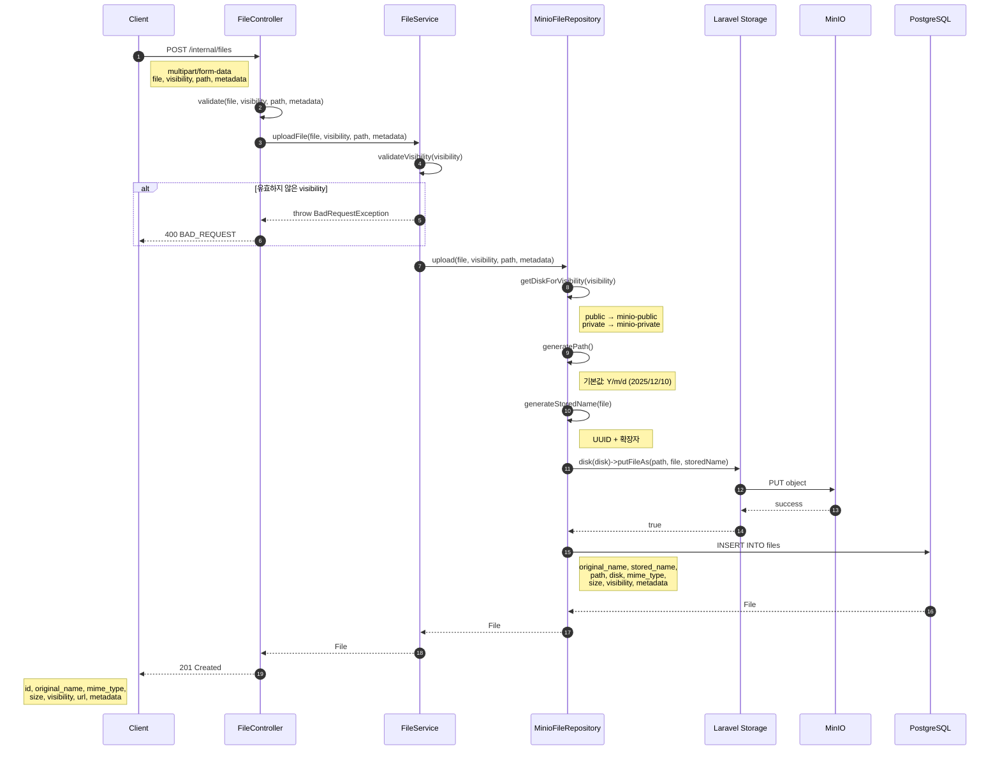
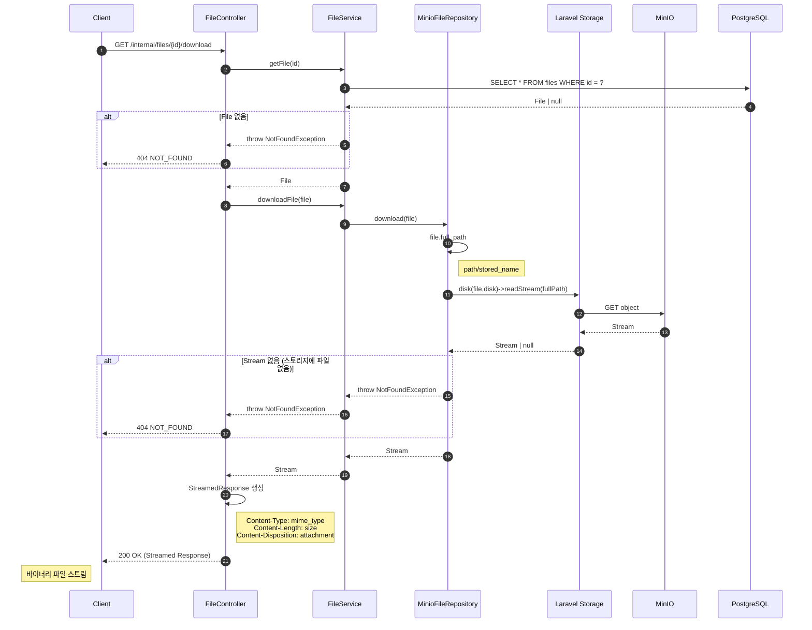
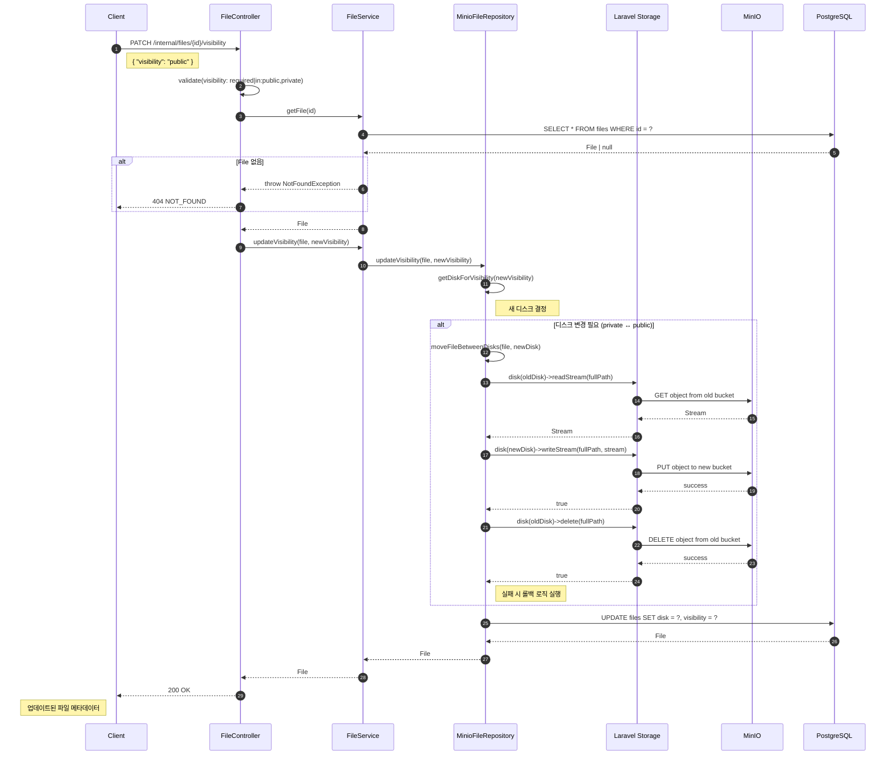
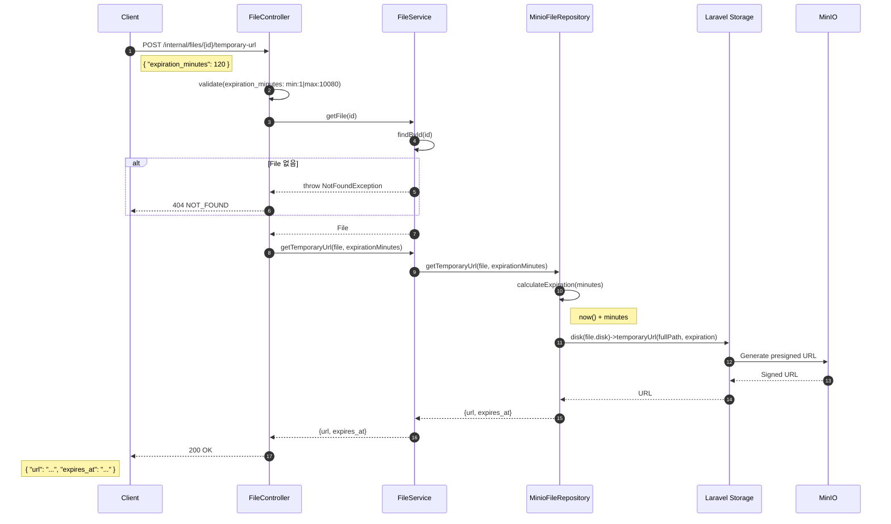
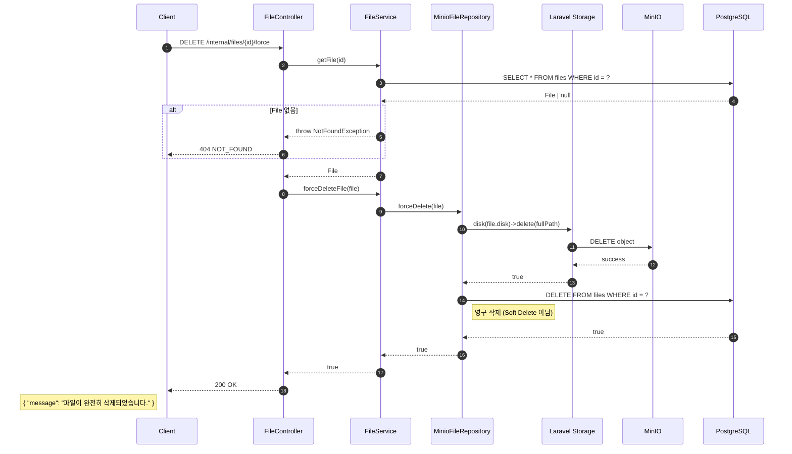

# File 도메인

File 도메인은 MinIO 기반의 파일 저장 및 관리를 담당하는 원자적 도메인 서비스입니다.

## 개요

| 항목 | 설명 |
|------|------|
| **목적** | 파일 업로드, 다운로드, 메타데이터 관리 |
| **스토리지** | MinIO (S3 호환 Object Storage) |
| **주요 기능** | 업로드/다운로드/삭제, 가시성 관리, 임시 URL 생성 |
| **특징** | UUID 기반, Soft Delete, Public/Private 이중 버킷 |

## 아키텍처

### 레이어 구조

```
Controller (FileController)
    ↓
Service (FileService)
    ↓
Repository Interface (FileRepositoryInterface)
    ↓
Repository Implementation (MinioFileRepository)
    ↓
├── Storage Facade (Laravel Filesystem)
│       ↓
│   MinIO (S3 Driver)
│
└── Database (PostgreSQL)
```

### 파일 구조

```
app/
├── Models/File.php                           # Eloquent 모델
├── Http/Controllers/FileController.php       # API 컨트롤러
├── Services/FileService.php                  # 비즈니스 로직
└── Repositories/
    ├── FileRepositoryInterface.php           # Repository 인터페이스
    └── MinioFileRepository.php               # MinIO 구현체

config/
└── filesystems.php                           # MinIO 디스크 설정

database/migrations/
└── 2025_12_10_000001_create_files_table.php  # 테이블 생성

tests/
├── Feature/File/FileControllerTest.php       # Feature 테스트 (32개)
└── Unit/
    ├── Models/FileTest.php                   # Model 테스트 (10개)
    └── Services/FileServiceTest.php          # Service 테스트 (17개)
```

## 데이터베이스 스키마

### files 테이블

| 컬럼 | 타입 | 설명 |
|------|------|------|
| `id` | UUID | Primary Key |
| `original_name` | VARCHAR | 원본 파일명 |
| `stored_name` | VARCHAR | 저장된 파일명 (UUID.확장자) |
| `path` | VARCHAR | 저장 경로 (Y/m/d 형식) |
| `disk` | VARCHAR | 스토리지 디스크 (minio-public/minio-private) |
| `mime_type` | VARCHAR | MIME 타입 |
| `size` | BIGINT | 파일 크기 (bytes) |
| `visibility` | ENUM | 가시성 (public/private) |
| `metadata` | JSON | 추가 메타데이터 (nullable) |
| `created_at` | TIMESTAMP | 생성 시간 |
| `updated_at` | TIMESTAMP | 수정 시간 |
| `deleted_at` | TIMESTAMP | 삭제 시간 (Soft Delete) |

### 인덱스

```sql
CREATE INDEX files_disk_index ON files (disk);
CREATE INDEX files_visibility_index ON files (visibility);
CREATE INDEX files_mime_type_index ON files (mime_type);
CREATE INDEX files_path_index ON files (path);
CREATE INDEX files_created_at_index ON files (created_at);
```

## MinIO 구성

### 이중 버킷 전략

| 버킷 | 디스크명 | 가시성 | 용도 |
|------|---------|--------|------|
| `public` | `minio-public` | Public | 공개 파일 (직접 URL 접근) |
| `private` | `minio-private` | Private | 비공개 파일 (임시 URL 필요) |

### 환경 변수

```env
MINIO_ACCESS_KEY_ID=your-access-key
MINIO_SECRET_ACCESS_KEY=your-secret-key
MINIO_REGION=us-east-1
MINIO_ENDPOINT=http://localhost:9000
MINIO_URL=http://localhost:9000
MINIO_PUBLIC_BUCKET=public
MINIO_PRIVATE_BUCKET=private
```

## API 엔드포인트

### 파일 업로드

```
POST /internal/files
Content-Type: multipart/form-data
```

**요청**
| 필드 | 타입 | 필수 | 설명 |
|------|------|------|------|
| `file` | File | O | 업로드 파일 (최대 100MB) |
| `visibility` | String | X | public/private (기본: private) |
| `path` | String | X | 저장 경로 (기본: Y/m/d) |
| `metadata` | JSON | X | 추가 메타데이터 |

**응답 (201 Created)**
```json
{
    "success": true,
    "data": {
        "id": "550e8400-e29b-41d4-a716-446655440000",
        "original_name": "photo.jpg",
        "mime_type": "image/jpeg",
        "size": 102400,
        "human_readable_size": "100 KB",
        "visibility": "private",
        "url": null,
        "metadata": null,
        "created_at": "2025-12-10T12:00:00Z",
        "updated_at": "2025-12-10T12:00:00Z"
    }
}
```

### 파일 메타데이터 조회

```
GET /internal/files/{id}
```

**응답 (200 OK)**
```json
{
    "success": true,
    "data": {
        "id": "550e8400-e29b-41d4-a716-446655440000",
        "original_name": "photo.jpg",
        "mime_type": "image/jpeg",
        "size": 102400,
        "human_readable_size": "100 KB",
        "visibility": "public",
        "url": "http://localhost:9000/public/2025/12/10/abc123.jpg",
        "metadata": {"category": "profile"},
        "created_at": "2025-12-10T12:00:00Z",
        "updated_at": "2025-12-10T12:00:00Z"
    }
}
```

### 파일 다운로드

```
GET /internal/files/{id}/download
```

**응답 (200 OK)**
```
Content-Type: image/jpeg
Content-Length: 102400
Content-Disposition: attachment; filename=photo.jpg

[바이너리 데이터]
```

### 가시성 변경

```
PATCH /internal/files/{id}/visibility
```

**요청**
```json
{
    "visibility": "public"
}
```

**응답 (200 OK)**
```json
{
    "success": true,
    "data": {
        "id": "550e8400-e29b-41d4-a716-446655440000",
        "visibility": "public",
        "url": "http://localhost:9000/public/2025/12/10/abc123.jpg",
        ...
    }
}
```

### 임시 URL 생성 (Private 파일용)

```
POST /internal/files/{id}/temporary-url
```

**요청**
```json
{
    "expiration_minutes": 120
}
```

| 필드 | 타입 | 필수 | 설명 |
|------|------|------|------|
| `expiration_minutes` | Integer | X | 만료 시간 (분), 1~10080, 기본: 60 |

**응답 (200 OK)**
```json
{
    "success": true,
    "data": {
        "url": "https://minio.example.com/private/...?X-Amz-Signature=...",
        "expires_at": "2025-12-10T14:00:00Z"
    }
}
```

### 파일 삭제 (Soft Delete)

```
DELETE /internal/files/{id}
```

**응답 (200 OK)**
```json
{
    "success": true,
    "data": {
        "id": "550e8400-e29b-41d4-a716-446655440000",
        "deleted_at": "2025-12-10T12:00:00Z"
    }
}
```

### 파일 영구 삭제 (Hard Delete)

```
DELETE /internal/files/{id}/force
```

**응답 (200 OK)**
```json
{
    "success": true,
    "data": {
        "id": "550e8400-e29b-41d4-a716-446655440000",
        "message": "파일이 완전히 삭제되었습니다."
    }
}
```

## Sequence Diagram

### 파일 업로드 (POST)



### 파일 다운로드 (GET /download)



### 가시성 변경 (PATCH /visibility)



### 임시 URL 생성 (POST /temporary-url)



### 파일 영구 삭제 (DELETE /force)



## Model 속성

### Accessor (계산된 속성)

| 속성 | 설명 | 예시 |
|------|------|------|
| `full_path` | 전체 경로 | `2025/12/10/abc123.jpg` |
| `url` | 공개 URL (private는 null) | `http://minio/public/...` |
| `human_readable_size` | 사람이 읽기 쉬운 크기 | `100 KB`, `1.5 MB` |

### 메서드

| 메서드 | 설명 |
|--------|------|
| `isPublic()` | visibility가 'public'인지 확인 |
| `isPrivate()` | visibility가 'private'인지 확인 |

## 파일 명명 규칙

### 저장 파일명

```
{UUID}.{extension}

예: 550e8400-e29b-41d4-a716-446655440000.jpg
```

### 저장 경로

```
{Y}/{m}/{d}/{stored_name}

예: 2025/12/10/550e8400-e29b-41d4-a716-446655440000.jpg
```

## 테스트 커버리지

| 영역 | 테스트 수 | 파일 |
|------|----------|------|
| Feature (API) | 32개 | `tests/Feature/File/FileControllerTest.php` |
| Service Unit | 17개 | `tests/Unit/Services/FileServiceTest.php` |
| Model Unit | 10개 | `tests/Unit/Models/FileTest.php` |
| **총합** | **59개** | |

## 예외 처리

| 예외 | HTTP | 상황 |
|------|------|------|
| `NotFoundException` | 404 | 파일을 찾을 수 없음 |
| `BadRequestException` | 400 | 잘못된 visibility 값 |
| `ValidationException` | 400 | 요청 유효성 검증 실패 |
