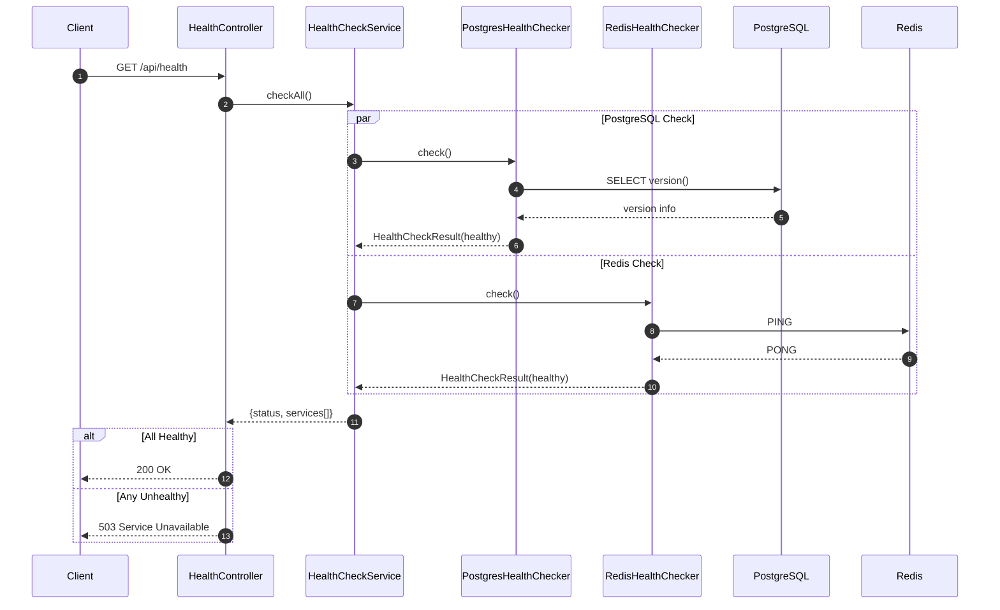
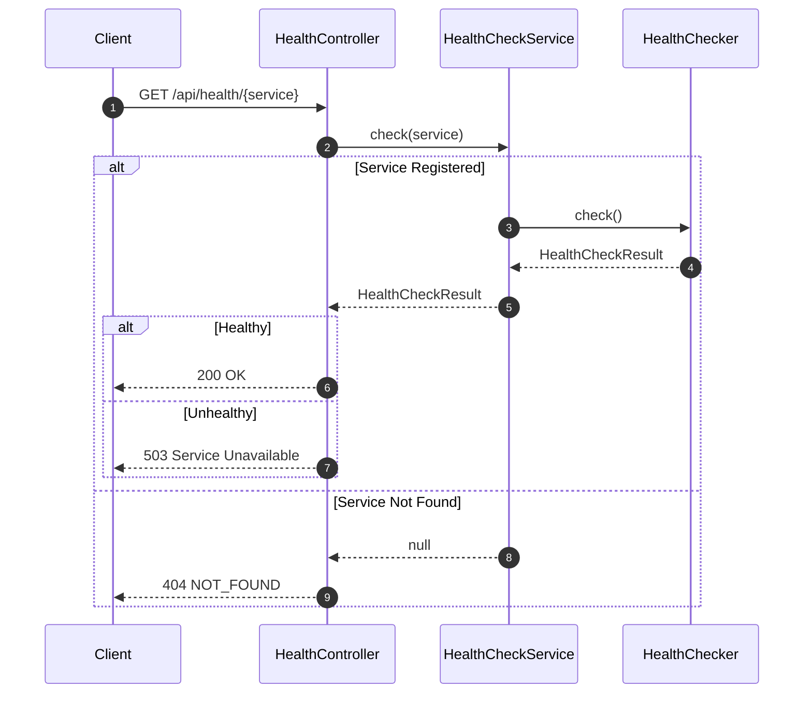

# Health 도메인

Health 도메인은 서비스 연결 상태 확인을 담당하는 원자적 도메인 서비스입니다.

## 개요

| 항목 | 설명 |
|------|------|
| **목적** | PostgreSQL, Redis, MongoDB, MinIO 등 외부 서비스 연결 상태 모니터링 |
| **주요 기능** | 전체/개별 서비스 Health Check, 응답 시간 측정 |
| **특징** | 확장 가능한 Checker 패턴, 설정 기반 활성화 |

## 아키텍처

### 레이어 구조

```
Controller (HealthController)
    ↓
Service (HealthCheckService)
    ↓
Checker Interface (HealthCheckerInterface)
    ↓
├── PostgresHealthChecker
├── RedisHealthChecker
├── MongoDbHealthChecker
├── MinioHealthChecker
└── (확장 가능: KafkaHealthChecker 등)
```

### 파일 구조

```
app/Domain/Health/
├── Contracts/
│   └── HealthCheckerInterface.php          # Checker 인터페이스
├── Checkers/
│   ├── PostgresHealthChecker.php           # PostgreSQL 연결 확인
│   ├── RedisHealthChecker.php              # Redis 연결 확인
│   ├── MongoDbHealthChecker.php            # MongoDB 연결 확인
│   └── MinioHealthChecker.php              # MinIO 연결 확인
├── DTOs/
│   └── HealthCheckResult.php               # Health Check 결과 DTO
├── Services/
│   └── HealthCheckService.php              # Health Check 서비스
└── Controllers/
    └── HealthController.php                # API 컨트롤러

app/Providers/
└── HealthServiceProvider.php               # Service Provider

config/
└── health.php                              # Health Check 설정

tests/
├── Unit/Domain/Health/
│   ├── Checkers/MongoDbHealthCheckerTest.php # MongoDB Checker 테스트
│   ├── DTOs/HealthCheckResultTest.php        # DTO Unit 테스트
│   └── Services/HealthCheckServiceTest.php   # Service Unit 테스트
└── Feature/Domain/Health/
    └── HealthControllerTest.php              # Feature 테스트
```

## 설정

### config/health.php

```php
return [
    'checkers' => [
        'postgres' => [
            'enabled' => env('HEALTH_CHECK_POSTGRES_ENABLED', true),
            'connection' => env('HEALTH_CHECK_POSTGRES_CONNECTION', 'pgsql'),
        ],
        'redis' => [
            'enabled' => env('HEALTH_CHECK_REDIS_ENABLED', true),
            'connection' => env('HEALTH_CHECK_REDIS_CONNECTION', 'default'),
        ],
        'mongodb' => [
            'enabled' => env('HEALTH_CHECK_MONGODB_ENABLED', true),
            'host' => env('MONGODB_HOST'),
            'port' => env('MONGODB_PORT', 27017),
            'database' => env('MONGODB_DATABASE', 'admin'),
            'username' => env('MONGODB_USERNAME'),
            'password' => env('MONGODB_PASSWORD'),
        ],
        'minio' => [
            'enabled' => env('HEALTH_CHECK_MINIO_ENABLED', true),
            'disk' => env('HEALTH_CHECK_MINIO_DISK', 'minio-public'),
        ],
    ],
];
```

### 환경 변수

| 변수 | 기본값 | 설명 |
|------|--------|------|
| `HEALTH_CHECK_POSTGRES_ENABLED` | `true` | PostgreSQL 체크 활성화 |
| `HEALTH_CHECK_POSTGRES_CONNECTION` | `pgsql` | PostgreSQL 연결 이름 |
| `HEALTH_CHECK_REDIS_ENABLED` | `true` | Redis 체크 활성화 |
| `HEALTH_CHECK_REDIS_CONNECTION` | `default` | Redis 연결 이름 |
| `HEALTH_CHECK_MONGODB_ENABLED` | `true` | MongoDB 체크 활성화 |
| `MONGODB_HOST` | - | MongoDB 호스트 |
| `MONGODB_PORT` | `27017` | MongoDB 포트 |
| `MONGODB_DATABASE` | `admin` | MongoDB 데이터베이스 |
| `MONGODB_USERNAME` | - | MongoDB 사용자명 |
| `MONGODB_PASSWORD` | - | MongoDB 비밀번호 |
| `HEALTH_CHECK_MINIO_ENABLED` | `true` | MinIO 체크 활성화 |
| `HEALTH_CHECK_MINIO_DISK` | `minio-public` | MinIO 디스크 이름 |

### MinIO 연결 환경변수

MinIO Health Check는 Laravel Storage를 통해 연결을 확인합니다. 다음 환경변수가 설정되어 있어야 합니다:

| 변수 | 설명 |
|------|------|
| `MINIO_ACCESS_KEY_ID` | MinIO 액세스 키 |
| `MINIO_SECRET_ACCESS_KEY` | MinIO 시크릿 키 |
| `MINIO_REGION` | MinIO 리전 (기본: us-east-1) |
| `MINIO_ENDPOINT` | MinIO 엔드포인트 URL |
| `MINIO_URL` | MinIO 공개 URL |
| `MINIO_USE_PATH_STYLE_ENDPOINT` | Path Style 엔드포인트 사용 여부 (기본: true) |
| `MINIO_PUBLIC_BUCKET` | Public 버킷 이름 (기본: public) |
| `MINIO_PRIVATE_BUCKET` | Private 버킷 이름 (기본: private) |

## API 엔드포인트

### 전체 서비스 Health Check

```
GET /api/health
```

**응답 (200 OK - 모든 서비스 정상)**
```json
{
    "success": true,
    "data": {
        "status": "healthy",
        "total_response_time_ms": 12.34,
        "services": [
            {
                "name": "postgres",
                "status": "healthy",
                "response_time_ms": 5.12,
                "message": "Connection successful",
                "metadata": {
                    "connection": "pgsql",
                    "version": "PostgreSQL 16.0..."
                }
            },
            {
                "name": "redis",
                "status": "healthy",
                "response_time_ms": 7.22,
                "message": "Connection successful",
                "metadata": {
                    "connection": "default"
                }
            }
        ]
    }
}
```

**응답 (503 Service Unavailable - 일부 서비스 장애)**
```json
{
    "success": true,
    "data": {
        "status": "unhealthy",
        "total_response_time_ms": 1005.67,
        "services": [
            {
                "name": "postgres",
                "status": "healthy",
                "response_time_ms": 5.12,
                "message": "Connection successful"
            },
            {
                "name": "redis",
                "status": "unhealthy",
                "response_time_ms": 1000.55,
                "message": "Connection refused",
                "metadata": {
                    "connection": "default"
                }
            }
        ]
    }
}
```

### 개별 서비스 Health Check

```
GET /api/health/{service}
```

**경로 파라미터**
| 파라미터 | 타입 | 필수 | 설명 |
|----------|------|------|------|
| `service` | String | O | 서비스 이름 (postgres, redis 등) |

**응답 (200 OK)**
```json
{
    "success": true,
    "data": {
        "name": "postgres",
        "status": "healthy",
        "response_time_ms": 5.12,
        "message": "Connection successful",
        "metadata": {
            "connection": "pgsql",
            "version": "PostgreSQL 16.0..."
        }
    }
}
```

**응답 (503 Service Unavailable)**
```json
{
    "success": true,
    "data": {
        "name": "redis",
        "status": "unhealthy",
        "response_time_ms": 1000.55,
        "message": "Connection refused"
    }
}
```

**에러 (404 Not Found)**
```json
{
    "success": false,
    "error": {
        "code": "NOT_FOUND",
        "message": "Service 'unknown' not found. Available services: postgres, redis"
    }
}
```

## Sequence Diagram

### 전체 Health Check



### 개별 Service Check



## 확장 가이드

### 새로운 Checker 추가하기

#### 1. Checker 클래스 생성

```php
<?php

declare(strict_types=1);

namespace App\Domain\Health\Checkers;

use App\Domain\Health\Contracts\HealthCheckerInterface;
use App\Domain\Health\DTOs\HealthCheckResult;
use Throwable;

final class MongoDbHealthChecker implements HealthCheckerInterface
{
    public function __construct(
        private readonly string $connection = 'mongodb',
    ) {}

    public function name(): string
    {
        return 'mongodb';
    }

    public function check(): HealthCheckResult
    {
        $startTime = microtime(true);

        try {
            // MongoDB 연결 확인 로직
            $client = app('mongodb')->connection($this->connection);
            $client->command(['ping' => 1]);

            $responseTimeMs = (microtime(true) - $startTime) * 1000;

            return HealthCheckResult::healthy(
                name: $this->name(),
                responseTimeMs: $responseTimeMs,
                message: 'Connection successful',
                metadata: [
                    'connection' => $this->connection,
                ],
            );
        } catch (Throwable $e) {
            $responseTimeMs = (microtime(true) - $startTime) * 1000;

            return HealthCheckResult::unhealthy(
                name: $this->name(),
                responseTimeMs: $responseTimeMs,
                message: $e->getMessage(),
                metadata: [
                    'connection' => $this->connection,
                ],
            );
        }
    }
}
```

#### 2. config/health.php에 설정 추가

```php
'mongodb' => [
    'enabled' => env('HEALTH_CHECK_MONGODB_ENABLED', false),
    'connection' => env('HEALTH_CHECK_MONGODB_CONNECTION', 'mongodb'),
],
```

#### 3. HealthServiceProvider에 등록

```php
// app/Providers/HealthServiceProvider.php

if (config('health.checkers.mongodb.enabled', false)) {
    $service->register(new MongoDbHealthChecker(
        connection: config('health.checkers.mongodb.connection', 'mongodb'),
    ));
}
```

## 테스트 커버리지

| 영역 | 테스트 수 | 파일 |
|------|----------|------|
| DTO Unit | 6개 | `tests/Unit/Domain/Health/DTOs/HealthCheckResultTest.php` |
| Service Unit | 9개 | `tests/Unit/Domain/Health/Services/HealthCheckServiceTest.php` |
| MongoDB Checker Unit | 5개 | `tests/Unit/Domain/Health/Checkers/MongoDbHealthCheckerTest.php` |
| MinIO Checker Unit | 2개 | `tests/Unit/Domain/Health/Checkers/MinioHealthCheckerTest.php` |
| Feature (API) | 7개 | `tests/Feature/Domain/Health/HealthControllerTest.php` |
| **총합** | **29개** | |

## 예외 처리

| 예외 | HTTP | 상황 |
|------|------|------|
| N/A | 200 | 모든 서비스 정상 |
| N/A | 503 | 하나 이상의 서비스 장애 |
| `NotFoundException` (내부) | 404 | 요청한 서비스가 등록되지 않음 |

## 활용 사례

### Kubernetes Liveness/Readiness Probe

```yaml
livenessProbe:
  httpGet:
    path: /api/health
    port: 80
  initialDelaySeconds: 10
  periodSeconds: 30

readinessProbe:
  httpGet:
    path: /api/health
    port: 80
  initialDelaySeconds: 5
  periodSeconds: 10
```

### Load Balancer Health Check

```
Health Check URL: /api/health
Expected Status: 200
Timeout: 5s
Interval: 30s
```

## 참고 문서

- [프로젝트 가이드](../CLAUDE.md)
- [HTTP Response 공통화](../CLAUDE.md#http-response-공통화)
- [Exception Handling 공통화](../CLAUDE.md#exception-handling-공통화)
