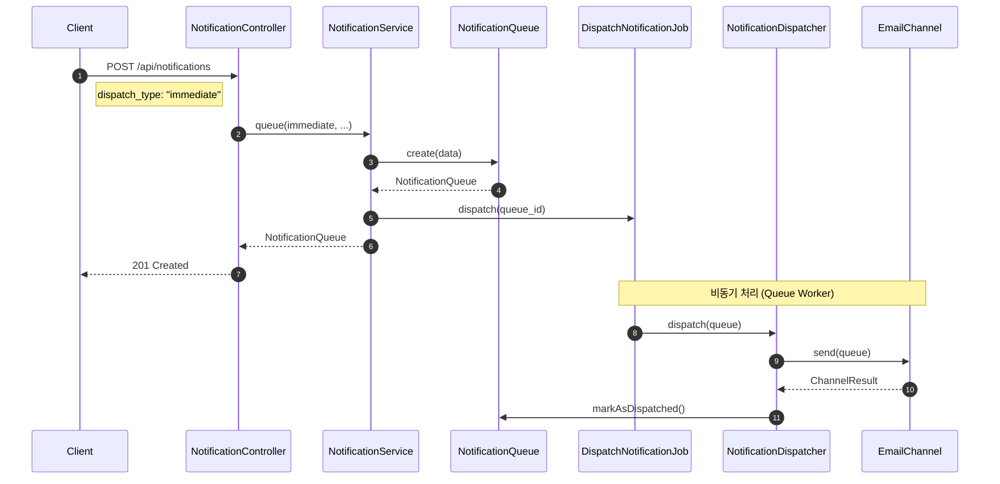
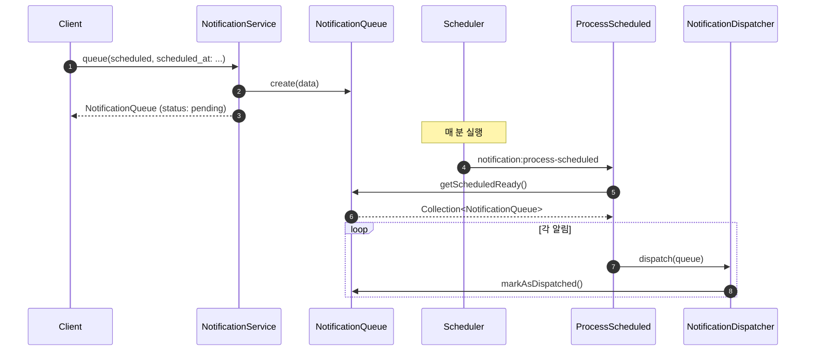
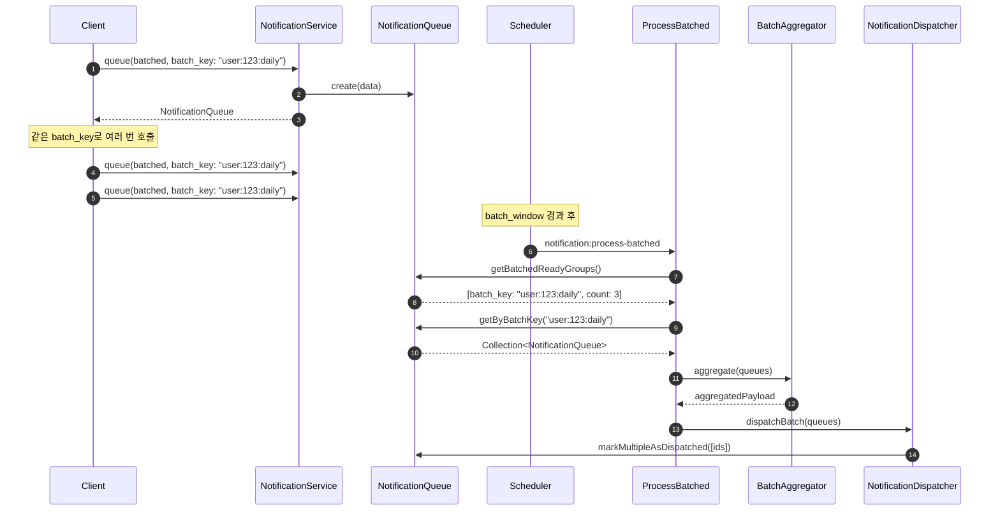

# Notification 도메인

Notification 도메인은 다채널(Email, SMS, Slack) 알림 발송을 담당하는 원자적 도메인 서비스입니다.

## 개요

| 항목 | 설명 |
|------|------|
| **목적** | 다양한 채널을 통한 통합 알림 발송 |
| **주요 기능** | 즉시 발송, 예약 발송, 묶음 발송 |
| **특징** | 대기열/발송부 분리, 비동기 처리, 채널 확장 가능 |

## 발송 유형

| 유형 | 설명 | 처리 방식 |
|------|------|----------|
| **IMMEDIATE** | 즉시 발송 | 등록 즉시 Job Dispatch |
| **SCHEDULED** | 예약 발송 | `scheduled_at` 도달 시 스케줄러가 처리 |
| **BATCHED** | 묶음 발송 | `batch_key`로 그룹화, 주기적으로 묶어서 발송 |

## 지원 채널

| 채널 | 필수 수신자 필드 | 설명 |
|------|------------------|------|
| **email** | `email` | 이메일 발송 |
| **sms** | `phone` | SMS 문자 발송 |
| **slack** | `slack_webhook` | Slack Webhook 알림 |

## 아키텍처

### 전체 흐름

```
┌─────────────────────────────────────────────────────────────────┐
│                          API Layer                               │
│                    NotificationController                        │
└──────────────────────────┬──────────────────────────────────────┘
                           │
┌──────────────────────────▼──────────────────────────────────────┐
│                    NotificationService                           │
│                   (대기열에 알림 등록)                            │
└──────────────────────────┬──────────────────────────────────────┘
                           │
                           ▼
┌─────────────────────────────────────────────────────────────────┐
│                  NOTIFICATION QUEUE (대기열)                     │
│  ┌────────────┐  ┌────────────┐  ┌────────────┐                 │
│  │ IMMEDIATE  │  │ SCHEDULED  │  │  BATCHED   │                 │
│  │  즉시발송   │  │  예약발송   │  │  묶음발송   │                 │
│  └─────┬──────┘  └─────┬──────┘  └─────┬──────┘                 │
└────────┼───────────────┼───────────────┼────────────────────────┘
         │               │               │
         │     ┌─────────┴───────────────┘
         │     │   Laravel Scheduler (매 분)
         │     │
┌────────▼─────▼──────────────────────────────────────────────────┐
│                  DISPATCHER (발송 처리부)                        │
│                 NotificationDispatcher                           │
│  ┌─────────────────────────────────────────────────────────┐    │
│  │                    Channel Router                        │    │
│  │      ┌─────────┬─────────┬─────────┐                    │    │
│  │      ▼         ▼         ▼                              │    │
│  │  ┌────────┐ ┌────────┐ ┌────────┐                       │    │
│  │  │ Email  │ │  SMS   │ │ Slack  │                       │    │
│  │  └────────┘ └────────┘ └────────┘                       │    │
│  └─────────────────────────────────────────────────────────┘    │
└─────────────────────────────────────────────────────────────────┘
```

### 파일 구조

```
app/
├── Enums/Notification/
│   ├── DispatchType.php              # 발송 유형 Enum
│   ├── NotificationStatus.php        # 알림 상태 Enum
│   └── ChannelType.php               # 채널 유형 Enum
├── Models/
│   ├── NotificationQueue.php         # 대기열 모델
│   └── NotificationLog.php           # 발송 이력 모델
├── Http/
│   ├── Controllers/NotificationController.php
│   └── Requests/Notification/StoreNotificationRequest.php
├── Services/Notification/
│   ├── NotificationService.php       # 대기열 등록 (진입점)
│   ├── NotificationDispatcher.php    # 발송 처리
│   ├── BatchAggregator.php           # 묶음 알림 집계
│   └── Channels/
│       ├── NotificationChannelInterface.php
│       ├── ChannelResult.php
│       ├── EmailChannel.php
│       ├── SmsChannel.php
│       └── SlackChannel.php
├── Repositories/
│   ├── NotificationQueueRepositoryInterface.php
│   ├── EloquentNotificationQueueRepository.php
│   ├── NotificationLogRepositoryInterface.php
│   └── EloquentNotificationLogRepository.php
├── Jobs/
│   ├── DispatchNotificationJob.php
│   └── ProcessBatchedNotificationsJob.php
├── Console/Commands/
│   ├── ProcessScheduledNotifications.php
│   └── ProcessBatchedNotifications.php
└── Shared/Exceptions/
    └── NotificationException.php

config/
└── notification.php                  # 채널별 설정

database/migrations/
├── create_notification_queues_table.php
└── create_notification_logs_table.php

tests/
├── Unit/
│   ├── Models/NotificationQueueTest.php
│   └── Services/Notification/BatchAggregatorTest.php
└── Feature/Notification/
    └── NotificationControllerTest.php
```

## 데이터베이스 스키마

### notification_queues 테이블

| 컬럼 | 타입 | 설명 |
|------|------|------|
| `id` | BIGINT | Primary Key |
| `dispatch_type` | VARCHAR(20) | 발송 유형 (immediate, scheduled, batched) |
| `scheduled_at` | TIMESTAMP | 예약 발송 시간 |
| `batch_key` | VARCHAR(100) | 묶음 발송 그룹 키 |
| `batch_window` | INTEGER | 묶음 간격 (초) |
| `type` | VARCHAR(100) | 알림 유형 |
| `channels` | JSON | 발송 채널 목록 |
| `recipient` | JSON | 수신자 정보 |
| `payload` | JSON | 알림 데이터 |
| `priority` | INTEGER | 우선순위 (높을수록 먼저) |
| `status` | VARCHAR(20) | 상태 |
| `attempts` | INTEGER | 시도 횟수 |
| `last_error` | TEXT | 마지막 오류 메시지 |
| `dispatched_at` | TIMESTAMP | 발송 완료 시간 |
| `created_at` | TIMESTAMP | 생성 시간 |
| `updated_at` | TIMESTAMP | 수정 시간 |

### notification_logs 테이블

| 컬럼 | 타입 | 설명 |
|------|------|------|
| `id` | BIGINT | Primary Key |
| `queue_id` | BIGINT | 원본 대기열 ID (단건) |
| `batch_queue_ids` | JSON | 묶음 발송 시 포함된 queue_id 목록 |
| `type` | VARCHAR(100) | 알림 유형 |
| `channels` | JSON | 발송 채널 목록 |
| `recipient` | JSON | 수신자 정보 |
| `payload` | JSON | 알림 데이터 |
| `status` | VARCHAR(20) | 발송 결과 (sent, partial, failed) |
| `channel_results` | JSON | 채널별 발송 결과 |
| `sent_at` | TIMESTAMP | 발송 시간 |
| `created_at` | TIMESTAMP | 생성 시간 |

### 인덱스

```sql
-- notification_queues
CREATE INDEX idx_nq_dispatch_type_status ON notification_queues(dispatch_type, status);
CREATE INDEX idx_nq_scheduled_at ON notification_queues(scheduled_at);
CREATE INDEX idx_nq_batch_key ON notification_queues(batch_key);
CREATE INDEX idx_nq_priority ON notification_queues(priority DESC, created_at ASC);

-- notification_logs
CREATE INDEX idx_nl_queue_id ON notification_logs(queue_id);
CREATE INDEX idx_nl_type ON notification_logs(type);
CREATE INDEX idx_nl_status ON notification_logs(status);
CREATE INDEX idx_nl_sent_at ON notification_logs(sent_at);
```

## API 엔드포인트

### 알림 발송 등록

```
POST /api/notifications
```

**요청 - 즉시 발송**
```json
{
    "dispatch_type": "immediate",
    "type": "welcome",
    "channels": ["email"],
    "recipient": {
        "email": "user@example.com"
    },
    "payload": {
        "subject": "환영합니다",
        "message": "서비스에 가입해주셔서 감사합니다."
    }
}
```

**요청 - 예약 발송**
```json
{
    "dispatch_type": "scheduled",
    "scheduled_at": "2025-12-25T09:00:00+09:00",
    "type": "promotion",
    "channels": ["email", "sms"],
    "recipient": {
        "email": "user@example.com",
        "phone": "+821012345678"
    },
    "payload": {
        "subject": "크리스마스 이벤트",
        "message": "특별 할인 이벤트에 참여하세요!"
    }
}
```

**요청 - 묶음 발송**
```json
{
    "dispatch_type": "batched",
    "batch_key": "user:123:activity_digest",
    "batch_window": 3600,
    "type": "activity_digest",
    "channels": ["email"],
    "recipient": {
        "email": "user@example.com"
    },
    "payload": {
        "activity": {
            "type": "comment",
            "message": "새 댓글이 달렸습니다"
        }
    }
}
```

**응답 (201 Created)**
```json
{
    "success": true,
    "data": {
        "id": 1,
        "dispatch_type": "immediate",
        "type": "welcome",
        "channels": ["email"],
        "status": "pending",
        "created_at": "2025-12-11T10:00:00+09:00"
    }
}
```

### 대기열 목록 조회

```
GET /api/notifications/queue
```

**쿼리 파라미터**
| 파라미터 | 타입 | 필수 | 설명 |
|----------|------|------|------|
| `dispatch_type` | string | X | 발송 유형 필터 |
| `status` | string | X | 상태 필터 |
| `type` | string | X | 알림 유형 필터 |
| `per_page` | integer | X | 페이지당 항목 수 (기본: 15) |

### 대기열 상세 조회

```
GET /api/notifications/queue/{id}
```

### 대기열 취소

```
DELETE /api/notifications/queue/{id}
```

- `pending` 상태인 알림만 취소 가능

### 실패한 알림 재시도

```
POST /api/notifications/queue/{id}/retry
```

- `failed` 상태인 알림만 재시도 가능
- 최대 재시도 횟수 제한 있음 (기본: 3회)

### 발송 로그 목록 조회

```
GET /api/notifications/logs
```

**쿼리 파라미터**
| 파라미터 | 타입 | 필수 | 설명 |
|----------|------|------|------|
| `status` | string | X | 상태 필터 (sent, partial, failed) |
| `type` | string | X | 알림 유형 필터 |
| `from` | datetime | X | 시작 시간 |
| `to` | datetime | X | 종료 시간 |
| `per_page` | integer | X | 페이지당 항목 수 |

### 발송 로그 상세 조회

```
GET /api/notifications/logs/{id}
```

### 채널 목록 조회

```
GET /api/notifications/channels
```

**응답**
```json
{
    "success": true,
    "data": [
        {
            "value": "email",
            "label": "이메일",
            "required_fields": ["email"]
        },
        {
            "value": "sms",
            "label": "SMS",
            "required_fields": ["phone"]
        },
        {
            "value": "slack",
            "label": "Slack",
            "required_fields": ["slack_webhook"]
        }
    ]
}
```

## Sequence Diagram

### 즉시 발송 (IMMEDIATE)



### 예약 발송 (SCHEDULED)



### 묶음 발송 (BATCHED)



## 설정

### config/notification.php

```php
return [
    // 최대 재시도 횟수
    'max_retries' => env('NOTIFICATION_MAX_RETRIES', 3),

    // 묶음 발송 설정
    'batch' => [
        'default_window' => env('NOTIFICATION_BATCH_DEFAULT_WINDOW', 3600),
    ],

    // 채널 설정
    'channels' => [
        'email' => [
            'enabled' => env('NOTIFICATION_EMAIL_ENABLED', true),
            'from' => env('MAIL_FROM_ADDRESS'),
        ],
        'sms' => [
            'enabled' => env('NOTIFICATION_SMS_ENABLED', true),
            'provider' => env('NOTIFICATION_SMS_PROVIDER', 'log'),
            'api_url' => env('NOTIFICATION_SMS_API_URL'),
            'api_key' => env('NOTIFICATION_SMS_API_KEY'),
        ],
        'slack' => [
            'enabled' => env('NOTIFICATION_SLACK_ENABLED', true),
        ],
    ],
];
```

## 스케줄러

`routes/console.php`에 등록된 스케줄:

```php
// 예약 알림 처리 (매 분)
Schedule::command('notification:process-scheduled')
    ->everyMinute()
    ->withoutOverlapping();

// 묶음 알림 처리 (5분마다)
Schedule::command('notification:process-batched')
    ->everyFiveMinutes()
    ->withoutOverlapping();
```

## 테스트 커버리지

| 영역 | 테스트 수 | 파일 |
|------|----------|------|
| Feature (API) | 15개 | `tests/Feature/Notification/NotificationControllerTest.php` |
| Model Unit | 11개 | `tests/Unit/Models/NotificationQueueTest.php` |
| Service Unit | 4개 | `tests/Unit/Services/Notification/BatchAggregatorTest.php` |
| **총합** | **30개** | |

## 예외 처리

| 예외 | HTTP | 상황 |
|------|------|------|
| `NotificationException::invalidChannel` | 400 | 지원하지 않는 채널 |
| `NotificationException::missingRecipient` | 400 | 채널에 필요한 수신자 정보 없음 |
| `NotificationException::queueNotFound` | 404 | 대기열 없음 |
| `NotificationException::cannotCancel` | 400 | 취소 불가능한 상태 |
| `NotificationException::cannotRetry` | 400 | 재시도 불가능한 상태 |
| `NotificationException::scheduledAtRequired` | 400 | 예약 시간 누락 |
| `NotificationException::batchKeyRequired` | 400 | 배치 키 누락 |
| `NotificationException::maxRetriesExceeded` | 400 | 최대 재시도 횟수 초과 |

## 참고 문서

- [프로젝트 가이드](../CLAUDE.md)
- [HTTP Response 공통화](../CLAUDE.md#http-response-공통화)
- [Exception Handling 공통화](../CLAUDE.md#exception-handling-공통화)
