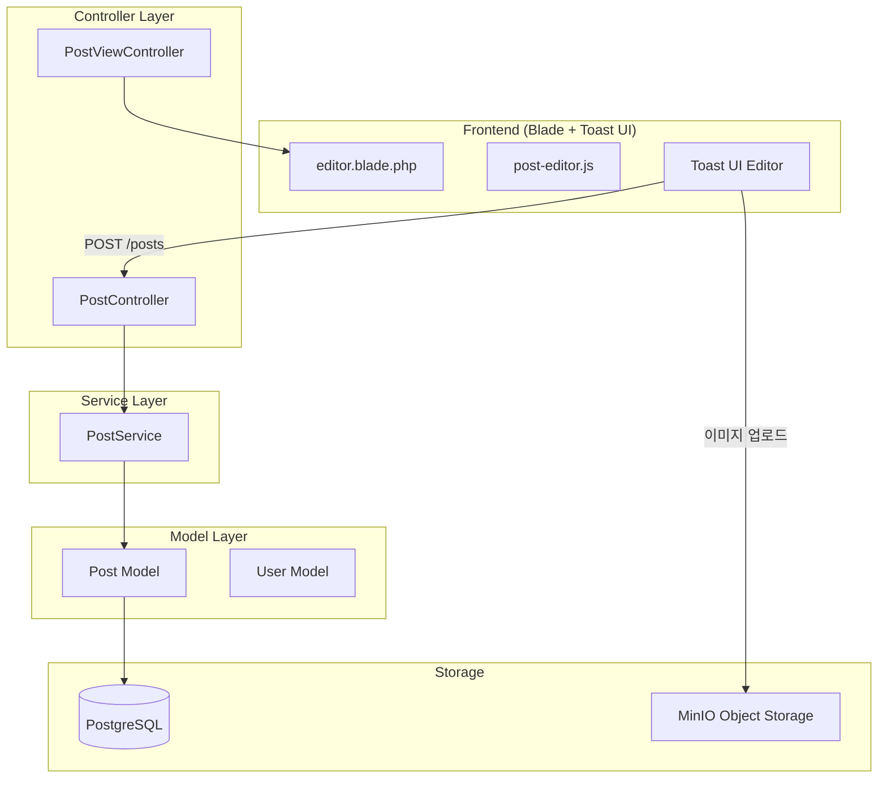
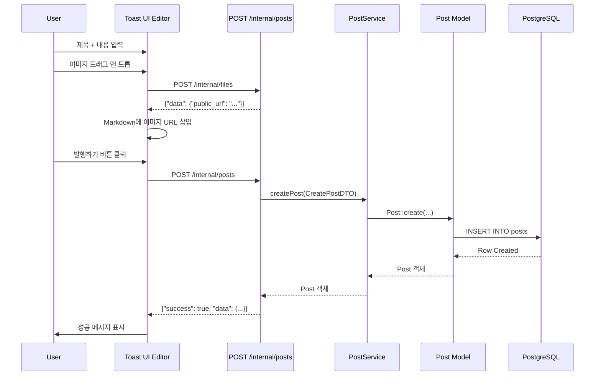
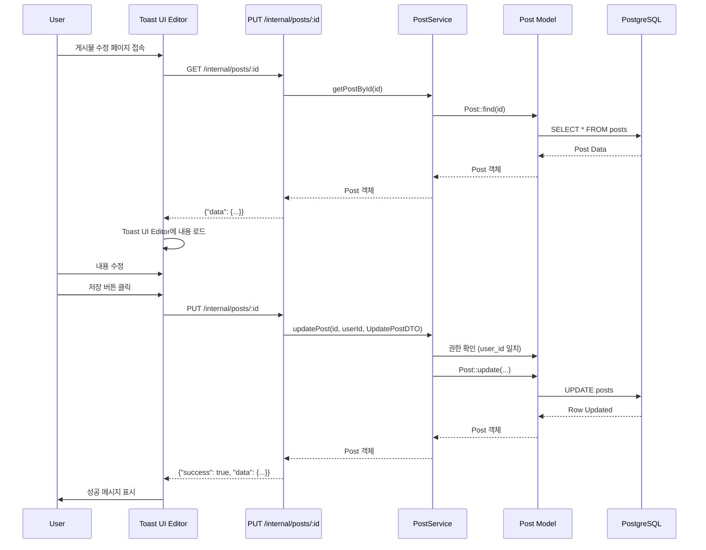

# Post 도메인

Post 도메인은 블로그 게시물의 생성, 수정, 발행 관리를 담당하는 원자적 도메인 서비스입니다.

## 개요

| 항목 | 설명 |
|------|------|
| **목적** | Markdown 기반 블로그 게시물 관리 |
| **주요 기능** | 게시물 CRUD, 임시저장/발행, 이미지 업로드 |
| **특징** | Toast UI Editor, Markdown 지원, 자동 Slug 생성 |

### 게시물 상태

| Status | 설명 | 공개 여부 |
|--------|------|----------|
| `draft` | 임시저장 | ❌ |
| `published` | 발행됨 | ✅ |
| `private` | 비공개 | ❌ |

---

## 아키텍처

### 디렉토리 구조

```
app/Domain/Post/
├── Controllers/
│   └── PostController.php          # REST API 컨트롤러
├── Services/
│   └── PostService.php              # 비즈니스 로직
├── DTOs/
│   ├── CreatePostDTO.php            # 게시물 생성 DTO
│   └── UpdatePostDTO.php            # 게시물 수정 DTO
└── Exceptions/                      # (향후 추가 예정)

app/Models/
└── Post.php                         # Eloquent Model

database/
├── migrations/
│   └── 2025_12_16_002944_create_posts_table.php
└── factories/
    └── PostFactory.php              # 테스트용 팩토리

resources/
├── js/
│   └── post-editor.js               # Toast UI Editor 초기화
└── views/posts/
    └── editor.blade.php             # 게시물 에디터 페이지

tests/Feature/Domain/Post/
└── PostControllerTest.php           # Feature 테스트
```

### 레이어 구조



---

## 데이터베이스 스키마

### posts 테이블

| Column | Type | Null | Key | Description |
|--------|------|------|-----|-------------|
| `id` | bigint unsigned | NO | PK | 게시물 ID |
| `user_id` | bigint unsigned | NO | FK | 작성자 ID (users.id) |
| `title` | varchar(255) | NO | | 제목 |
| `slug` | varchar(255) | NO | UK | URL 슬러그 (unique) |
| `content` | longtext | NO | | Markdown 본문 |
| `excerpt` | text | YES | | 요약 (자동 생성 가능) |
| `status` | enum | NO | | draft/published/private |
| `published_at` | timestamp | YES | IDX | 발행 날짜 |
| `created_at` | timestamp | NO | | 생성 날짜 |
| `updated_at` | timestamp | NO | | 수정 날짜 |

**인덱스:**
- `PRIMARY KEY (id)`
- `UNIQUE KEY (slug)`
- `FOREIGN KEY (user_id) REFERENCES users(id) ON DELETE CASCADE`
- `INDEX (user_id, status)`
- `INDEX (published_at)`

**자동 Slug 생성:**
- 제목(`title`)에서 자동으로 slug 생성 (예: "Hello World" → "hello-world")
- 중복 시 숫자 접미사 추가 (예: "hello-world-1", "hello-world-2")

---

## API 엔드포인트

### 공개 엔드포인트 (인증 불필요)

#### 1. 발행된 게시물 목록 조회

```http
GET /internal/posts/published?per_page=15
```

**Response:**
```json
{
  "success": true,
  "data": [
    {
      "id": 1,
      "user_id": 1,
      "title": "Hello World",
      "slug": "hello-world",
      "excerpt": "This is a test post...",
      "status": "published",
      "published_at": "2025-12-16T10:00:00Z",
      "created_at": "2025-12-16T09:00:00Z",
      "updated_at": "2025-12-16T10:00:00Z",
      "user": {
        "id": 1,
        "name": "John Doe",
        "email": "john@example.com",
        "avatar": "https://..."
      }
    }
  ],
  "pagination": {
    "type": "offset",
    "page": 1,
    "per_page": 15,
    "total": 100,
    "last_page": 7,
    "has_more_pages": true
  }
}
```

#### 2. 발행된 게시물 상세 조회 (slug)

```http
GET /internal/posts/slug/{slug}/published
```

**Example:**
```http
GET /internal/posts/slug/hello-world/published
```

**Response:**
```json
{
  "success": true,
  "data": {
    "id": 1,
    "title": "Hello World",
    "slug": "hello-world",
    "content": "# Hello World\n\nThis is a test post...",
    "excerpt": "This is a test post...",
    "status": "published",
    "published_at": "2025-12-16T10:00:00Z",
    "user": {
      "id": 1,
      "name": "John Doe",
      "email": "john@example.com"
    }
  }
}
```

---

### 인증 필요 엔드포인트

#### 3. 게시물 생성

```http
POST /internal/posts
X-User-Id: 1
```

**Request Body:**
```json
{
  "title": "My New Post",
  "content": "# Hello\n\nThis is my post.",
  "excerpt": "This is my post...",
  "slug": "my-new-post",
  "status": "draft"
}
```

**필수 필드:**
- `title` (max: 255)
- `content`

**선택 필드:**
- `excerpt` (max: 500, 없으면 자동 생성)
- `slug` (없으면 제목에서 자동 생성)
- `status` (default: `draft`)

**Response:** `201 Created`
```json
{
  "success": true,
  "data": {
    "id": 2,
    "title": "My New Post",
    "slug": "my-new-post",
    "content": "# Hello\n\nThis is my post.",
    "status": "draft",
    "published_at": null,
    "created_at": "2025-12-16T11:00:00Z"
  }
}
```

#### 4. 게시물 목록 조회

```http
GET /internal/posts?status=draft&per_page=15
X-User-Id: 1
```

**Query Parameters:**
- `user_id` (optional): 특정 사용자의 게시물만 조회
- `status` (optional): `draft`, `published`, `private`
- `per_page` (optional, default: 15, max: 100): 페이지 크기
- `use_cursor` (optional, default: false): 커서 페이지네이션 사용

**Response:** 공개 엔드포인트와 동일

#### 5. 게시물 상세 조회 (ID)

```http
GET /internal/posts/{id}
X-User-Id: 1
```

**Response:** `200 OK`

#### 6. 게시물 수정

```http
PUT /internal/posts/{id}
X-User-Id: 1
```

**Request Body:**
```json
{
  "title": "Updated Title",
  "content": "Updated content...",
  "status": "published"
}
```

**권한:** 작성자만 수정 가능 (user_id 일치 확인)

**Response:** `200 OK`

#### 7. 게시물 삭제

```http
DELETE /internal/posts/{id}
X-User-Id: 1
```

**권한:** 작성자만 삭제 가능

**Response:** `200 OK`

#### 8. 게시물 발행

```http
POST /internal/posts/{id}/publish
X-User-Id: 1
```

**기능:**
- `status`를 `published`로 변경
- `published_at`이 없으면 현재 시각으로 설정

**Response:** `200 OK`

#### 9. 게시물 발행 취소

```http
POST /internal/posts/{id}/unpublish
X-User-Id: 1
```

**기능:**
- `status`를 `draft`로 변경

**Response:** `200 OK`

#### 10. 사용자 게시물 통계

```http
GET /internal/posts/stats
X-User-Id: 1
```

**Response:**
```json
{
  "success": true,
  "data": {
    "total": 10,
    "published": 3,
    "draft": 5,
    "private": 2
  }
}
```

---

## Toast UI Editor 통합

### 설치

```bash
npm install @toast-ui/editor
```

### 사용 방법

**JavaScript 초기화:**

```javascript
import { initPostEditor, savePost, generateExcerpt } from '/resources/js/post-editor.js';

const editor = initPostEditor({
  elementId: 'editor',
  initialValue: '',
  height: '600px',
  imageUploadUrl: '/internal/files',
  placeholder: 'Markdown 형식으로 내용을 입력하세요...',
});

// Markdown 내용 가져오기
const markdown = editor.getMarkdown();

// 게시물 저장
const post = await savePost({
  title: 'My Post',
  content: markdown,
  status: 'draft',
});
```

**이미지 업로드:**

Toast UI Editor는 이미지 드래그 앤 드롭 또는 붙여넣기 시 자동으로 MinIO에 업로드하고 public URL을 Markdown에 삽입합니다.

```javascript
hooks: {
  addImageBlobHook: async (blob, callback) => {
    const formData = new FormData();
    formData.append('file', blob);
    formData.append('visibility', 'public');

    const response = await fetch('/internal/files', {
      method: 'POST',
      headers: { 'X-User-Id': getUserId() },
      body: formData,
    });

    const result = await response.json();
    const imageUrl = result.data.public_url;
    callback(imageUrl, blob.name);
  }
}
```

### Blade 템플릿

**에디터 페이지:**

```blade
@extends('layouts.app')

@section('content')
<div class="editor-container">
  <input type="text" id="title" placeholder="제목">
  <div id="editor"></div>
  <button id="save-draft">임시저장</button>
  <button id="save-publish">발행하기</button>
</div>
@endsection

@push('scripts')
<script type="module">
  import { initPostEditor } from '/resources/js/post-editor.js';
  const editor = initPostEditor({ elementId: 'editor' });
</script>
@endpush
```

---

## Web Routes

게시물 에디터 페이지는 Web 라우트를 통해 접근합니다.

```php
// routes/web.php
Route::prefix('posts')->group(function () {
    Route::get('/', [PostViewController::class, 'index'])->name('posts.index');
    Route::get('/create', [PostViewController::class, 'create'])->name('posts.create');
    Route::get('/{id}/edit', [PostViewController::class, 'edit'])->name('posts.edit');
    Route::get('/{slug}', [PostViewController::class, 'show'])->name('posts.show');
});
```

**URL 예시:**
- 게시물 작성: `http://localhost:8000/posts/create`
- 게시물 수정: `http://localhost:8000/posts/1/edit`
- 게시물 보기: `http://localhost:8000/posts/hello-world`

---

## 시퀀스 다이어그램

### 게시물 생성 흐름



### 게시물 수정 흐름



---

## 예외 처리

Post 도메인은 공통 예외 클래스를 사용합니다 (`app/Shared/Exceptions/`).

| 예외 클래스 | HTTP Status | 발생 상황 |
|------------|-------------|----------|
| `NotFoundException` | 404 | 게시물을 찾을 수 없음 |
| `ForbiddenException` | 403 | 작성자가 아닌 사용자가 수정/삭제 시도 |
| `ValidationException` | 400 | 입력 검증 실패 (title, content 누락 등) |
| `ConflictException` | 409 | Slug 중복 (수동 입력 시) |

**예시:**

```php
// 게시물을 찾을 수 없음
throw NotFoundException::forResource('Post', $id);

// 권한 없음
throw ForbiddenException::forResource('Post', $id);

// Slug 중복
throw ConflictException::duplicateField('slug', $slug);
```

---

## 테스트 커버리지

### Feature Tests

**파일:** `tests/Feature/Domain/Post/PostControllerTest.php`

**테스트 케이스:**
- ✅ 게시물 생성
- ✅ 자동 Slug 생성
- ✅ 커스텀 Slug 사용
- ✅ Slug 중복 방지
- ✅ 게시물 목록 조회
- ✅ 상태별 필터링 (draft/published)
- ✅ 발행된 게시물만 조회
- ✅ ID/Slug로 단일 게시물 조회
- ✅ 게시물 수정
- ✅ 권한 확인 (작성자만 수정 가능)
- ✅ 게시물 삭제
- ✅ 권한 확인 (작성자만 삭제 가능)
- ✅ 게시물 발행/발행 취소
- ✅ 사용자 게시물 통계
- ✅ 입력 검증 (필수 필드)
- ✅ 404 예외 처리

**실행:**

```bash
php artisan test tests/Feature/Domain/Post/
```

---

## 향후 계획

### Phase 2: 고급 기능
- [ ] 태그 시스템 (`posts_tags`, `tags` 테이블)
- [ ] 카테고리 분류
- [ ] 게시물 검색 (제목, 내용)
- [ ] 조회수 추적
- [ ] 좋아요/북마크 기능

### Phase 3: 성능 최적화
- [ ] Redis 캐싱 (발행된 게시물)
- [ ] Elastic Search 통합 (전문 검색)
- [ ] CDN 통합 (이미지 최적화)

### Phase 4: 협업 기능
- [ ] 다중 작성자 지원
- [ ] 댓글 시스템
- [ ] 게시물 공동 편집

---

## 참고 자료

- **Toast UI Editor 공식 문서**: https://nhn.github.io/tui.editor/latest/
- **Markdown 가이드**: https://www.markdownguide.org/
- **Laravel Eloquent**: https://laravel.com/docs/11.x/eloquent
- **MinIO File 도메인**: [docs/FILE.md](FILE.md)
