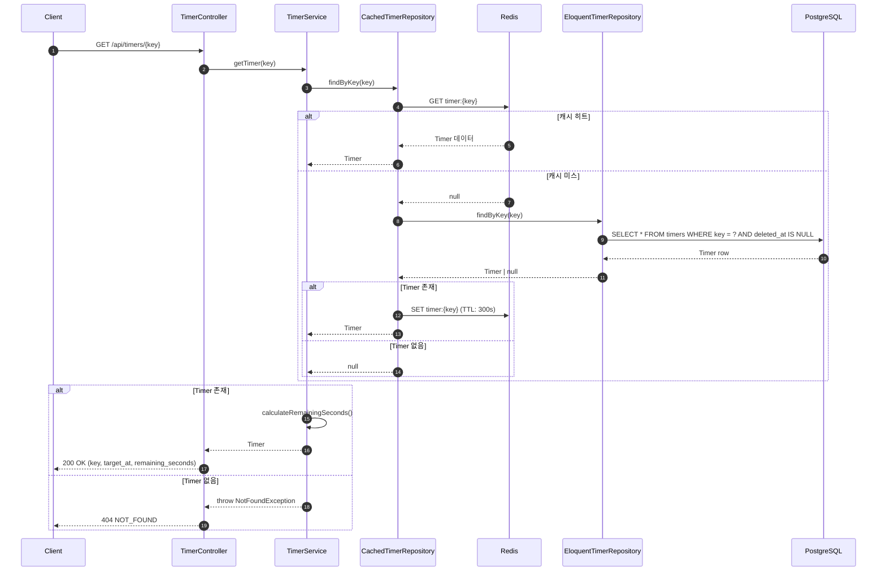
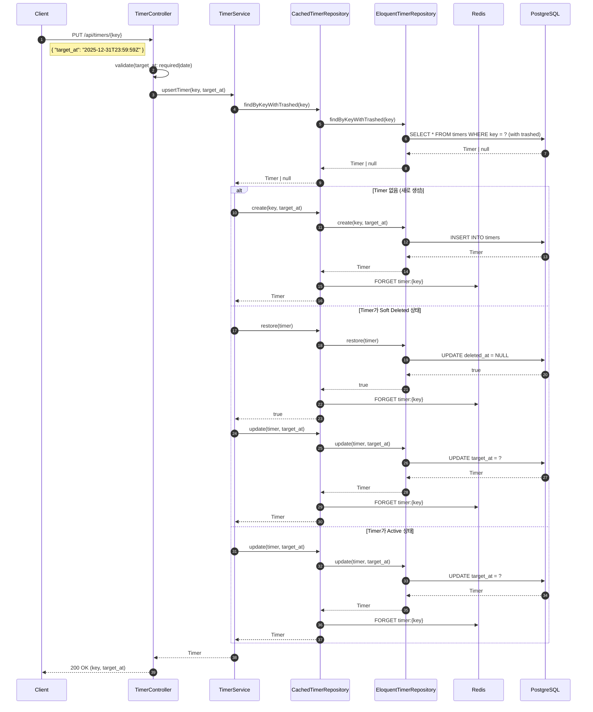
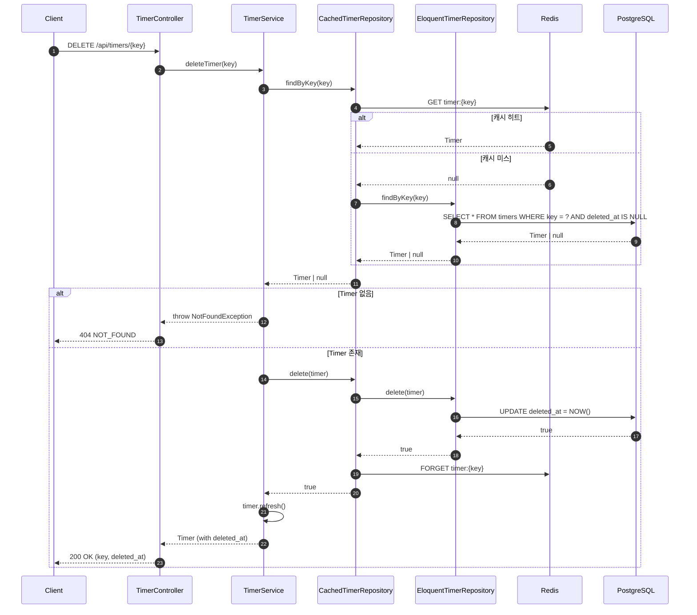

# Timer 도메인

Timer 도메인은 목표 시점까지의 남은 시간을 관리하는 원자적 도메인 서비스입니다.

## 개요

| 항목 | 설명 |
|------|------|
| **목적** | 목표 시간(target_at)까지의 남은 초(remaining_seconds) 계산 |
| **주요 기능** | 타이머 생성/조회/수정/삭제 (CRUD + Upsert) |
| **특징** | Soft Delete, Redis 캐싱, Repository 패턴 |

## 아키텍처

### 레이어 구조

```
Controller (TimerController)
    ↓
Service (TimerService)
    ↓
Repository Interface (TimerRepositoryInterface)
    ↓
├── CachedTimerRepository (Redis 캐시 데코레이터)
│       ↓
└── EloquentTimerRepository (DB 구현체)
        ↓
    Database (PostgreSQL)
```

### 파일 구조

```
app/
├── Models/Timer.php                          # Eloquent 모델
├── Http/Controllers/TimerController.php      # API 컨트롤러
├── Services/TimerService.php                 # 비즈니스 로직
└── Repositories/
    ├── TimerRepositoryInterface.php          # Repository 인터페이스
    ├── EloquentTimerRepository.php           # Eloquent 구현체
    └── CachedTimerRepository.php             # 캐시 데코레이터

database/migrations/
├── 2025_12_09_162005_create_timers_table.php         # 테이블 생성
└── 2025_12_09_170742_add_indexes_to_timers_table.php # 인덱스 추가

tests/
├── Feature/Timer/TimerControllerTest.php             # Feature 테스트 (18개)
└── Unit/
    ├── Models/TimerTest.php                          # Model 테스트 (10개)
    ├── Models/TimerCalculationTest.php               # 계산 테스트 (11개)
    └── Services/TimerServiceTest.php                 # Service 테스트 (9개)
```

## 데이터베이스 스키마

### timers 테이블

| 컬럼 | 타입 | 설명 |
|------|------|------|
| `id` | BIGINT | Primary Key |
| `key` | VARCHAR | 고유 식별자 (UNIQUE) |
| `target_at` | TIMESTAMP | 목표 시점 |
| `created_at` | TIMESTAMP | 생성 시간 |
| `updated_at` | TIMESTAMP | 수정 시간 |
| `deleted_at` | TIMESTAMP | 삭제 시간 (Soft Delete) |

### 인덱스

```sql
CREATE INDEX timers_key_deleted_at_index ON timers (key, deleted_at);
CREATE INDEX timers_target_at_index ON timers (target_at);
```

## API 엔드포인트

### 타이머 조회

```
GET /api/timers/{key}
```

**응답 (200 OK)**
```json
{
    "success": true,
    "data": {
        "key": "my-timer",
        "target_at": "2025-12-31T23:59:59+09:00",
        "remaining_seconds": -3600
    }
}
```

**remaining_seconds 해석**
- 음수 (-3600): 목표까지 3600초 남음
- 0: 목표 시점 도달
- 양수 (+3600): 목표 시점 3600초 경과

**에러 (404 Not Found)**
```json
{
    "success": false,
    "error": {
        "code": "NOT_FOUND",
        "message": "Timer를 찾을 수 없습니다: my-timer"
    }
}
```

### 타이머 생성/수정 (Upsert)

```
PUT /api/timers/{key}
```

**요청**
```json
{
    "target_at": "2025-12-31T23:59:59+09:00"
}
```

**응답 (200 OK / 201 Created)**
```json
{
    "success": true,
    "data": {
        "key": "my-timer",
        "target_at": "2025-12-31T23:59:59+09:00"
    }
}
```

**동작 방식**
1. 키가 없으면 → 새로 생성
2. 키가 있으면 → target_at 업데이트
3. Soft Delete된 타이머 → 복원 후 업데이트

### 타이머 삭제 (Soft Delete)

```
DELETE /api/timers/{key}
```

**응답 (200 OK)**
```json
{
    "success": true,
    "data": {
        "key": "my-timer",
        "deleted_at": "2025-12-10T12:00:00+09:00"
    }
}
```

## Sequence Diagram

### 타이머 조회 (GET)



### 타이머 생성/수정 (PUT - Upsert)



### 타이머 삭제 (DELETE)



## 캐싱 전략

### Redis 캐시

| 항목 | 값 |
|------|------|
| 캐시 키 | `timer:{key}` |
| TTL | 300초 (5분) |
| 전략 | Read-through Cache |

### 캐시 무효화

모든 쓰기 작업(create, update, delete, restore)에서 캐시 무효화:

```php
Cache::forget("timer:{$key}");
```

## 테스트 커버리지

| 영역 | 테스트 수 | 파일 |
|------|----------|------|
| Feature (API) | 18개 | `tests/Feature/Timer/TimerControllerTest.php` |
| Service Unit | 9개 | `tests/Unit/Services/TimerServiceTest.php` |
| Model Unit | 10개 | `tests/Unit/Models/TimerTest.php` |
| Calculation | 11개 | `tests/Unit/Models/TimerCalculationTest.php` |
| **총합** | **48개** | |

## 참고 문서

- [Timer 최적화 가이드](./TIMER_OPTIMIZATION.md)
