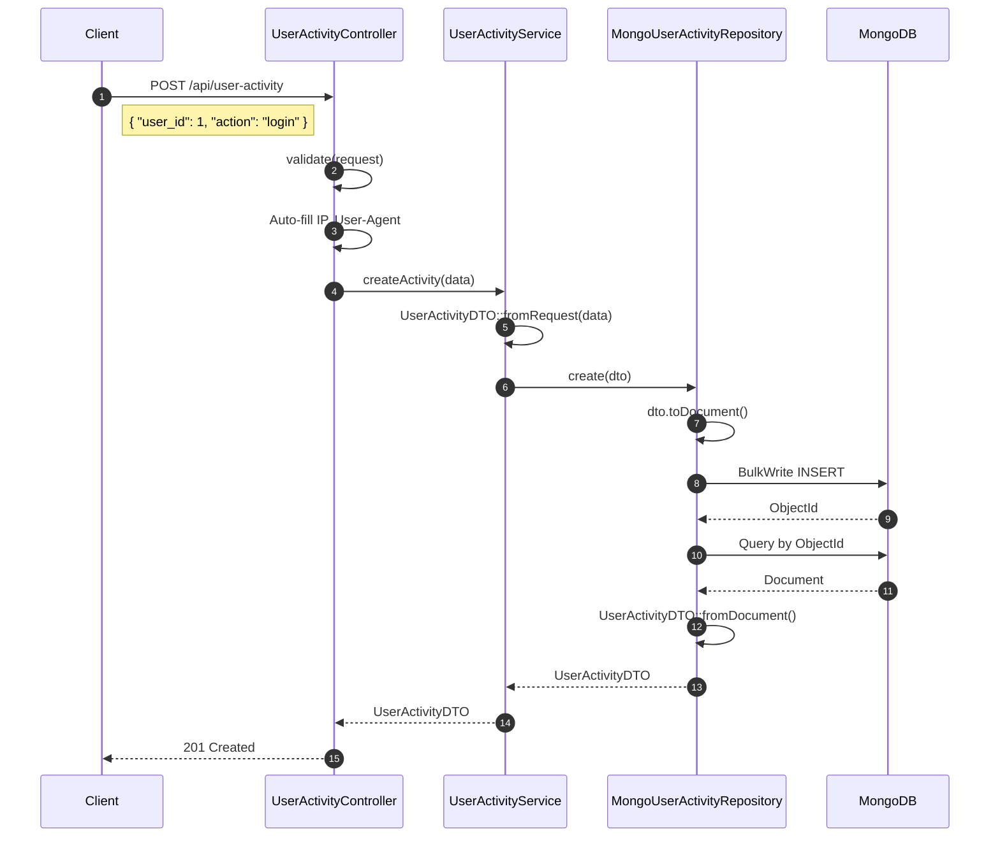
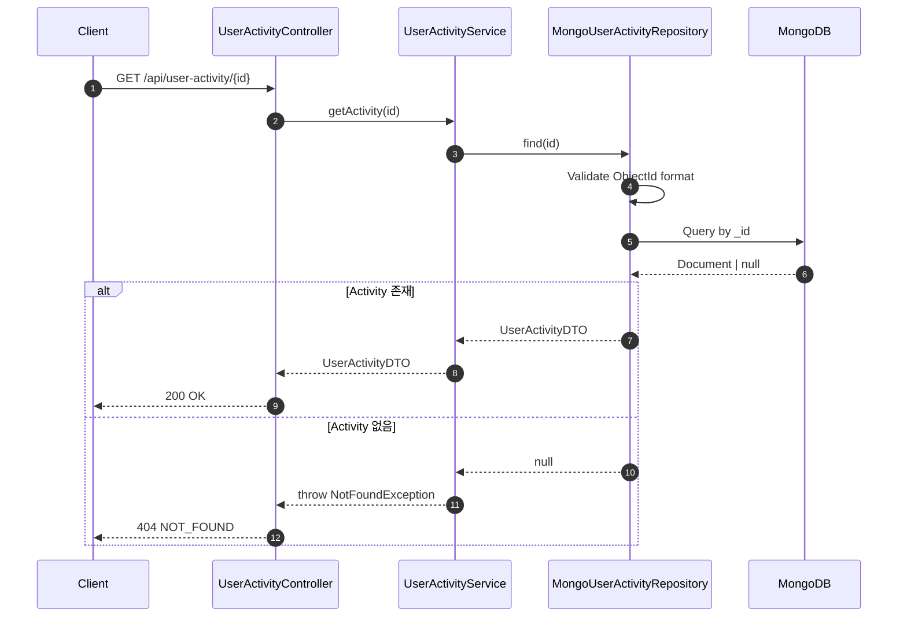

# User Activity 도메인

User Activity 도메인은 사용자 활동 로그를 MongoDB에 저장하고 관리하는 원자적 도메인 서비스입니다.

## 개요

| 항목 | 설명 |
|------|------|
| **목적** | 사용자의 행동 및 이벤트 추적, 감사 로그 |
| **주요 기능** | 활동 로그 CRUD, 사용자별 조회, 통계 집계 |
| **특징** | MongoDB 기반, 유연한 메타데이터 저장, 시계열 조회 |

## 아키텍처

### 레이어 구조

```
Controller (UserActivityController)
    ↓
Service (UserActivityService)
    ↓
Repository Interface (UserActivityRepositoryInterface)
    ↓
MongoUserActivityRepository (MongoDB 구현체)
    ↓
Database (MongoDB)
```

### 파일 구조

```
app/
├── Domain/UserActivity/
│   ├── Contracts/
│   │   └── UserActivityRepositoryInterface.php    # Repository 인터페이스
│   ├── Controllers/
│   │   └── UserActivityController.php             # API 컨트롤러
│   ├── DTOs/
│   │   └── UserActivityDTO.php                    # 데이터 전송 객체
│   ├── Repositories/
│   │   └── MongoUserActivityRepository.php        # MongoDB 구현체
│   └── Services/
│       └── UserActivityService.php                # 비즈니스 로직
├── Providers/
│   └── UserActivityServiceProvider.php            # DI 바인딩
└── Shared/Database/MongoDB/
    └── MongoConnection.php                        # MongoDB 연결 관리

config/
└── database.php                                   # MongoDB 연결 설정
```

## 데이터베이스 스키마

### user_activities 컬렉션 (MongoDB)

| 필드 | 타입 | 설명 |
|------|------|------|
| `_id` | ObjectId | Primary Key |
| `user_id` | Integer | 사용자 ID |
| `action` | String | 활동 유형 (login, logout, view, create 등) |
| `target_type` | String (nullable) | 대상 리소스 타입 (post, comment 등) |
| `target_id` | String (nullable) | 대상 리소스 ID |
| `metadata` | Object (nullable) | 추가 메타데이터 |
| `ip_address` | String (nullable) | 클라이언트 IP 주소 |
| `user_agent` | String (nullable) | 클라이언트 User-Agent |
| `created_at` | UTCDateTime | 생성 시간 |
| `updated_at` | UTCDateTime | 수정 시간 |

### 인덱스 권장사항

```javascript
// MongoDB Shell 명령
db.user_activities.createIndex({ user_id: 1, created_at: -1 });
db.user_activities.createIndex({ action: 1 });
db.user_activities.createIndex({ created_at: -1 });
db.user_activities.createIndex({ target_type: 1, target_id: 1 });
```

## API 엔드포인트

### 활동 목록 조회

```
GET /api/user-activity
```

**쿼리 파라미터**
| 파라미터 | 타입 | 필수 | 설명 |
|----------|------|------|------|
| `page` | Integer | X | 페이지 번호 (기본: 1) |
| `per_page` | Integer | X | 페이지당 항목 수 (기본: 15, 최대: 100) |
| `user_id` | Integer | X | 사용자 ID로 필터 |
| `action` | String | X | 활동 유형으로 필터 |
| `target_type` | String | X | 대상 타입으로 필터 |
| `target_id` | String | X | 대상 ID로 필터 |
| `action_like` | String | X | 활동 유형 부분 검색 |
| `from_date` | DateTime | X | 시작 날짜 (ISO 8601) |
| `to_date` | DateTime | X | 종료 날짜 (ISO 8601) |

**응답 (200 OK)**
```json
{
    "success": true,
    "data": [
        {
            "id": "507f1f77bcf86cd799439011",
            "user_id": 1,
            "action": "login",
            "target_type": null,
            "target_id": null,
            "metadata": { "method": "oauth", "provider": "github" },
            "ip_address": "192.168.1.1",
            "user_agent": "Mozilla/5.0...",
            "created_at": "2025-12-12T10:00:00+00:00",
            "updated_at": "2025-12-12T10:00:00+00:00"
        }
    ],
    "pagination": {
        "type": "offset",
        "page": 1,
        "per_page": 15,
        "total": 100,
        "last_page": 7,
        "has_more_pages": true
    }
}
```

### 단일 조회

```
GET /api/user-activity/{id}
```

**응답 (200 OK)**
```json
{
    "success": true,
    "data": {
        "id": "507f1f77bcf86cd799439011",
        "user_id": 1,
        "action": "login",
        "target_type": null,
        "target_id": null,
        "metadata": { "method": "oauth" },
        "ip_address": "192.168.1.1",
        "user_agent": "Mozilla/5.0...",
        "created_at": "2025-12-12T10:00:00+00:00",
        "updated_at": "2025-12-12T10:00:00+00:00"
    }
}
```

**에러 (404 Not Found)**
```json
{
    "success": false,
    "error": {
        "code": "NOT_FOUND",
        "message": "UserActivity를 찾을 수 없습니다: 507f1f77bcf86cd799439011"
    }
}
```

### 생성

```
POST /api/user-activity
```

**요청**
```json
{
    "user_id": 1,
    "action": "view",
    "target_type": "post",
    "target_id": "123",
    "metadata": {
        "referrer": "https://example.com"
    }
}
```

| 필드 | 타입 | 필수 | 설명 |
|------|------|------|------|
| `user_id` | Integer | O | 사용자 ID |
| `action` | String | O | 활동 유형 |
| `target_type` | String | X | 대상 리소스 타입 |
| `target_id` | String | X | 대상 리소스 ID |
| `metadata` | Object | X | 추가 메타데이터 |
| `ip_address` | String | X | IP 주소 (자동 감지) |
| `user_agent` | String | X | User-Agent (자동 감지) |

**응답 (201 Created)**
```json
{
    "success": true,
    "data": {
        "id": "507f1f77bcf86cd799439012",
        "user_id": 1,
        "action": "view",
        "target_type": "post",
        "target_id": "123",
        "metadata": { "referrer": "https://example.com" },
        "ip_address": "192.168.1.1",
        "user_agent": "Mozilla/5.0...",
        "created_at": "2025-12-12T10:00:00+00:00",
        "updated_at": "2025-12-12T10:00:00+00:00"
    },
    "message": "리소스가 생성되었습니다."
}
```

### 수정

```
PUT /api/user-activity/{id}
```

**요청**
```json
{
    "action": "click",
    "metadata": { "button": "submit" }
}
```

**응답 (200 OK)**
```json
{
    "success": true,
    "data": {
        "id": "507f1f77bcf86cd799439012",
        "user_id": 1,
        "action": "click",
        ...
    }
}
```

### 삭제

```
DELETE /api/user-activity/{id}
```

**응답 (200 OK)**
```json
{
    "success": true,
    "message": "리소스가 삭제되었습니다."
}
```

### 사용자별 활동 조회

```
GET /api/user-activity/user/{userId}
```

**쿼리 파라미터**
| 파라미터 | 타입 | 필수 | 설명 |
|----------|------|------|------|
| `page` | Integer | X | 페이지 번호 (기본: 1) |
| `per_page` | Integer | X | 페이지당 항목 수 (기본: 15) |

**응답 (200 OK)**
```json
{
    "success": true,
    "data": [...],
    "pagination": {
        "type": "offset",
        "page": 1,
        "per_page": 15,
        "total": 50,
        "last_page": 4,
        "has_more_pages": true
    }
}
```

### 사용자 활동 통계

```
GET /api/user-activity/user/{userId}/stats
```

**응답 (200 OK)**
```json
{
    "success": true,
    "data": {
        "user_id": 1,
        "activity_counts": {
            "login": 15,
            "logout": 10,
            "view": 120,
            "create": 25
        },
        "total": 170
    }
}
```

### 사용자 활동 전체 삭제

```
DELETE /api/user-activity/user/{userId}
```

**응답 (200 OK)**
```json
{
    "success": true,
    "data": {
        "deleted_count": 50,
        "message": "Deleted 50 activities for user 1"
    }
}
```

## Sequence Diagram

### 활동 로그 생성 (POST)



### 조회 (GET)



## 환경 설정

### 환경 변수 (.env)

```bash
# MongoDB Configuration
MONGODB_HOST=127.0.0.1
MONGODB_PORT=27017
MONGODB_DATABASE=toy_core
MONGODB_USERNAME=
MONGODB_PASSWORD=
MONGODB_AUTH_SOURCE=admin
```

### 데이터베이스 설정 (config/database.php)

```php
'mongodb' => [
    'driver' => 'mongodb',
    'host' => env('MONGODB_HOST', '127.0.0.1'),
    'port' => (int) env('MONGODB_PORT', 27017),
    'database' => env('MONGODB_DATABASE', 'toy_core'),
    'username' => env('MONGODB_USERNAME'),
    'password' => env('MONGODB_PASSWORD'),
    'options' => [
        'authSource' => env('MONGODB_AUTH_SOURCE', 'admin'),
    ],
],
```

## 사용 예시

### Service에서 활동 로그 기록

```php
use App\Domain\UserActivity\Services\UserActivityService;

class SomeService
{
    public function __construct(
        private readonly UserActivityService $activityService,
    ) {}

    public function someMethod(): void
    {
        // 편의 메서드로 활동 로그 기록
        $this->activityService->log(
            userId: 1,
            action: 'document_download',
            targetType: 'document',
            targetId: '123',
            metadata: ['filename' => 'report.pdf'],
            ipAddress: request()->ip(),
            userAgent: request()->userAgent(),
        );
    }
}
```

### 권장 활동 유형 (action)

| Action | 설명 |
|--------|------|
| `login` | 로그인 |
| `logout` | 로그아웃 |
| `view` | 조회 |
| `create` | 생성 |
| `update` | 수정 |
| `delete` | 삭제 |
| `download` | 다운로드 |
| `upload` | 업로드 |
| `search` | 검색 |
| `click` | 클릭 |

## 테스트 커버리지

| 영역 | 테스트 수 | 파일 |
|------|----------|------|
| Feature (API) | 예정 | `tests/Feature/UserActivity/UserActivityControllerTest.php` |
| Service Unit | 예정 | `tests/Unit/Domain/UserActivity/UserActivityServiceTest.php` |
| Repository Unit | 예정 | `tests/Unit/Domain/UserActivity/MongoUserActivityRepositoryTest.php` |

## 예외 처리

| 예외 | HTTP | 상황 |
|------|------|------|
| `NotFoundException` | 404 | 활동 로그를 찾을 수 없음 |
| `ValidationException` | 400 | 유효성 검증 실패 (user_id, action 누락 등) |

## 참고 문서

- [프로젝트 가이드](../CLAUDE.md)
- [HTTP Response 공통화](../CLAUDE.md#http-response-공통화)
- [Exception Handling 공통화](../CLAUDE.md#exception-handling-공통화)
- [Health Check - MongoDB](./HEALTH.md)
